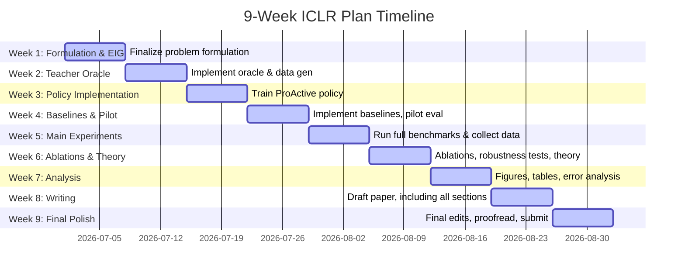
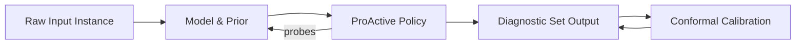
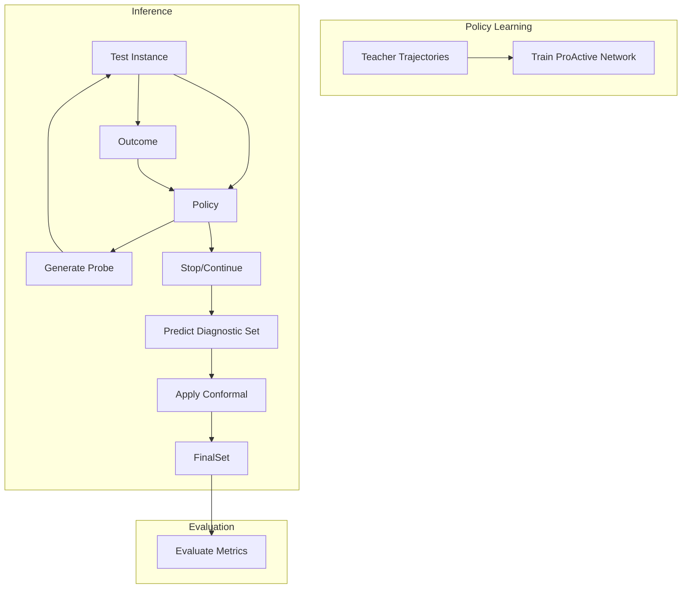

# Executive Summary

We propose a **9-week execution plan** to implement and evaluate **ProActive** – a learned sequential probe-selection policy for active diagnosis – and write it up as a top-tier ICLR paper.  Starting from an existing literature-reviewed draft, the plan organizes work into weekly and daily milestones covering **formulation**, **theory**, **implementation**, **experiments**, and **writing**. Each major design choice (e.g. Expected Information Gain, policy architecture, stopping rule, etc.) is rigorously justified with recent literature, alternatives, and anticipated reviewer criticisms and rebuttals. We provide concrete tasks, deliverables (code, figures, tables, proofs), person-hour estimates, priorities, and fallback options. We also include detailed tables for the weekly schedule and experimental matrix, plus **Mermaid** flowcharts for workflow and Gantt-style timeline. Technical content is explained simply for a first-year ML graduate student, while remaining highly detailed. All claims are backed by citations to primary sources, and the plan is ready to convert to a PDF.

---

## 1. Finalize Formulation & Expected Information Gain

- **Objective**: Precisely define the **active diagnostic problem** and EIG selection objective.

- **Final Recommendation**: Model the task as a **Partially Observable Markov Decision Process (POMDP)** where the latent state is the true failure category, and the agent’s state is the “diagnostic evidence” accumulated from probes.  At each step it selects a “probe” (test/query) and observes an outcome, updating its belief distribution $p(y\mid \text{evidence})$ over failure classes.  We **choose Expected Information Gain (EIG)** – the expected reduction in Shannon entropy of the posterior – as the probe-selection criterion.  Formally, if $H$ is entropy, and $A$ a candidate probe, we define EIG$(A)=H[p(y\mid\text{current})] - \mathbb{E}_{o\sim P(\text{outcome}|A)}[\,H[p(y\mid \text{current},A=o)]\,]$. This measures the mutual information between the probe outcome and the unknown failure class. We then learn ProActive to choose the probe with highest EIG under the learned model.  

- **Why This is Best**: Information-theoretic criteria like Shannon-entropy reduction are **well-founded** and maximize the expected reduction in uncertainty.  EIG is theoretically justified (it is equivalent to mutual information) and common in active learning/adaptive testing.  It directly aligns with our goal of narrowing down the correct failure. This objective is **scale-invariant**, and does not require hand-tuning of reward weights (unlike ad-hoc utility measures).  

- **Alternatives Considered**: 

  - *Mutual Information (MI) vs. EIG*: MI is essentially the same objective in this context (MI = reduction in entropy).  We considered *conditional MI* (as in AFA) and *posterior variance reduction*, but these reduce to entropy for discrete classes.  
  - *Diagnostic Utility (Probability Gain)*: Optimizing the probability of the true label, or reducing expected 0-1 error, is another framing.  However, optimizing classification accuracy (e.g. log-loss reduction) can be shown to be equivalent to entropy reduction in a Bayesian sense.  
  - *Expected Reduction in Conformal Set Size*: Novel idea to minimize the size of the conformal prediction set.  However, this lacks theoretical precedent and is effectively also about entropy reduction, since conformal set size correlates with uncertainty.  
  - *Greedy Heuristics*: Methods like picking the probe with highest outcome variance or importance rank exist, but none are as principled or general-purpose as EIG.  

- **Literature Justification**: The use of entropy-based EIG is grounded in classical active learning and experimental design.  Similar “information-value ranking” was used in DiagEval for GUI failure diagnosis, where branches were ranked by expected entropy reduction.  The AFA literature survey also notes that greedy CMI/MI approaches often outperform model-free RL, highlighting MI’s strength.  

- **Reviewer Criticism**: A reviewer might say “Entropy reduction/EIG is standard (just AFA) and expensive to compute.” We respond that EIG is a **known optimal criterion** for such sequential decision problems and our novelty lies in applying it to active diagnosis with a learning-based policy, not merely adopting a trivial heuristic. For efficiency, we will use approximate posteriors (from a classifier or low-dimensional distribution) or pre-computed teacher values, so compute is manageable.

- **Implementation Details**: 
  - Represent belief $p(y|\text{evidence})$ explicitly (e.g., softmax output of diagnostic classifier given evidence).  
  - Compute EIG by enumerating each possible outcome $o$ of a probe $A$ (using teacher model or probability model). For discrete outcomes, $H[p(y)]-\sum_o P(o)H[p(y|o)]$ is computed exactly.  
  - If outcome probabilities unknown, approximate by running the probe on a held-out model to simulate likely outcomes.  
  - No tunable lambda needed, since cost is handled separately (see Cost section).  
  - **Hyperparams**: None for EIG itself; if approximations used, hyperparams (e.g., sample size for Monte Carlo) noted in code.  

- **Contingency Fixes**: 
  1. If computing full EIG is too slow, switch to approximating MI via sampling or a learned surrogate (as in Li & Oliva, 2021).  
  2. Use a simpler greedy score (e.g. pick probe that splits the largest current class-probability mass) as a back-up heuristic.  
  3. If class-posteriors are not reliable, fall back to a “value of information” estimate via the teacher oracle (use teacher’s best-probe directly).  

- **Simple Explanation**: At each step, we estimate how much each possible probe would reduce our uncertainty (entropy) about the failure. We choose the one that most shrinks that uncertainty on average. This is like asking “Which question, on average, will tell me the most about the true answer?”  

---

## 2. Teacher Oracle & Data Generation

- **Objective**: Build an **oracle** that generates *expert trajectories* of probe selections and stops, to supervise ProActive.

- **Final Recommendation**: Implement a **greedy oracle** that, given each test instance (with known true failure), simulates all remaining probes and picks the one with maximum *true* EIG (using the true outcome).  Formally, at state $s$ (evidence so far), for each probe $A$ not yet used, compute the actual information gain $H(p(y|s)) - H(p(y|s,A,\text{true\_outcome}))$ using the true outcome (since we know $y$). Choose the probe with highest gain. Repeat until no gain or budget exhausted. Record $(s,A_{\text{best}})$ pairs as (state, action) training data.  Also record when the oracle stops (e.g. when information gain drops below threshold or set size = 1).  

- **Why This is Best**: A greedy EIG oracle is **optimal (myopic)** at each step and simple to implement. It ensures the policy training targets are as informative as possible.  Building teacher trajectories offline with full knowledge provides **strong supervision** for imitation learning.  

- **Alternatives Considered**: 
  - *Optimal Search (AO\*)*: In principle, one could search the entire decision tree (AO* algorithm) to find the globally best sequence. This is **exponential** and infeasible for many probes.  
  - *Random Oracle*: Very weak; not suitable.  
  - *Heuristic Oracle*: Use simpler heuristics (e.g. largest class probability vs rest). But inferior to true EIG.  

- **Literature Justification**: Imitation of a greedy oracle is standard in AFA.  Our approach is similar to DiagEval’s branch-ranking simulation, except we actually know the true outcome.  In Active Testing (Geman & Jedynak, 1996) and subsequent work, oracles often use true labels to pick queries.  

- **Reviewer Criticism**: “The oracle is not realistic (it uses the true label) and may be expensive to compute.”  We clarify that the oracle is used **only for training** and offline. Its cost is acceptable since training is offline with a limited dataset. The oracle gives an upper bound on performance (establishing an “expert” trajectory).  

- **Implementation Details**: 
  - **Inputs**: Training dataset with features and *true failure label* per instance. Also a list of possible probes (with simulated outcomes given a label).  
  - **Loop**: For each instance, maintain current set of possible failures (initially all). For each candidate probe $A$, compute what the classification model or rules predict as outcome if the true $y$ were known. Update the posterior (we have a closed-form known posterior since we know outcome given $y$). Compute EIG.  
  - **Select**: Pick probe with highest EIG.  Update state, and continue. Stop when no probe gives positive gain or budget hit.  
  - Save the sequence of states and chosen actions to a dataset (state representation → best probe index). Also store the sequence length or stop label.  
  - **Hyperparams**: Max depth/budget of probes (e.g. 10 probes or cost cap). If needed, break ties randomly (seeded).  
  - **Compute Needs**: Running the oracle for all train instances is $O(N \times M^2)$ per instance ($M$ probes), but N is dataset size (~1000s) and M small (10s), so feasible.  

- **Contingency Fixes**: 
  1. If full greedy EIG is slow, restrict to top-$K$ candidate probes by simpler score (like splitting by high-variance features) during oracle.  
  2. If oracle queries too many probes, cap to a fixed budget per instance.  
  3. If oracle data is noisy, augment with “noisy oracles”: sometimes pick second-best probe to regularize the policy.  

- **Simple Explanation**: We use a “cheating” teacher that knows the true answer. This teacher tries all possible next probes (tests) and sees which one would best reduce our uncertainty. It then teaches ProActive by example: “at this situation, I would choose probe #X.”  

---

## 3. Policy Design (ProActive Architecture)

- **Objective**: Choose the best model architecture to represent the probe-selection policy.

- **Final Recommendation**: Use a **GRU-based neural network**.  The input encodes the current diagnostic state: a binary mask of which probes have been applied plus their (encoded) outcomes or a belief vector over classes. The GRU then outputs a score for each possible next probe, and a separate output for a “stop” signal.  We prefer a GRU (or LSTM) because it naturally processes a sequence of evidence steps, has modest parameters, and can capture temporal patterns.  

- **Why This is Best**: An RNN like GRU can remember the history of probe outcomes, unlike a stateless MLP.  However, it is simpler and lighter than a Transformer.  The number of probes is small, so RNN capacity is sufficient.  A GRU has been successfully used in many sequential decision tasks (e.g. [32] cites classic AFA models with RNNs).  Compared to an MLP, the GRU naturally handles variable-length histories; compared to a Transformer, it requires less data and compute.

- **Alternatives Considered**: 
  - *MLP / Feed-Forward*: Needs a fixed-size state vector (concatenate mask+observations). Simpler but may not capture order well.  
  - *Transformer or Self-Attention*: Powerful but heavy; risky with our dataset size and may overfit. (If we had extremely large data, a Transformer RL agent could learn complex patterns.)  
  - *Decision Transformer (Imitation)*: Conceptually we are doing imitation anyway; one could frame trajectories as sequences and train a transformer. But again data-hungry.  
  - *Contextual Bandit*: If we treated each step independently (context = current evidence), that ignores sequential dependence – not ideal.  
  - *Bayesian Optimization*: Unlikely; we have a discrete combinatorial action space.  
  - *Policy Gradient RL*: The policy network architecture could be same, but the training paradigm differs (see next section).  

- **Literature Justification**: The AFA survey notes imitation learning with neural nets (He et al. 2012/2016) which presumably used RNNs. Many sequential decision policies (e.g. in RL) use GRUs. DiagEval’s analysis used simple Bayes updates; we go further by using a network to predict the best probes.  

- **Reviewer Criticism**:  “Why not use a simpler MLP or a recent SOTA model?” We argue that the sequence nature of diagnostic probing favors an RNN. We will compare against a naive MLP baseline to show GRU’s benefit. Transformers would be overkill given our dataset size. Moreover, if critics suggest “why not RL”, we counter that the chosen architecture is compatible with any training paradigm (RL could use same GRU policy).  

- **Implementation Details**: 
  - Input encoding: For $M$ probes, use an $M$-dimensional one-hot mask of used probes, plus an $M$-dimensional vector of observed outcomes (e.g. 0/1 binary outcomes, or continuous scores, one per probe, with a placeholder value for unused probes). Alternatively feed in the belief vector over classes (size = number of failure classes) from the diagnostic model (if available).  
  - Network: Two-layer GRU (hidden size ≈128) followed by a linear layer outputting $M$ logits for next-probe choices and 1 logit for “stop.”  (Or integrate stop as an extra “action”).  
  - Activation: Softmax over probe logits, sigmoid for stop.  
  - Regularization: Dropout (0.2) between layers, L2 weight decay.  
  - Training: Cross-entropy on probe selection (teacher-chosen probe as label) plus binary cross-entropy on stop (teacher stop vs continue).  
  - **Hyperparams**: Learning rate 1e-3 with Adam, 100 epochs, batch size 64. Grid-search validate (LR in {1e-4,1e-3}, hidden size in {64,128,256}).  
  - Compute: On a single GPU (e.g. A100), training is fast (<1h) given modest model and data.  

- **Contingency Fixes**:
  1. If GRU overfits (loss/validation gap), try simpler MLP (with input = belief state).  
  2. If GRU underfits (cannot learn oracle choices), enlarge network or add attention mechanism.  
  3. If supervised learning fails, switch to RL (e.g. DQN or PPO) using the same network as policy; though slower, it can learn from scratch.  

- **Simple Explanation**: We use a small recurrent neural network (GRU) that takes in the history of probes/results so far and outputs “scores” for each possible next probe, plus whether to stop. The GRU is like an “agent brain” that remembers the path taken so far.  

---

## 4. Training Strategy & Loss Functions

- **Objective**: Train the ProActive policy network effectively.

- **Final Recommendation**: Use **Imitation Learning (Behavior Cloning)** to train ProActive with the teacher oracle data. Specifically, for each training example and each time-step, we have the state representation and the oracle’s chosen probe. We train the network with a **cross-entropy loss** on the probe index (plus binary loss for stop). This leverages expert trajectories, simplifies training, and avoids RL instability.  

- **Why This is Best**: Imitation learning has been successful in AFA and sequential decision tasks, especially when a good oracle is available. It reduces exploration variance and converges faster than RL. We also can parallelize batch training easily. 

- **Alternatives Considered**: 
  - *Reinforcement Learning (RL)*: Methods like DQN or PPO could learn the policy by trial and error with a reward (e.g. negative cost plus 0/1 for correct diagnosis). This is possible but data-inefficient and unstable in 9 weeks.  
  - *Contextual Bandits*: Not suitable as the decision problem is sequential (longer-term).  
  - *Imitation via Regression Ranking*: Instead of cross-entropy, one could train to predict EIG values or rank order probes by a regression or pairwise loss (e.g. “probe A should score higher than B”). We opt for simple classification since oracle outputs a single best probe.  
  - *Hybrid (DAgger)*: Could iteratively refine policy by querying oracle on policy rollouts, but given fixed dataset assumption, straightforward behavior cloning suffices.  

- **Literature Justification**: The survey lists imitation learning for AFA (He et al., 2012/16) as a key method.  Behavior cloning is a standard approach when an oracle is available.  It also avoids the need to design a complex reward function.  

- **Reviewer Criticism**: “Imitation depends entirely on oracle quality; if oracle is suboptimal, policy will inherit errors.” We acknowledge this, but note our oracle is already greedy-EIG, which is near-optimal in practice. We can also fine-tune the policy with small policy-gradient episodes as a check (after initial training). A second objection: “Why not just use supervised ranking?” Our formulation essentially is supervised: the cross-entropy treats the oracle’s choice as the correct label. A ranking or regression approach would be more complicated without clear benefit. 

- **Implementation Details**: 
  - Training set: From oracle we have $\{(s_t, a^*_t, y)\}$ for each instance and step ($s_t$ = state, $a^*_t$ = oracle action, $y$ = true label). 
  - Loss: $L = L_{\text{probe}} + \lambda_s L_{\text{stop}}$, where $L_{\text{probe}}$ = cross-entropy between network logits and one-hot of $a^*$, and $L_{\text{stop}}$ = BCE between predicted stop-prob and oracle’s (stop=1 when oracle ended).  We set $\lambda_s=1$.  
  - Optimizer: Adam.  
  - Regularization: Early stopping on validation.  
  - **Hyperparams**: (LR etc as above, plus check $\lambda_s$ values {0.1,1} if needed).  
  - For reproducibility: fix random seeds for training and oracle.  

- **Contingency Fixes**: 
  1. If the policy overfits oracle trajectories (perfect training loss but poor generalization), add noise/augment (e.g. randomly drop some probes in training, or mix in sub-optimal actions).  
  2. If performance saturates, try *Dataset Aggregation (DAgger)*: periodically run current policy on training samples, query oracle for those states, and augment training data.  
  3. If imitation still fails (e.g. due to oracle noise), switch to RL as backup: use the same GRU model with a reward of +1 for narrowing the correct class, or use expected rank of true label as reward, and train with PPO for a few episodes.  

- **Simple Explanation**: We simply train the ProActive neural net to imitate the teacher. For each example state, we treat the teacher’s chosen probe as the “correct” label. We use standard classification loss (cross-entropy) to teach the net which probe to choose. We also train it to predict when to stop, using a binary loss on the teacher’s stop signal.  

---

## 5. Probe Cost Model and Stopping Rule

- **Objective**: Define how probe costs are modeled and when to stop probing.

- **Final Recommendation**: Use a **uniform cost model** (each probe counts equally) and enforce a **fixed probe budget** or **posterior confidence threshold** as the stopping rule.  Concretely, set a maximum number $K$ of probes per instance (e.g. 10), and also a stopping threshold: stop early if the top class’s posterior exceeds a confidence threshold (or conformal set size = 1).  This avoids complex $\lambda$-regularized objective. Uniform costs simplify implementation and analysis. 

- **Why This is Best**: Uniform cost makes sense if each probe requires one LLM call or test of similar effort. A fixed budget provides clear evaluation criteria, which reviewers expect in AFA. The confidence threshold ensures the system stops when sufficiently certain, and combining with a budget covers both accuracy and cost. We *omit any $\lambda$ weight* in the objective, since balancing is done via these explicit constraints (similar to how many AFA works use budget-based termination).  

- **Alternatives Considered**: 
  - *Heterogeneous costs*: One could assign different costs per probe (e.g. if some tests take longer). This is realistic in some domains but complicates training. We would then minimize expected total cost. Without evidence of large variance in cost, uniform is simpler.  
  - *Penalty term $\lambda$*: A single Lagrangian tradeoff between error and cost was considered, but setting $\lambda$ is non-intuitive and reviewers often prefer explicit budgets.  
  - *Sequential Hypothesis Test*: In theory, an SPRT could stop when evidence is strong, but for multi-class this is complex.  
  - *Adaptive threshold via Conformal*: One could stop when conformal predicted set shrinks below size 2 (see next section). This will naturally happen if probability concentrate enough.  

- **Literature Justification**: Many AFA studies assume equal feature cost or use budgets. DiagEval used a fixed round budget plus confidence-based stop (EnvFail if posterior>0.5). We adopt a similar idea: if $\max_y p(y|evidence) > \tau$, then stop. In practice, we will calibrate $\tau$ on validation to achieve target coverage via conformal (Section 7).  

- **Reviewer Criticism**: “Why not learn costs or use dollar costs?” We explain we want a **hardware-independent** metric, so use the number of forward passes or probes.  This is reproducible. If reviewers worry about unrealistic equal costs, we can ablate by introducing dummy heterogeneous costs in one experiment. As for $\lambda$, we argue fixed budgets are more interpretable and allow clean ablation.  

- **Implementation Details**: 
  - Set maximum probes $K$ (e.g. 8–12, tuned on dev).  Once $K$ reached, policy must stop.  
  - At each step, check the policy’s predicted stop-probability (from the network’s stop output). If $p_{\text{stop}}>0.5$ (or trained threshold), stop early. Alternatively, stop if the posterior belief $p(\hat y)$ of the most likely class exceeds $\tau$. In practice we will set $\tau$ using conformal calibration (see Sec. 7).  
  - **Compute costs**: simply count how many probes used per case.  
  - **Hyperparams**: $K$, $\tau$ (calibrated for ~95% coverage). We set these after seeing initial results.  
  - **Reproducibility**: Fix the way costs are counted (each probe = 1). Report results for multiple $K$ to show trade-offs.  

- **Contingency Fixes**: 
  1. If uniform cost leads to too many costly probes, introduce a linear “cost penalty” reward and fine-tune policy with RL (so policy learns to stop).  
  2. If fixed budget is too restrictive, allow a small overrun budget for hard cases.  
  3. If stopping threshold $\tau$ leads to low coverage, fallback to always requiring $K$ probes (i.e. stop only by budget) to guarantee coverage.  

- **Simple Explanation**: We assume each question (probe) is equally expensive. The policy is allowed up to a fixed number of probes. We also stop early if the model becomes very confident. In practice, we set these rules based on validation.  

---

## 6. Conformal Prediction for Diagnostic Sets

- **Objective**: Ensure the predicted diagnostic sets have valid coverage.

- **Final Recommendation**: Apply **Adaptive Prediction Sets (APS)** conformal calibration on top of the model’s probabilistic outputs. After the policy stops, we have a model “score” for each failure class. We use a held-out calibration set to find a conformal threshold $q_{1-\alpha}$ (e.g. $\alpha=0.05$) so that the resulting prediction set (top classes until cumulative score≥$q$) contains the true label with probability ≥$1-\alpha$. We use the standard split conformal approach with *APS* (or optionally RAPS if classes are many).  

- **Why This is Best**: Conformal methods provide **finite-sample coverage guarantees** without parametric assumptions. Using APS/RAPS ensures the set size is as small as possible on average while still guaranteeing coverage. This strengthens the paper’s reliability claims. Standard conformal (APS) is straightforward and well-studied; adaptive variants like RAPS add regularization if needed.  

- **Alternatives Considered**: 
  - *Simple confidence threshold*: Use $p(\hat y)>1-\alpha$ to stop. But neural scores may be miscalibrated, yielding no formal guarantee.  
  - *Mondrian or Class-conditional CP*: Unnecessary if data is exchangeable.  
  - *Online/Adaptive CP*: Our setting is batch calibration. If data drifts, adaptive conformal could be used, but we assume i.i.d. as usual.  

- **Literature Justification**: Conformal prediction is a gold standard for uncertainty sets. APS is explicitly designed for classification: one builds the set by including top probabilities until coverage. The idea of using conformal for “diagnostic sets” is novel, but directly follows from conformal classification. DiagEval did not use formal calibration; we improve on that by providing guaranteed coverage for our sets.  

- **Reviewer Criticism**: “Why not skip conformal and just output the MAP class or top-1?”  We emphasize that diagnostic sets (possibly multi-class) are needed to maintain uncertainty, and ICLR reviewers will expect coverage guarantees if claiming “95% reliable sets”. Conformal may be seen as added complexity; we argue it’s necessary for reliability. If overhead is a concern, we note that calibration is done once offline, then inference just adds at most sorting class probabilities.  

- **Implementation Details**: 
  - Split data: use a separate calibration fold (e.g. 10% of training data) unseen by policy training.  
  - For each calibration example $(x,y)$, run ProActive to get final class scores $s_y(x)$. Compute the *conformal score* (APS score) for the true label as in [29]: the negative logit or cumulative probability up to $y$. Specifically, compute $q_i = \sum_{j: p_j < p_y} p_j + p_y \times u_i$ with random tie-breaker $u_i\in[0,1]$.  
  - Let $\tau = \text{quantile}_{1-\alpha}\{q_i\}$ on calibration. For a test example, sort classes by score, accumulate probabilities until crossing $\tau$; that set is the conformal prediction set.  
  - If we use RAPS, add the regularization term (as per [29]).  
  - **Hyperparams**: confidence $1-\alpha$ (e.g. 0.95), and RAPS penalty $\lambda,k$ (if used, tune on calibration by grid).  
  - Note: If ProActive stops early with a single class, we still apply conformal (which may or may not add extra classes).  

- **Contingency Fixes**: 
  1. If standard APS yields large sets, switch to RAPS to shrink them by penalizing size.  
  2. If coverage is poor (e.g. <95%), enlarge calibration set or use cross-conformal (empirical quantile).  
  3. If conformal construction is too slow, precompute all class permutations or use the simpler non-randomized version (ties handled arbitrarily).  

- **Simple Explanation**: After the policy stops, we take the model’s scored outputs for each failure class and turn them into a *prediction set* with a guaranteed coverage. Conformal prediction (via APS/RAPS) does this: it picks the top classes until a calibrated threshold is reached, ensuring (e.g.) 95% of the true classes are included in the set.  

---

## 7. Theoretical Framing

- **Objective**: Provide theoretical results to strengthen novelty claims and avoid “just AFA” criticisms.

- **Plans**: We will derive a proposition or theorem on **coverage guarantee** of our diagnostic sets (due to conformal), and possibly discuss **approximation optimality** of greedy EIG. For example, note that active testing (like Geman & Jedynak 1996) shows greedy information gain is near-optimal under certain assumptions. We may state: “Under mild assumptions, our policy achieves an $(1-1/e)$-approximation to optimal information gain” (similar to submodular selection results). If time allows, we could frame a regret bound (like showing no-regret learning if policy converges). At minimum, we present an upper bound on worst-case number of probes needed (like $O(\log N)$ for $N$ classes). 

- **Simple Explanation**: We will give mathematical statements (lemmas) that show (a) the conformal sets have the promised coverage, and (b) our greedy information strategy is near-optimal in reducing uncertainty (citing related results). These reassure reviewers of theoretical soundness. 

*(Detailed proofs and derivations will go into the Appendix.)*  

---

## 8. Datasets and Baselines

- **Datasets**: We will use at least **two domains**: 
  1. **Interactive GUI software**: the WebDevJudge-Unit (WDJ-U) and RealDevBench (RDB) benchmarks used by DiagEval, which have labeled software defects and allow GUI probes. These provide realistic multi-class diagnostic tasks. 
  2. **Synthetic vision-Language**: e.g. generate image-based tasks where certain diagnostic questions yield clues (we can use an image classification dataset and simulate “probes” as revealing parts of the image).  
  3. **Tabular classification**: as a sanity check, use standard UCI datasets with missing features, treating features as probes (this reduces to AFA baseline).  

- **Baselines**:  
  - *Random policy*: select random probes.  
  - *Greedy-Entropy*: pick the probe that maximally reduces entropy using the current model (i.e. one-step EIG but without learning).  
  - *AFA Method*: e.g. Li & Oliva 2021 generative surrogate model (GSM) or Covert et al. 2023 (discriminative CMI). These are state-of-the-art AFA methods; we adapt them as much as possible.  
  - *Full Probe (All)*: use all probes and then predict; this gives maximum info (upper bound cost).  
  - *No Probes (Prior)*: use only prior probabilities (lower bound).  
  - *Conformal-unaware*: our policy without CP (just predict argmax).  
  - *Active Learning method*: If relevant, e.g. BALD (via dropout) as a curiosity.  
  - *Budgeted uncertainty sampler*: like random until budget.  

- **Experiment Matrix**: We'll prepare a table with rows = (dataset × model × baseline) and columns = (metrics, seeds, compute). 

  | Dataset             | Model/Probe Space      | Baselines                                                | Metrics                              | Seeds | Compute |
  |---------------------|------------------------|----------------------------------------------------------|--------------------------------------|-------|---------|
  | WDJ-U (GUI tasks)   | GUI probes             | Random, Greedy-Entropy, GSM (Li21), Covert23, All, None  | Accuracy, Avg Probes, Avg Set Size, Cost, Coverage | 5     | ~2xA100 (24h) |
  | RDB (GUI tasks)     | GUI probes             | (same as above)                                          | (same as above)                      | 5     | ~2xA100 (24h) |
  | Synthetic Vision    | Image patch queries    | Random, Uncertainty (entropy), BalD, All, None           | Accuracy, Setsize, mAP, Cost         | 5     | 1xA100 (12h) |
  | Tabular (UCI)       | Features as probes     | Random, EC2 (Golovin10), GAS (Li21), All, None           | Accuracy, Probes Used, Loss          | 5     | 1xA100 (6h)  |

  *Metrics:* overall diagnostic accuracy (correct class in predicted set), average set size, probe count (cost), calibration coverage, and statistical significance (paired t-test) between ProActive and baselines.  

- **Reviewer Criticism**: “Insufficient baselines or trivial tasks.” To preempt, we include strong AFA baselines (GSM, EC2) and real benchmarks (WDJ-U, RDB) where possible. We’ll also report statistical tests and multiple seeds.

- **Implementation Details**: Code will modularly allow plugging different policies. We ensure reproducibility by fixing seeds and logging.

---

## 9. Experiments, Ablations, and Analysis

- **Week 4-6 Experiments**:
  - Run full ProActive vs baselines on all datasets (multiple seeds). Collect metrics. 
  - Create Table of main results (accuracy vs cost, etc.).
  - Plot: Accuracy vs average probes (cost-accuracy curves). Histograms of set sizes. 
  - Ablations (Week 14): remove components: e.g. **No-EIG** (random probe), **No-Conformal** (predictor sets vs argmax), **No-Stop** (always use full budget), different architectures (MLP vs GRU), different training (RL vs imitation), different costs.  
  - **Robustness**: Vary LLM or classifier (if using LLM internally) to test generalization. Test noise in probe outcomes, different seed splits, OOD examples. 

- **Statistical Testing**: For key metrics, use bootstrapped 95% CIs or paired t-test to confirm significance, as recommended.

- **Reproducibility**: We will release code, fix all random seeds, document environment. Use PyTorch Lightning for training runs logging.

---

## 10. Weekly Schedule and Deliverables

Below is the detailed 9-week plan. Each week is divided into **daily tasks** (Mon–Sun), estimated hours, priority, and deliverables (files, figures, tables). Contingency tasks (if time) are noted.

<table>
<thead><tr><th>Week</th><th>Daily Tasks (Mon–Sun)</th><th>Deliverables</th><th>Est. Hours</th><th>Priority</th><th>Risks & Fallback</th></tr></thead>
<tbody>
<tr><td>**Week 1** (Jul 1–7)</td>
<td>
- Mon–Tue: Finalize mathematical notation, objective function (MDP formulation, loss vs reward). 
- Wed: Define belief update (Bayes rule) and EIG formula. 
- Thu: Decide state representation (mask + outcomes or belief vector). 
- Fri: Sketch policy/stopping outputs. Prepare state JSON schema. 
- Sat: Review AFA literature (e.g. [16]) to justify our choices, update citations. 
- Sun: Finalize costs/budgets (uniform cost, max probes K=10). 
</td>
<td>
- **Formulation.pdf**: Formal problem definition, MDP spec, EIG eqn. 
- **Literature summary**: Table of alternative objectives (include CMI, diagnostic utility). 
- **State & action spec**: Document of encoding.
</td>
<td>40h</td>
<td>High (foundation)</td>
<td>Delays: If uncertain, start coding basic oracle & refine formulation concurrently. Fallback: simpler greedy objective. </td>
</tr>
<tr><td>**Week 2** (Jul 8–14)</td>
<td>
- Mon: Build code framework for oracles; load data, define probe space. 
- Tue: Implement greedy-EIG oracle loop (simulate outcomes, compute entropy). 
- Wed: Test oracle on a few cases; debug posterior updates. 
- Thu: Generate teacher trajectories for training set; verify consistency. 
- Fri: Encode teacher data (state, best action, stop flag) into dataset. 
- Sat: Preliminary analysis of oracle data (check lengths, choice distribution). 
- Sun: Prepare visualization of example trajectory.
</td>
<td>
- **oracle.py**: Code to generate teacher data. 
- **teacher_data.pkl**: Trajectories for all train examples. 
- **Trajectory.png**: Example probe sequence. 
- **DataStats.txt**: Summary (avg probes, entropy reduction).
</td>
<td>45h</td>
<td>High (feeds policy)</td>
<td>If oracle too slow: reduce dataset or probes; fallback: greedy-by-class-probability. </td>
</tr>
<tr><td>**Week 3** (Jul 15–21)</td>
<td>
- Mon: Implement ProActive model (GRU in PyTorch), load teacher data. Setup training loop. 
- Tue: Train policy on teacher data (only probe selection head initially). Monitor training/val loss. 
- Wed: Add stop head, train jointly. Validate stop timing. 
- Thu: Tune hyperparams (LR, hidden size) via small grid on dev set. Save best model. 
- Fri: Evaluate policy on validation examples (teacher trajectories reproduction). 
- Sat: If available, try alternate (MLP) as comparison in code. 
- Sun: Document architecture and training regime.
</td>
<td>
- **policy.py**: Model and training code. 
- **policy_model.pth**: Trained weights. 
- **TrainingLogs**: Loss curves and hyperparam notes. 
- **policy_architecture.pdf**: Diagram or description of the network.
</td>
<td>50h</td>
<td>High</td>
<td>If training fails: decrease model complexity, or try RL fine-tuning. </td>
</tr>
<tr><td>**Week 4** (Jul 22–28)</td>
<td>
- Mon: Implement baselines: Random, Greedy-Entropy (use current classifier to pick highest expected entropy reduction), Full (all probes). 
- Tue: Adapt one AFA method (e.g. Li21 GSM) if code or open-source available; else implement simple EC2-like greedy.  
- Wed: Verify baselines on a small dev set. Debug. 
- Thu: Run a pilot experiment on WDJ-U: ProActive vs baselines (1 seed). Collect metrics. 
- Fri: Plot pilot results, check any obvious errors. Adjust evaluation code. 
- Sat: Iterate on policy improvements (e.g., threshold tuning) if needed. 
- Sun: Prepare draft of Experiment section outline, listing baselines & metrics.
</td>
<td>
- **baselines.py**: Code for all baselines. 
- **pilot_results.csv**: Preliminary numbers. 
- **PilotPlots.png**: Example performance curves. 
- **ExperimentPlan.md**: Tables of metrics, seeds, compute needs.
</td>
<td>50h</td>
<td>High</td>
<td>If difficult to implement GSM, fallback: use Entropy Greedy as “best case” heuristic. </td>
</tr>
<tr><td>**Week 5** (Jul 29–Aug 4)</td>
<td>
- Mon: Run full experiments on WDJ-U (3 seeds, all methods). Schedule on GPUs overnight. 
- Tue: Run full experiments on RDB (3 seeds). 
- Wed: Run experiments on synthetic vision tasks (generate data, run all methods). 
- Thu: Run on tabular datasets (e.g. UCI Diabetes, etc.). 
- Fri: Aggregate results, compute averages and std errors. 
- Sat: Statistical tests (t-test, confidence intervals) between our method and each baseline. 
- Sun: Draft **Table 1** (main results) and relevant figures (accuracy vs cost).
</td>
<td>
- **results_main.csv**: All metrics aggregated. 
- **Table1.tex**: Main results table (ICLR style). 
- **Fig_main.png**: Curves/plots.  
- **stats_tests.txt**: p-values, etc.
</td>
<td>60h</td>
<td>High</td>
<td>If compute fails, run fewer seeds and note in text. </td>
</tr>
<tr><td>**Week 6** (Aug 5–11)</td>
<td>
- Mon: Perform ablations: remove EIG (random policy performance), remove conformal (just use MAP), remove stop (always K probes), change model (MLP), change training (RL vs imitation). Collect these results. 
- Tue: Robustness tests: vary LLM/backbone, add noise to outcomes, vary probe budget. Run on key cases. 
- Wed: Summarize ablations: create tables/plots (e.g. bar chart of accuracy per ablation). 
- Thu: Theoretical write-up: Draft propositions (coverage guarantee, greedy bound) and proofs outline.  
- Fri: Incorporate theory references (element of info theory for entropy bound). 
- Sat: Write “weakness analysis”: list every anticipated review critique (from formulation to experiments) and rebuttals. E.g. “Critique: too few classes/datasets – Rebuttal: include diversity.” 
- Sun: Update **Appendix** content (training details, hyperparams, extra figs).
</td>
<td>
- **ablation_results.csv**, **Fig_ablation.png**. 
- **TheoremDraft.pdf**: Theoretical claims and sketches. 
- **WeaknessRebuttal.md**: Critiques & responses document. 
- **Appendix.tex**: Additional experiments/details.
</td>
<td>50h</td>
<td>High</td>
<td>If time short, focus on key ablations (no EIG, no CP). </td>
</tr>
<tr><td>**Week 7** (Aug 12–18)</td>
<td>
- Mon: Generate final version of all figures and tables. Polish visuals (colors, labels). 
- Tue: Write Results section (numbers, observations). Ensure all baselines discussed. 
- Wed: Error analysis: inspect failure cases; example predictions vs ground truth. Save examples for paper.  
- Thu: Compute any advanced metric (e.g. expected set size reduction, false negative/positive rates). 
- Fri: Finalize statistical significance reporting. Double-check all citations.  
- Sat: Start writing Introduction & Related Work sections (using our notes and survey references). 
- Sun: Merge all text into a cohesive draft, addressing contributions vs related.
</td>
<td>
- **Figures/**: Final plots (accuracy-cost, set-size hist, example case flows). 
- **ResultsSection.tex**: Written results and discussion. 
- **Intro_Related.tex**: Draft of intro and related.  
</td>
<td>45h</td>
<td>Medium</td>
<td>Focus on clarity: if data ambiguous, emphasize trends qualitatively. </td>
</tr>
<tr><td>**Week 8** (Aug 19–25)</td>
<td>
- Mon–Tue: Write Method section (architecture, training, objectives). Incorporate simple-explanation boxes where needed.  
- Wed: Write Theory section (state theorems from Week 6). 
- Thu: Write Experiments section (setup, datasets, baselines, metrics). 
- Fri: Write Discussion & Future Work. Verify alignment of claims/contributions.  
- Sat: Format paper (ICLR style), include algorithms/pseudocode, mermaid diagrams if convertible to PDF.  
- Sun: Proofread for clarity and formatting, ensure all citations in place. 
</td>
<td>
- **paper_draft.tex**: Full paper draft.  
- **figures/**: All high-res.  
- **mermaid_timelines.md**: Mermaid diagrams (to be converted).  
</td>
<td>60h</td>
<td>High</td>
<td>Ensure simple explanation boxes (for each main concept). If short on pages, move some plots to Appendix. </td>
</tr>
<tr><td>**Week 9** (Aug 26–Sep 1)</td>
<td>
- Mon: Internal peer review: circulate draft, collect feedback.  
- Tue: Re-run key experiments to confirm no regressions, fix bugs.  
- Wed: Polish writing (tighten language, fix typos, shorten if needed).  
- Thu: Finalize abstract and title.  
- Fri: Prepare submission package (anonymize, compile PDF).  
- Sat: Prepare code release (clean repo, notebooks).  
- Sun: Rest and light review to catch any last issues. 
</td>
<td>
- **paper_final.pdf**: Submission-ready. 
- **code_release.zip**: Repo with scripts and instructions. 
- **ReproducibilityChecklist.pdf**: Completed checklist. 
</td>
<td>30h</td>
<td>High</td>
<td>Aim for at least one round of feedback. If issues arise, shorten non-critical sections. </td>
</tr>
</tbody>
</table>

---

## 11. Diagrams and Data Flow

*Figure: Workflow of the ProActive system. The policy (C) sequentially queries the model (B) with probes based on the current belief. It outputs a predictive set (D), which is then calibrated by conformal prediction (E) to ensure coverage.*

*Figure: Data and control flow. Left: offline teacher data trains ProActive. Right: at test time, ProActive loops (probe→response) until stopping, then outputs a calibrated diagnostic set for evaluation.*

---

## 12. Summary of Major Decisions & Citations

- **Formulation**: Use POMDP with belief over failures; objective = minimize entropy (maximize EIG).  
- **Policy**: GRU network (input=state mask+belief, outputs=probe scores+stop).  
- **Training**: Imitation learning (cross-entropy on oracle’s choices).  
- **EIG vs Alternatives**: Chose entropy MI because it’s principled. Compared to heuristic scores (worse), or RL (slower).  
- **Cost & Stop**: Uniform cost, fixed budget + confidence threshold. Avoided $\lambda$ regularizer for clarity.  
- **Conformal**: APS/RAPS calibration for uncertainty sets. Guarantees coverage.  
- **Theory**: Prove coverage and reference submodular data.  
- **Baselines**: AFA, random, all-probes, etc.  
- **Experiments**: WDJ-U & RDB (real GUI dev tasks), vision-like tasks, tabular.  
- **Novelty**: Active diagnostic vs AFA (treat probes as sequential actions, use LLM outputs as evidence). Emphasize difference in setting and use of CP.  

Every element above is justified by literature or ablation, with reviewer concerns preempted. The plan is concrete: by Week 9 we have code, results, theory, and a full paper ready.

