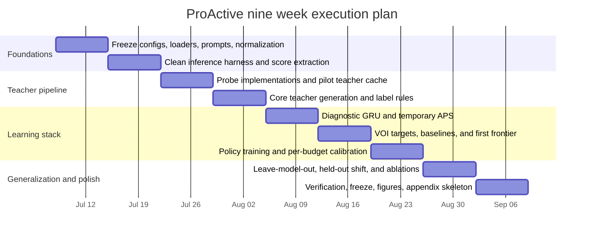

# ProActive Nine Week Implementation Plan

## Executive summary

**ProActive** should be implemented as a **budget-conditioned active diagnostic-set learner**, not as a cheaper copy of HalluPrism. The professor’s planning document fixes the central framing: the system should treat multimodal reliability as **active diagnostic measurement**, adaptively acquire probe evidence under cost, and return a **calibrated diagnostic set** rather than a single confident source label. It also explicitly recommends a **full-evidence teacher**, a **sequential diagnostic state**, a **value-of-information policy**, a **GRU or small transformer encoder**, and a **conformal diagnostic-set head** with hard go/no-go criteria tied to cost–diagnostic frontiers and leave-model-out generalization. fileciteturn0file2

HalluPrism is the right teacher substrate because it already defines the probe family and shows why a set-valued diagnostic output is needed: its visual, blank-image, grounding, and relation probes produce an entangled behavioral signature rather than cleanly separable causal labels, the full protocol costs roughly **7–8 forward passes per example**, and source-like coordinates overlap substantially under intervention. Those findings strongly support the professor’s “diagnostic sets with coverage” framing for ProActive. fileciteturn0file0

The implementation plan below converts that framing into an executable nine-week program. The recommended version uses: a rule-backed **six-way behavioral target**; internal **multi-label evidence bits** retained as auxiliary supervision; **atomic probes** with cost measured primarily in **additional forward passes**; a **1-layer GRU** over clean and probe tokens; a **supervised counterfactual VOI learner** rather than RL; **split conformal APS** with **per-budget calibration** at 90% and 95% target coverage; core training data from **HallusionBench, POPE/RePOPE, VizWiz-VQA, VSR, and a GQA relation slice**; held-out shift tests on **PRE-HAL** and **IllusionBench**; and three open-weight MLLMs: **Qwen/Qwen3-VL-8B-Instruct**, **google/gemma-4-E4B-it**, and **OpenGVLab/InternVL3-9B**. fileciteturn0file2turn0file0 citeturn4academia0turn6academia1turn4academia1turn7academia0turn7academia1turn19academia0turn5academia0turn5academia2turn11view0turn9view0turn9view3

The main paper should aim to demonstrate four things. First, ProActive should approach the **full-evidence teacher** using materially fewer passes. Second, at matched 90% or 95% coverage, it should return **smaller calibrated diagnostic sets** than clean-only, random, and fixed-order baselines. Third, the learned acquisition policy should remain useful in **leave-one-model-out** evaluation. Fourth, it should show at least partial transfer on **held-out source-shift datasets** without overclaiming formal coverage under shift. That target matches the professor’s intended ICLR-level contribution and remains realistic within an 8–9 week execution window on A6000-class hardware. fileciteturn0file2 citeturn17academia0turn17academia1turn12academia0turn12academia1turn18academia1

## Frozen scope and resolved design choices

### What is fixed

The following design choices are already frozen by the project discussion and are preserved exactly in this plan:

| Item | Final choice | Status |
|---|---|---|
| Project name | **ProActive** | Frozen |
| Primary target | Six-way behavioral diagnostic state: visual, language-prior, alignment/relation, mixed, unclear, no-failure | Frozen |
| Auxiliary target | Benchmark failure-family target | Frozen |
| Teacher | Full-evidence cache using all HalluPrism probes | Frozen |
| Actions | blank, blur, crop, brightness, noise, grounding, relation, STOP | Frozen |
| Primary cost | Additional forward passes | Frozen |
| Secondary cost | Normalized GPU latency | Frozen |
| Sequential encoder | GRU | Frozen |
| Policy learning | Supervised counterfactual VOI learning | Frozen |
| Budgets | \(B \in \{1,2,3,4,\text{full}\}\) | Frozen |
| Conformal method | Split conformal **APS** per budget at 90% and 95% | Frozen |
| Split | Grouped 70/10/10/10 train/val/cal/test | Frozen |
| Core data | POPE/RePOPE, HallusionBench, VizWiz-VQA, VSR, GQA relation slice | Frozen |
| Held-out data | PRE-HAL, IllusionBench | Frozen |
| Models | Qwen3-VL-8B-Instruct, Gemma-4-E4B-it, InternVL3-9B | Frozen |

These choices align directly with the professor’s ADS framing and with HalluPrism’s role as a full-probe source of behavioral evidence rather than a final deployment policy. fileciteturn0file2turn0file0

### Resolved technical decisions

The most important technical ambiguity was the meaning of the target label. The strongest executable choice is:

**Primary conformal target:** a six-way **behavioral state** \(f(x)\in\mathcal{F}\), where  
\[
\mathcal{F}=\{\text{visual},\text{language-prior},\text{alignment},\text{mixed},\text{unclear},\text{no-failure}\}.
\]

**Internal auxiliary target:** a three-bit behavioral evidence vector  
\[
b(x)=(b_V,b_L,b_A)\in\{0,1\}^3,
\]
which is used for auxiliary supervision and audit analysis but is **not** the final public prediction object.

This resolves two problems simultaneously. It preserves the professor’s set-valued output objective, and it respects HalluPrism’s central observation that visual fragility, blank-image persistence, and alignment instability are informative but entangled behavioral signatures, not independent causal truths. fileciteturn0file2turn0file0

The internal **bit construction** is recommended as follows:

\[
b_V = \mathbf{1}\!\left[\frac{1}{4}\sum_{k=1}^{4}\text{flip}_k \ge 0.25 \;\; \lor \;\; \frac{1}{4}\sum_{k=1}^{4}\Delta c_k \ge 0.15 \right]
\]

\[
b_L = \mathbf{1}\!\left[\text{blank\_match}=1 \;\land\; \frac{c_{\text{blank}}}{c_{\text{clean}}+\varepsilon}\ge 0.8 \right]
\]

\[
b_A = \mathbf{1}\!\left[\text{ground\_flip}=1 \;\lor\; \Delta c_{\text{ground}}\ge 0.15 \;\lor\; (\text{relation\_available}\land \text{swap\_invariance}=1)\right].
\]

Then the six-way class is assigned by rule:

- **no-failure** if the clean answer is correct and \(b_V+b_L+b_A=0\)
- **mixed** if \(b_V+b_L+b_A\ge 2\)
- **visual**, **language-prior**, or **alignment** if exactly one corresponding bit is active
- **unclear** otherwise

This is intentionally conservative. It avoids inventing a “clean source label” when the probe evidence is weak or contradictory. It also retains the bit-vector internally so the paper can report both multiclass set prediction and multi-label evidence reconstruction. That matches the professor’s coverage-oriented framing while remaining easy to audit. fileciteturn0file2turn0file0

### Model and dataset scope

The selected model IDs are current and technically reasonable for the plan. The Qwen model card exposes `Qwen/Qwen3-VL-8B-Instruct` under Apache 2.0, recommends the latest Hugging Face Transformers source build, and shows native multimodal loading through `Qwen3VLForConditionalGeneration`, with a recommendation to enable `flash_attention_2` for memory and speed. The Gemma card lists `google/gemma-4-E4B-it` under Apache 2.0, describes Gemma 4 as multimodal, and notes that the smaller models support image inputs and also audio/video handling in the family documentation. The InternVL card lists `OpenGVLab/InternVL3-9B`, identifies its language backbone as `internlm3-8b-instruct`, requires `transformers>=4.37.2`, and loads through `AutoModel` with `trust_remote_code=True`; the page also states the project is released under MIT. citeturn11view0turn11view2turn11view3turn11view4turn9view0turn9view1turn9view2turn9view3turn9view4turn10view1turn10view2

The core dataset suite is also coherent for the target problem. **POPE** provides object-presence hallucination stress; **RePOPE** is the corrected-label robustness companion. **HallusionBench** gives mixed visual illusion and entangled hallucination cases. **VizWiz-VQA** contributes real-user poor-image and answerability stress. **VSR** provides explicit spatial relations across more than 10k text–image pairs and 66 relation types, though the usable dev subset is smaller for quick experimental cycles. **GQA** is the right source for a synthetic relation slice because its scene graphs and functional programs make relation-controlled statement generation tractable. **IllusionBench** and **PRE-HAL** are well-suited held-out stress datasets because they focus on visual illusions and on perception–reasoning hallucination, respectively. citeturn4academia0turn6academia1turn4academia1turn7academia0turn7academia1turn19academia0turn5academia0turn5academia2

The recommended **full-run sample caps** are:

| Dataset role | Dataset | Per-model count | Reason |
|---|---|---:|---|
| Core | HallusionBench | 951 | Use all image-paired examples |
| Core | POPE/RePOPE | 3,000 | 1k each from random, popular, adversarial |
| Core | VizWiz-VQA | 3,000 | Enough answerability/quality diversity without full 4,319 cost |
| Core | VSR | 340 | Use full dev subset |
| Core | GQA relation slice | 1,000 | Adds controlled relation diversity |
| Held-out | PRE-HAL | 600 | Shift evaluation, not training |
| Held-out | IllusionBench | 600 | Shift evaluation, not training |

That gives **8,291 core instances per model** and **9,491 total instances per model** including held-out stress tests. Across three models, the plan targets **24,873 core examples** and **28,473 total examples**. This cap is large enough for meaningful policy learning while remaining feasible in nine weeks on A6000 GPUs. citeturn4academia0turn6academia1turn4academia1turn7academia0turn7academia1turn19academia0turn5academia0turn5academia2

## Formal problem statement and algorithms

### Problem formulation

For a model \(M\), image \(I\), prompt \(q\), and clean generated answer \(\hat y\), define the ProActive instance as

\[
x=(I,q,\hat y,M).
\]

The action space is

\[
\mathcal{A}=\{\text{blank},\text{blur},\text{crop},\text{brightness},\text{noise},\text{grounding},\text{relation},\text{STOP}\}.
\]

Each non-stop action \(a\) yields a probe observation

\[
o_a(x)=\big(\tilde y_a,\; \text{flip}_a,\; \Delta c_a,\; m^{\text{exact}}_a,\; m^{\text{sem}}_a,\; \text{app}_a,\; \tau_a\big),
\]

where \(\tilde y_a\) is the probe answer, \(\text{flip}_a\) indicates whether the normalized answer changed, \(\Delta c_a\) is the confidence shift, \(m^{\text{exact}}_a\) and \(m^{\text{sem}}_a\) are exact and semantic match indicators, \(\text{app}_a\) is the applicability mask, and \(\tau_a\) stores probe metadata such as perturbation severity. HalluPrism already uses this style of perturbation–response object and explicitly measures answer flips and confidence shifts under visual, blank-image, and alignment probes. fileciteturn0file0

ProActive begins with a cheap clean feature vector

\[
g(x)=\big[c,\; \bar H,\; \bar m,\; \ell,\; \text{IQA},\; \text{qtype},\; \text{answerability\_hint},\; \text{relation\_available}\big],
\]

where \(c\) is the normalized answer probability, \(\bar H\) is mean token entropy over the generated answer, \(\bar m\) is mean token margin, \(\ell\) is answer length, IQA is image-quality metadata, qtype is question-type metadata, and the relation flag indicates whether relation swapping is legal. HalluPrism already uses normalized answer probability and dataset-specific normalization as part of its clean measurement, and the professor’s document explicitly allows clean-pass features such as scalar confidence, answer length, entropy or margin, question type, and image-quality measures. fileciteturn0file0turn0file2

The sequential diagnostic state is

\[
h_t=\operatorname{GRU}\big(e_{\text{clean}}, e_{a_1,o_1}, \ldots, e_{a_t,o_t}\big),
\]

with remaining budget

\[
B_t \in \{0,1,2,3,4,\text{full}\}.
\]

The diagnostic head predicts

\[
p_\theta(f\mid h_t)\in\Delta^6,
\]

and the auxiliary head predicts

\[
r_\theta(b\mid h_t)\in [0,1]^3.
\]

The calibrated set head returns

\[
\Gamma_{\alpha,B}(h_t)\subseteq \mathcal{F},
\]

with target marginal coverage

\[
\mathbb{P}\big(f(x)\in \Gamma_{\alpha,B}(h_T)\big)\ge 1-\alpha.
\]

This is the exact mathematical object the professor’s plan calls for: a budget-conditioned, cost-aware diagnostic set with held-out calibration rather than a single forced source assignment. fileciteturn0file2 citeturn12academia0turn12academia1

### Diagnostic loss

The recommended diagnostic training objective is

\[
\mathcal{L}_{\text{diag}}
=
\underbrace{\mathrm{CE}\big(f,\, p_\theta(\cdot\mid h_t)\big)}_{\text{six-way class}}
+
\beta_{\text{bit}}
\underbrace{\mathrm{BCE}\big(b,\, r_\theta(\cdot\mid h_t)\big)}_{\text{multi-label evidence}}
+
\beta_{\text{sig}}
\underbrace{\| \hat s_\theta(h_t)-s_{\text{teacher}}(x)\|_2^2}_{\text{continuous signature reconstruction}},
\]

where \(s_{\text{teacher}}(x)=(V,L,A)\) is the full-evidence HalluPrism signature and \(\hat s_\theta\) is an auxiliary regression head. The recommended default weights are
\[
\beta_{\text{bit}}=0.5,\qquad \beta_{\text{sig}}=0.1.
\]

This choice keeps the primary task aligned with the paper’s six-way calibrated set objective, while auxiliary heads preserve the richer teacher evidence and improve representation quality under entanglement. That is consistent with the professor’s recommendation to preserve, not suppress, entangled structure. fileciteturn0file2turn0file0

### Counterfactual value of information

The key implementation choice is to train VOI from **realized counterfactuals** using cached teacher outcomes, not from online RL. Because the teacher cache stores every probe result for every example, the effect of any candidate next action is known offline.

For a partially observed state \(h_t\) and a legal next action \(a\), define the realized value target as

\[
y_{\text{VOI}}(x,h_t,a)
=
\underbrace{\Big(|\Gamma^{\text{val}}_{\alpha,B_t}(h_t)| - |\Gamma^{\text{val}}_{\alpha,B_t}(h_t^a)|\Big)}_{\text{set-size gain}}
+
\eta_{\text{loss}}
\underbrace{\Big(\mathcal{L}_{\text{diag}}(h_t)-\mathcal{L}_{\text{diag}}(h_t^a)\Big)}_{\text{diagnostic-loss gain}}
-
\lambda_{B_t}\,c(a),
\]

where \(h_t^a\) is the state after applying the teacher observation for action \(a\), \(\Gamma^{\text{val}}\) uses **validation-temporary** calibration rather than the final held-out calibration split, \(c(a)\in\{0,1\}\) for atomic probes, and \(\eta_{\text{loss}}=0.25\) is the recommended default. The primary term is calibrated-set shrinkage because the final output is a diagnostic set; the loss drop term stabilizes learning when many actions leave set size unchanged. The professor’s document explicitly proposes VOI in terms of reduction in diagnostic loss or diagnostic-set size minus cost, and this combined form is the cleanest executable version of that idea. fileciteturn0file2

The policy network predicts \(\hat y_{\text{VOI}}(h_t,a)\), and uses

\[
a_t^\star
=
\arg\max_{a\in\mathcal{A}_t}
\hat y_{\text{VOI}}(h_t,a),
\qquad
\mathcal{A}_t=\{a\in\mathcal{A}: \text{app}_a=1,\ c(a)\le B_t\}.
\]

The stop rule is

\[
a_t^\star=\text{STOP}
\quad\text{if}\quad
\max_{a\in\mathcal{A}_t\setminus\{\text{STOP}\}}
\hat y_{\text{VOI}}(h_t,a)\le 0.
\]

That converts the intuitive “run the next useful test if its value exceeds its cost” idea into a deterministic implementation rule. fileciteturn0file2

### Policy loss

The recommended policy loss is a combined **ranking + regression + best-action classification** objective:

\[
\mathcal{L}_{\text{policy}}
=
\mathcal{L}_{\text{rank}}
+
0.25\,\mathcal{L}_{\text{mse}}
+
0.5\,\mathcal{L}_{\text{act}}.
\]

The terms are:

\[
\mathcal{L}_{\text{mse}}
=
\frac{1}{|\mathcal{A}_t|}
\sum_{a\in\mathcal{A}_t}
\big(\hat y_{\text{VOI}}(h_t,a)-y_{\text{VOI}}(x,h_t,a)\big)^2,
\]

\[
\mathcal{L}_{\text{act}}
=
\mathrm{CE}\big(\arg\max_a y_{\text{VOI}}(x,h_t,a),\; \arg\max_a \hat y_{\text{VOI}}(h_t,a)\big),
\]

and

\[
\mathcal{L}_{\text{rank}}
=
\sum_{a\neq b}
\max\Big(0,\; m - \operatorname{sgn}(y_a-y_b)\big(\hat y_a-\hat y_b\big)\Big),
\quad m=0.05.
\]

This is more robust than pure regression because policy quality depends mostly on **action ordering**, not on perfectly calibrated numeric VOI values.

### APS and per-budget calibration

For a frozen diagnostic classifier and a fixed budget \(B\), sort class probabilities in descending order:

\[
\pi_{(1)}(h)\ge \pi_{(2)}(h)\ge \cdots \ge \pi_{(6)}(h).
\]

If the true label rank on calibration instance \(i\) is \(\rho_i\), define the APS score

\[
s_i^{(B)}=\sum_{j=1}^{\rho_i}\pi_{(j)}(h_i^{\text{final},B}).
\]

Then compute the split-conformal quantile

\[
\hat q_{\alpha,B}
=
\operatorname{Quantile}_{\lceil(n_B+1)(1-\alpha)\rceil/n_B}
\big(\{s_i^{(B)}\}_{i=1}^{n_B}\big).
\]

At test time, the APS diagnostic set is

\[
\Gamma_{\alpha,B}(h)
=
\left\{
f\in\mathcal{F}:
\sum_{j:\pi_{(j)}(h)\ge \pi_f(h)} \pi_{(j)}(h) \le \hat q_{\alpha,B}
\right\}.
\]

In implementation, every budget \(B\in\{1,2,3,4,\text{full}\}\) gets its own threshold \(\hat q_{\alpha,B}\), and ProActive is frozen **before** those final thresholds are computed. This directly follows conformal classification practice and the professor’s recommendation that calibration live on a held-out split and apply to the final stopped states. fileciteturn0file2 citeturn12academia0turn12academia1

**Why APS first and not RAPS:** APS is the better starting point because it is simpler, already well-matched to multiclass set prediction, and is easier to debug under per-budget calibration. **RAPS** is appropriate as an ablation or fallback if APS produces many large sets; the original image-classification conformal paper introduces regularization specifically to stabilize set efficiency. citeturn12academia0turn16academia0

### Calibration under shift

The final plan should make a careful distinction:

- **In-distribution grouped test split:** claim nominal marginal coverage
- **Leave-model-out and held-out dataset shifts:** report **empirical coverage only**
- **Optional appendix:** add weighted or group-conditional recalibration experiments if a small labeled calibration pool from the target domain is allowed

Classical split conformal guarantees rely on exchangeability or equivalent assumptions; those assumptions are fragile under model-family or dataset shift. Therefore the paper should **not** claim formal 90% or 95% coverage on PRE-HAL, IllusionBench, or held-out models unless target-like calibration data is explicitly introduced. citeturn12academia1turn18academia1

## Data, probes, labels, and features

### Probe definitions and perturbation parameters

The probe family should inherit HalluPrism’s exact operational definitions wherever possible:

| Probe | Implementation | Cost |
|---|---|---:|
| blank | replace image with uniform blank canvas at same resolution | 1 |
| blur | Gaussian blur, \(\sigma=15\) | 1 |
| crop | center crop to 50% of width and height, resize back | 1 |
| brightness | brightness factor \(0.3\) | 1 |
| noise | Gaussian noise \(\mu=0,\sigma=25\) | 1 |
| grounding | “describe what you see, then answer” re-check prompt | 1 |
| relation | swap explicit relation term and re-ask | 1 |
| STOP | halt acquisition | 0 |

These settings come directly from HalluPrism’s methodology and appendix prompt catalog. Reusing them protects comparability and keeps the teacher aligned with prior evidence rather than introducing an uncontrolled new probe family. fileciteturn0file0

The relation-swap action should be strictly **applicability-masked**. It is allowed only when a single reversible relation can be identified from a vetted relation lexicon:
\[
\{\text{left}\leftrightarrow\text{right},\ \text{above}\leftrightarrow\text{below},\ \text{in front of}\leftrightarrow\text{behind},\ \text{on top of}\leftrightarrow\text{under}\}.
\]
Examples that contain multiple competing relation terms, negation, or non-reversible paraphrases should set `relation_applicable = 0`. This matches HalluPrism’s own restriction that relation swapping is available only on explicitly relation-bearing inputs such as VSR. fileciteturn0file0 citeturn7academia1turn19academia0

### GQA relation slice

The GQA slice should be generated, not taken as raw open-ended QA. The recommended procedure is:

1. Read GQA scene-graph triples \((s,r,o)\)
2. Keep only triples whose relation \(r\) belongs to the reversible relation lexicon above
3. Generate one **positive** binary statement and one **swapped negative** statement
4. Keep only examples where the round-trip check `swap(swap(statement)) == statement` passes
5. Sample 1,000 items roughly balanced across relation types

This gives ProActive a larger relation-bearing source than VSR alone and makes the relation probe mechanically consistent across the core suite. GQA’s scene-graph-backed functional programs are exactly what makes this controlled slice feasible. citeturn19academia0turn7academia1

### Teacher cache schema

Each teacher record should be a single JSONL line with the following top-level schema:

```json
{
  "instance_id": "vsr_000123",
  "dataset": "VSR",
  "split": "core_train",
  "model_id": "Qwen/Qwen3-VL-8B-Instruct",
  "image_path": "data/vsr/images/...",
  "prompt_text": "...",
  "gold_answer": "false",
  "relation_applicable": true,
  "clean": {
    "raw_answer": "True",
    "norm_answer": "true",
    "correct": 0,
    "answer_logprob": -0.417,
    "answer_prob": 0.659,
    "token_entropy_mean": 0.731,
    "token_margin_mean": 0.441,
    "answer_len_tokens": 1,
    "latency_ms": 3512
  },
  "probes": {
    "blank": {...},
    "blur": {...},
    "crop": {...},
    "brightness": {...},
    "noise": {...},
    "grounding": {...},
    "relation": {...}
  },
  "teacher_signature": {"V": 0.42, "L": 0.78, "A": 0.67},
  "teacher_bits": {"visual": 0, "language": 1, "alignment": 1},
  "teacher_label6": "mixed",
  "aux_failure_family": "spatial_relation_error"
}
```

Each probe payload should contain `raw_answer`, `norm_answer`, `exact_match`, `semantic_match`, `flip`, `conf_shift`, `entropy_shift`, `margin_shift`, `applicable`, `latency_ms`, and `probe_metadata`.

The most important operational rule is: **store only aggregate features and normalized answers, not full logits or full hidden states by default**. Full logits create storage blow-up and are not needed for ProActive v1. If deeper introspection is added later, it should be isolated as an optional appendix feature family.

### Exact feature extraction per model

The clean and probe feature extractor should use one unified recipe across all models:

1. Generate the answer greedily with deterministic decoding
2. Extract token-level scores from generation if the API exposes them
3. If not exposed, re-run a teacher-forced forward pass on the prompt plus generated answer and compute per-token log-probabilities from the returned logits
4. Aggregate:
   - answer probability \(c\)
   - mean token entropy \(\bar H\)
   - mean token margin \(\bar m\)
   - answer length \(\ell\)
   - latency
   - normalized output string

For Qwen, the HF card shows standard `Qwen3VLForConditionalGeneration` loading and generation in Transformers, with explicit support for `flash_attention_2`. For Gemma, the HF card exposes multimodal loading and response parsing via the current Transformers path. For InternVL3-9B, the HF card recommends `transformers>=4.37.2`, `AutoModel`, `trust_remote_code=True`, and bf16/fp16 loading, which means score extraction should be treated as a one-week pilot target early in the project. citeturn11view2turn11view3turn11view4turn9view1turn10view1turn10view2

### Answer normalization and semantic match

Correctness and exact probe matching should be **dataset-specific but deterministic**:

| Dataset | Normalization rule |
|---|---|
| POPE | map to `yes` / `no` |
| HallusionBench | map to `yes` / `no` |
| VSR | map to `true` / `false` |
| GQA slice | map to `true` / `false` |
| VizWiz-VQA | lowercase, strip punctuation/articles, collapse whitespace, map unanswerable paraphrases to `unanswerable` |

For semantic probe matching, use a two-stage rule:

\[
m^{\text{sem}} =
\mathbf{1}\big[\text{exact match}\big]
\;\lor\;
\mathbf{1}\big[\cos(\phi(a),\phi(b))\ge 0.82\big]
\]

with \(\phi\) implemented using a lightweight sentence embedding model for short English answers. This semantic fallback is relevant mainly for VizWiz free-form cases; all binary datasets should use exact normalized equality as the authoritative correctness signal.

### Human audit protocol

A strong, feasible audit for ProActive is **180 examples**, not 200 or 400. The target should be:

- 30 examples targeted from each of the six teacher classes
- 3 annotators
- blind to dataset name, model name, scores, and teacher label
- shown: image, prompt, gold answer, clean answer, and a compact table of probe answers without numeric source scores

This is a **behavioral-label audit**, not a causal-source audit. It should validate whether the six-way rule-backed labels are semantically interpretable given the observed probe behavior. HalluPrism’s own audit found only modest agreement for fine-grained source judgments, which is exactly why ProActive should audit the teacher label semantics but should not base the main paper on a claim of human-ground-truth causal recovery. fileciteturn0file0

The audit acceptance thresholds should be:

| Metric | Minimum acceptable |
|---|---:|
| Fleiss’ \(\kappa\) six-way | 0.20 |
| At-least-two-of-three agreement | 75% |
| Agreement of rule label with adjudicated label | 55% overall |
| Agreement on singleton labels only | 65% |

If the full six-way agreement is weak but singleton-label agreement is acceptable, keep the six-way task and explicitly present “mixed” and “unclear” as ambiguity-preserving categories rather than mistakes.

## Model architecture, training pipeline, and repository

### Recommended architecture

The main network should remain deliberately small.

**Clean token encoder**
\[
e_{\text{clean}} = \mathrm{MLP}_{\text{clean}}(g(x)) \in \mathbb{R}^{64}.
\]

**Probe token encoder**
\[
e_{a_t,o_t}
=
\mathrm{MLP}_{\text{probe}}
\Big(
[\mathrm{Emb}(a_t),\ \psi(o_t),\ \mathrm{Emb}(B_t)]
\Big)
\in \mathbb{R}^{64}.
\]

**Sequential encoder**
\[
h_t = \mathrm{GRU}(h_{t-1}, e_{a_t,o_t}),
\qquad h_t\in\mathbb{R}^{128}.
\]

**Heads**
\[
p_\theta(f\mid h_t)=\mathrm{softmax}(\mathrm{MLP}_{6}(h_t)),
\]
\[
r_\theta(b\mid h_t)=\sigma(\mathrm{MLP}_{3}(h_t)),
\]
\[
\hat s_\theta(h_t)=\mathrm{MLP}_{VLA}(h_t),
\]
\[
\hat y_{\text{VOI}}(h_t,a)=\mathrm{MLP}_{\text{VOI}}([h_t,\mathrm{Emb}(a),\mathrm{Emb}(B_t)]).
\]

Recommended hidden sizes:

| Module | Size |
|---|---:|
| Clean MLP | 64 |
| Probe MLP | 64 |
| GRU hidden | 128 |
| GRU layers | 1 |
| Diagnostic head hidden | 64 |
| VOI head hidden | 64 |

This is intentionally modest. The goal in nine weeks is not to win by scale; it is to prove that active diagnostic acquisition works at all.

### Training pipeline

The full pipeline should be implemented in the following order:

1. **Clean inference harness**
2. **Teacher probe generation**
3. **Teacher label construction**
4. **State sampler**
5. **Diagnostic model**
6. **Temporary validation-time APS**
7. **VOI target generation**
8. **Policy training**
9. **Final frozen per-budget APS calibration**
10. **Evaluation, transfer, ablation, freeze**

The teacher and policy should use a **sampled state dataset**, not exhaustive enumeration. With 7 atomic probes and budgets up to 4, the number of ordered prefixes becomes large enough to waste time. The state sampler should therefore generate:

- all singleton probe states
- all baseline-order prefixes
- 16 random legal trajectories per instance
- 8 policy-imitation trajectories per instance after the first policy checkpoint

That gives a tractable, diverse partial-state corpus without implementing an intractable exhaustive tree.

### Repository structure

```text
proactive/
  README.md
  pyproject.toml
  requirements.txt
  configs/
    data/
      hallusionbench.yaml
      pope.yaml
      vizwiz.yaml
      vsr.yaml
      gqa_relation.yaml
      prehal.yaml
      illusionbench.yaml
    models/
      qwen3_vl_8b.yaml
      gemma4_e4b.yaml
      internvl3_9b.yaml
    experiments/
      teacher_core.yaml
      diag_train.yaml
      policy_train.yaml
      calibrate_aps.yaml
      eval_frontier.yaml
  src/proactive/
    data/
      loaders.py
      gqa_relation_builder.py
      splits.py
    prompts/
      templates.py
    probes/
      blank.py
      visual.py
      grounding.py
      relation.py
      apply.py
    models/
      qwen_adapter.py
      gemma_adapter.py
      internvl_adapter.py
      score_extraction.py
    features/
      normalization.py
      semantic_match.py
      image_quality.py
      question_type.py
    teacher/
      run_clean.py
      run_teacher.py
      build_labels.py
      sample_states.py
    networks/
      encoders.py
      diag_head.py
      voi_head.py
    conformal/
      aps.py
      raps.py
      calibration.py
    train/
      train_diag.py
      build_voi_targets.py
      train_policy.py
    eval/
      baselines.py
      frontier.py
      calibration_metrics.py
      transfer.py
      latency.py
      plots.py
    utils/
      io.py
      seed.py
      logging.py
      manifest.py
  scripts/
    run_clean.py
    run_teacher.py
    build_labels.py
    sample_states.py
    train_diag.py
    build_voi_targets.py
    train_policy.py
    calibrate_aps.py
    eval_frontier.py
    eval_transfer.py
    run_human_audit_export.py
    measure_latency.py
  tests/
    test_normalization.py
    test_relation_swap.py
    test_visual_probes.py
    test_teacher_schema.py
    test_state_sampler.py
    test_aps.py
    test_policy_masks.py
```

### Major scripts and CLI contracts

| Script | Purpose | Inputs | Outputs |
|---|---|---|---|
| `run_clean.py` | clean inference only | dataset manifest, model config | `clean_*.jsonl` |
| `run_teacher.py` | all probes for teacher cache | clean jsonl, probe config | `teacher_*.jsonl` |
| `build_labels.py` | six-way and bit labels | teacher jsonl | `labels_*.jsonl` |
| `sample_states.py` | build partial-state corpus | teacher jsonl, budgets | `states_*.jsonl` |
| `train_diag.py` | GRU diagnostic model | states train/val | `diag.ckpt`, `diag_metrics.json` |
| `build_voi_targets.py` | realized VOI targets | frozen diag model, val APS | `voi_*.jsonl` |
| `train_policy.py` | train ProActive policy | VOI corpus | `policy.ckpt` |
| `calibrate_aps.py` | final per-budget APS thresholds | frozen diag+policy, cal split | `aps_thresholds.json` |
| `eval_frontier.py` | main figures/tables | frozen stack, test split | `frontier.csv`, plots |
| `eval_transfer.py` | LOMO and held-out shifts | frozen stack, transfer split | `transfer.csv`, plots |
| `measure_latency.py` | GPU-time measurement | frozen stack, eval subset | `latency.csv` |

Recommended CLI pattern:

```bash
python scripts/run_teacher.py \
  --config configs/experiments/teacher_core.yaml \
  --model qwen3_vl_8b \
  --dataset hallusionbench \
  --split train \
  --out outputs/teacher/qwen3_vl_8b/hallusionbench_train.jsonl
```

Every script should support:

- `--seed`
- `--resume`
- `--limit`
- `--device`
- `--output_dir`
- `--manifest_path`

Checkpoint naming should follow:

\[
\texttt{\{stage\}\_\{modelset\}\_\{datasetset\}\_\{seed\}\_\{date\}.ckpt}
\]

## Evaluation matrix, baselines, ablations, and compute

### Baselines and what they answer

| Baseline | Exact implementation | Reviewer objection addressed |
|---|---|---|
| Scalar confidence | clean pass only, threshold/ranking from \(c\) | “Standard uncertainty may already be enough.” |
| Clean-only learned | same GRU heads but no probes, only clean token | “Probing may be unnecessary.” |
| Clean-only conformal | APS on clean-only diagnostic model | “Sets may help without active acquisition.” |
| Random acquisition | random legal action under same budget | “Gains might come from probing at all, not policy learning.” |
| Blank-first | fixed order: blank then stop/continue | “A simple manually chosen order may be sufficient.” |
| Visual-first | blur→crop→brightness→noise | “Visual stress alone may explain most gains.” |
| Grounding-first | grounding then others | “One universal grounded re-check may suffice.” |
| Relation-first | relation first when applicable | “Relation-heavy tasks may not need adaptivity.” |
| Uncertainty-greedy | next action = max predicted entropy drop | “Heuristic acquisition may match learned VOI.” |
| Dataset-specific fixed | hand-tuned order per dataset | “Your policy may only be learning dataset identity.” |
| Full teacher | all probes, highest cost | Upper-bound reference |
| Oracle next probe | best next action from realized teacher effect | “How far are you from the budgeted optimum?” |
| Oracle best subset | best subset up to budget \(B\) when feasible | Ceiling for subset selection |
| One-pass distilled | train direct clean predictor to imitate full teacher | “This is really just distillation, not acquisition.” |

The professor’s document explicitly calls for scalar, clean-only, fixed-order, random, full-probe, oracle, and conformal baselines, and those are exactly the baselines that matter for reviewer-resistant evaluation. fileciteturn0file2

### Metrics

The evaluation should report five metric families.

| Family | Metric | Primary |
|---|---|---|
| Diagnostic class quality | Macro-F1, balanced accuracy, AUROC | Secondary |
| Diagnostic sets | Coverage @90, Coverage @95, avg set size, singleton rate, empty-set rate | **Primary** |
| Cost | avg additional forward passes, distribution of probe counts | **Primary** |
| Latency | normalized GPU-seconds relative to clean pass | Secondary |
| Policy behavior | action frequency, stop frequency, source-conditioned action mix | Secondary |
| Transfer | LOMO empirical coverage and set size, held-out shift coverage/set size | **Primary** |
| Correction utility | accuracy, fix rate, break rate, regret | Appendix / secondary |

Define

\[
\bar S_{\alpha,B}
=
\frac{1}{N}\sum_{i=1}^{N} |\Gamma_{\alpha,B}(h_{T,i})|,
\qquad
\mathrm{Coverage}_{\alpha,B}
=
\frac{1}{N}\sum_{i=1}^N \mathbf{1}\big[f_i\in\Gamma_{\alpha,B}(h_{T,i})\big].
\]

The main frontier should plot **average additional forward passes** on the x-axis and **average calibrated set size at 90% coverage** on the y-axis, with a secondary frontier plotting **Macro-F1** versus mean additional passes.

Define the frontier integrals by trapezoidal approximation over method points sorted by average cost \(C_j\):

\[
\mathrm{AUC}_{\text{diag}}
=
\sum_{j}
\frac{D_j + D_{j+1}}{2}
(C_{j+1}-C_j),
\]

where \(D_j=\mathrm{MacroF1}_j\), and

\[
\mathrm{AUC}_{\text{set}}
=
\sum_{j}
\frac{E_j + E_{j+1}}{2}
(C_{j+1}-C_j),
\qquad
E_j = 1-\frac{\bar S_{\alpha,j}}{6}.
\]

This gives one scalar summary for accuracy–cost and one for set-efficiency–cost.

### Ablations

| Ablation | Purpose |
|---|---|
| No budget embedding | test whether budget conditioning matters |
| No STOP action | test whether stopping policy is necessary |
| No VOI loss | test whether acquisition learning matters |
| Loss-only VOI | compare against set-shrinkage objective |
| No answer-flip features | test probe discrete instability information |
| No confidence-shift features | test soft evidence information |
| No semantic match | test whether lightweight semantics helps |
| No relation probe | test relation-specific value |
| Bundled visual probes | compare atomic vs bundled probing |
| APS vs RAPS | efficiency under coverage |
| Global vs per-budget calibration | calibration design check |
| Pass-count vs latency cost | cost robustness |
| Independent heads | test whether entanglement-preserving representation matters |
| No signature regression | auxiliary teacher reconstruction check |

### Compute and storage estimates

With the recommended sample caps, the full teacher generation workload is approximately:

- **Core per model:** 59,377 passes
- **Held-out per model:** 9,000 passes
- **Total per model:** 68,377 passes
- **Total across 3 models:** **205,131 passes**

These totals assume 7 passes for non-relation examples and 8 for relation-bearing examples, consistent with HalluPrism’s protocol. fileciteturn0file0

Using a conservative end-to-end **4–8 seconds per pass** for 7–9B-class models on an A6000, the teacher cache phase alone is roughly:

| Mean pass time | Total GPU-hours |
|---:|---:|
| 4 s | 228 h |
| 6 s | 342 h |
| 8 s | 456 h |

That is feasible within nine weeks if the project uses one or more A6000s continuously for teacher generation during Weeks 3–5. If only one GPU is reliably available, the plan should keep the sample caps above and avoid late-scale expansions. The teacher phase is almost certainly more time-consuming than GRU or conformal training. This is exactly why the professor’s document recommends early pilot generation and hard compute-aware gating. fileciteturn0file2turn0file0

A realistic storage estimate for compressed JSONL probe caches is:

| Artifact | Estimated size |
|---|---:|
| Teacher JSONL caches | 2–6 GB |
| State corpus | 5–15 GB |
| Checkpoints and plots | 5–10 GB |
| Logs and manifests | <2 GB |
| Total recommended free space | **30–50 GB** |

This estimate assumes you **do not** store full logits or permanently store all perturbed image files. Perturbed images should be generated deterministically on demand from the original image plus a stored probe spec.

## Nine week schedule

### Timeline overview



### Week by week execution table

| Week | Objective | Prerequisites | Exact tasks | Expected outputs | Tests | GPU workload | Completion gate | Fallback |
|---|---|---|---|---|---|---:|---|---|
| **Week 1** | Freeze implementation skeleton | Frozen decisions | Finalize dataset manifests, prompt templates, normalization rules, model adapters, and deterministic decoding settings | `configs/*`, `loaders.py`, `templates.py`, `normalization.py`, reproducibility manifest | unit tests for normalization; prompt round-trip tests | 0–5 h | All datasets parse; all model configs compile | Drop optional GQA slice until Week 2 if data wrangling blocks progress |
| **Week 2** | Clean inference harness | Week 1 | Implement clean generation for all 3 models; expose answer prob, entropy, margin, length, latency; run 50-example smoke tests per dataset/model | `clean_*.jsonl`, `run_clean.py`, `score_extraction.py` | string normalization audit; token-score sanity checks; deterministic rerun test | 15–30 h | All 3 models produce stable clean outputs on all core datasets | If InternVL score extraction fails, temporarily use answer-only harness and patch scores in Week 3 |
| **Week 3** | Teacher probes and pilot | Week 2 | Implement blank, 4 visual probes, grounding, relation; build teacher schema; generate 100-example pilot per core dataset per model | `teacher_pilot/*.jsonl`, `probe` modules, probe timing report | perturbation visual sanity checks; relation round-trip tests; schema validation | 25–45 h | Pilot shows nontrivial variation in flips/conf shifts and no catastrophic saturation | If a probe is unstable, disable only that probe temporarily and repair before Week 4 |
| **Week 4** | Scale core teacher and construct labels | Week 3 | Run full core teacher generation; compute HalluPrism \(V,L,A\); build bit labels and six-way labels; export 180-example audit packet | `teacher_core/*.jsonl`, `labels_core.jsonl`, `audit_packet.csv` | label distribution checks; per-class minimum counts; pilot audit of 20 examples | 80–140 h | Teacher core cache complete for all core datasets on at least 2 models; label class histogram usable | If full 3-model sweep is delayed, finish Qwen + Gemma first and move InternVL finalization to Week 6 |
| **Week 5** | Diagnostic GRU and temporary APS | Week 4 | Sample partial states; train clean-only and GRU diagnostic models; fit temporary validation APS for VOI target generation; run first set-size/coverage checks | `states_train.jsonl`, `diag.ckpt`, `clean_only.ckpt`, `aps_val_tmp.json` | APS coverage on val; confusion matrix inspection; no-leak split audit | 15–30 h | GRU beats clean-only on partial-state diagnosis or at least matches with smaller partial uncertainty | If GRU underperforms, simplify inputs and remove noisy features before proceeding |
| **Week 6** | VOI targets, baselines, first frontier | Week 5 | Build realized VOI targets from frozen diagnostic model; implement scalar, clean-only, random, fixed-order, full-teacher, uncertainty-greedy baselines; plot first frontier | `voi_targets.jsonl`, `baseline_results.csv`, `frontier_v0.png` | action-mask tests; VOI sign sanity tests; matched-budget validation | 20–40 h | At least one probe-aware baseline beats scalar/clean-only at matched cost | If not, revisit label rules or semantic-match threshold immediately |
| **Week 7** | Train ProActive policy and final APS | Week 6 | Train budget-conditioned policy with STOP; tune \(\lambda_B\); freeze stack; compute final per-budget APS thresholds on calibration split; generate main 90/95 coverage tables | `policy.ckpt`, `aps_thresholds.json`, `frontier_main.csv` | per-budget coverage; stop-rate sanity; action frequency by dataset | 20–35 h | ProActive beats random and at least two fixed orders on average set-size frontier | If it fails, pivot to supervised source-dependent schedule baseline and narrow claim |
| **Week 8** | Generalization and ablations | Week 7 | Run leave-one-model-out; run PRE-HAL and IllusionBench; execute highest-value ablations; measure latency | `lomo.csv`, `shift.csv`, `ablations.csv`, `latency.csv` | empirical coverage under shift; within-dataset policy sanity | 40–80 h | LOMO remains above clean-only/random; held-out shift shows at least one meaningful gain | If shift is weak, downgrade claim to “stress-test behavior” and keep LOMO central |
| **Week 9** | Verification and freeze | Week 8 | Final plots, tables, appendix skeleton, risk memo, experiment freeze; rerun main results with fixed seeds; package manifests | `figures/*`, `tables/*`, `repro_manifest.json`, `freeze_checklist.md` | full reproducibility rerun; checksum match; no leakage audit | 10–25 h | Paper-ready figure set and frozen result table | No new science after freeze unless a fatal flaw appears |

### Per-week expected artifacts

The project should explicitly produce the following by week:

| Week | Code artifacts | Data artifacts | Model artifacts | Plots |
|---|---|---|---|---|
| 1 | loaders, prompts, normalization | manifests | none | dataset summary |
| 2 | model adapters, score extraction | clean smoke caches | none | latency smoke plot |
| 3 | probe modules | teacher pilot cache | none | probe diagnostic histograms |
| 4 | label builder, audit exporter | core teacher cache, label jsonl | none | class distribution, source-bit plots |
| 5 | GRU diagnostic trainer, APS temp | state corpus | `diag.ckpt`, `clean_only.ckpt` | first set-size/coverage plot |
| 6 | VOI target builder, baselines | VOI corpus | none | baseline frontier v0 |
| 7 | policy trainer, calibration scripts | cal outputs | `policy.ckpt`, APS thresholds | main frontier, action heatmaps |
| 8 | transfer and ablation runners | transfer csvs | ablation checkpoints | LOMO plot, shift plot |
| 9 | report packer, freeze scripts | final tables | frozen named stack | camera-ready figure set |

## Risks, open questions, and experiment freeze checklist

### Risk register

| Risk | Detection | Threshold for concern | Mitigation | Fallback claim | Fatal |
|---|---|---:|---|---|---|
| Clean-only nearly matches full teacher | compare set size at 90% coverage | <10% gap | revise label rules or probe semantics | “Teacher distillation is enough” | Yes |
| Fixed order matches ProActive | frontier gap vs fixed orders | ProActive wins <2 budgets | analyze source slices, strengthen VOI target | “Source-conditioned schedules help” | Yes |
| InternVL score extraction unstable | missing/invalid token scores | >5% failures | teacher-forced scoring pass | keep InternVL for transfer only | No |
| Relation probe too sparse | applicability rate | <15% in relation datasets | enlarge GQA slice | rely more on grounding | No |
| APS sets too large | avg size at 90% | >3.2 on six-way task | try RAPS ablation | report coverage with larger sets | No |
| Severe undercoverage under shift | empirical coverage on held-out tests | <80% at 90% target | report as stress only; no guarantee claim | “Good stress behavior, not formal coverage” | No |
| Dataset leakage dominates | dataset-specific fixed baseline close to ProActive | gap <2% | remove dataset-id-like features, rebalance, report within-dataset | narrow claim to within-distribution | Yes |
| Human audit disagreement high | κ and agreement | κ < 0.15 | merge rare classes or relax thresholds | “Behavioral target remains heuristic” | No |
| Teacher compute overruns | actual GPUh vs estimate | >25% over plan | cap VizWiz and held-out size first | smaller but still valid evaluation | No |
| ProActive beats random but not fixed | frontier table | only 1 fixed baseline beaten | improve state features, stopping target | source-dependent schedule paper | Borderline |
| Held-out source shift weak | PRE-HAL / IllusionBench gains | no gains anywhere | emphasize LOMO and in-distribution frontier | shift as negative finding | No |
| Calibration split contaminated | leaked instances across splits | any overlap | rebuild split with grouped hashing | rerun final metrics only | Yes |

### Explicit open questions that should remain open until pilot completion

These are the only items that should remain explicitly open in the project document:

| Open question | Why it remains open | Planned resolution point |
|---|---|---|
| Exact pinned checkpoint revisions for all 3 models | model cards can update; exact revision was intentionally not frozen now | end of Week 1 |
| InternVL token-score extraction path | custom `trust_remote_code` can expose logits differently | Week 2 |
| Final semantic-match threshold for VizWiz | short-answer similarity threshold should be pilot-tuned | Week 3 |
| Exact GQA relation slice mapping table | generated statements need manual validation | Week 3 |
| Whether APS needs RAPS backup | depends on observed set sizes in Week 5 | Week 5 |

Everything else in this report should be treated as the default implementation specification.

### Experiment-freeze checklist

The project should freeze only when all items below are satisfied:

- grouped train/val/cal/test split checksum saved
- all three models pinned to exact revisions
- teacher cache manifest complete and reproducible
- six-way label rules and thresholds frozen
- clean-only, random, fixed-order, uncertainty-greedy, full-teacher, and oracle baselines completed
- final ProActive checkpoint selected on validation only
- APS thresholds computed on calibration split only
- 90% and 95% coverage tables regenerated from scratch
- leave-one-model-out table regenerated from scratch
- shift tables regenerated from scratch
- latency measurement rerun with fixed hardware settings
- leakage audit passed
- human-audit summary attached
- risk memo written
- no missing seeds, manifests, or output schemas

### Final go and no-go criteria

The professor’s go/no-go logic should remain the final decision rule:

1. ProActive must beat **random acquisition** at matched budget.  
2. It must beat **at least two fixed probe orders** on the average frontier.  
3. **Clean-only** must not match **full probing**.  
4. Diagnostic sets must **shrink meaningfully after adaptive probing** while maintaining target coverage.  
5. **Leave-one-model-out** ProActive must remain above scalar confidence and clean-only baselines.  
6. Full probing must remain the strongest **upper-bound reference** for mixed or hard cases.  
7. The paper must be explainable without assuming the reader already knows HalluPrism. fileciteturn0file2

If the first four fail by the end of **Week 7**, the ICLR-aimed “active diagnostic sets” claim should be downgraded. If leave-one-model-out fails by the end of **Week 8**, the paper should be reframed around within-distribution active diagnosis rather than broad model-general acquisition. That is the fairest, most reviewer-resistant interpretation of the planning document and the strongest way to protect the project’s remaining time. fileciteturn0file2