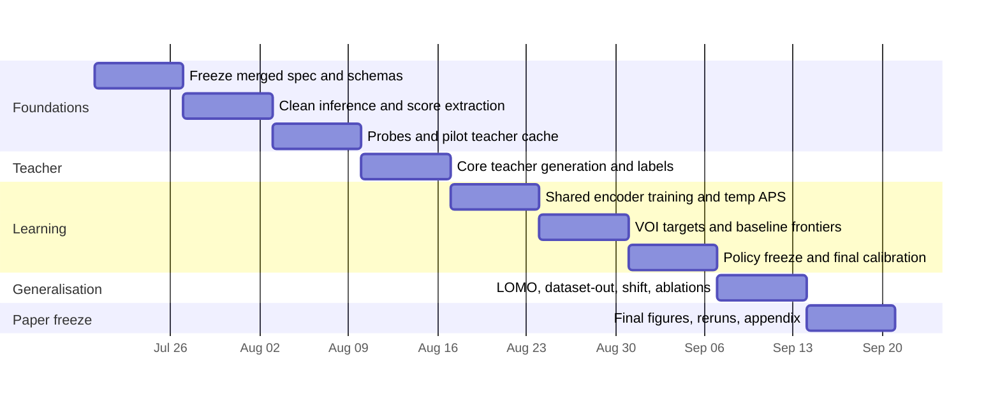
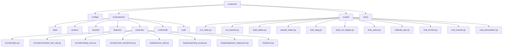

# Revised ICLR Implementation Plan for ProActive

## Executive summary

Your original document should remain the **execution backbone**. It already fixes the probe family, teacher-cache idea, budgeted acquisition, per-budget APS calibration, dataset suite, held-out shift tests, and repository/training scaffold. The professor’s document should be treated as a **methodological override**: it changes the paper framing from “cheap diagnosis” to **active diagnostic measurement**, replaces the GRU as the main evidence encoder with **permutation-invariant set encoders**, adds **permutation-drift experiments** as a first-class result, strengthens baselines, and reopens the question of whether the six-way class should remain the scientific primary target. fileciteturn0file0L28-L43 fileciteturn0file1L5-L15 fileciteturn0file1L20-L31

The implementation-ready compromise that best merges both documents is this: keep the original **teacher, probes, budgets, state-sampling pipeline, and conformal reporting machinery**, but refactor the learning stack so that **Deep Sets is the default main encoder**, **masked-slot MLP is the cheapest invariant control**, **GRU stays as a serious baseline**, and **Set Transformer is optional unless probe interactions clearly matter**. This follows the professor’s ranking of encoder roles and preserves the original project’s execution realism. fileciteturn0file1L510-L574 fileciteturn0file1L588-L617

On targets, the cleanest merge is **dual-head training with asymmetric importance**: make the **three source bits** the main scientific head used for learning and analysis, keep the **six-way mapped label** as the human-readable reporting/calibration head, and explicitly say that the six-way output is a compressed presentation layer over richer behavioural evidence. That preserves your original six-way auditability while aligning the learning objective with the professor’s source-bit-centric proposal. fileciteturn0file0L47-L53 fileciteturn0file1L577-L605

Operationally, Weeks 1–4 from your original plan remain mostly intact. The real changes begin in Weeks 5–8: instead of a single GRU-centred stack, you now need a **shared-state interface** over four encoder conditions, a new **permutation evaluation script**, and a stricter **main-result hierarchy** centred on frontier quality, calibration efficiency, and robustness under permutation, model-family shift, and dataset shift. The mandatory additions are realistic within nine weeks if you treat Set Transformer, HALP, and BCEA-style baselines as **optional expansion**, not critical path. fileciteturn0file0L400-L449 fileciteturn0file1L618-L656 citeturn6academia48turn6academia49

## What remains and what changes

The merged rule is simple: **keep the data-and-systems spine, replace the encoder-and-paper spine**.

| Original-plan section | Merged decision | Why |
|---|---|---|
| Project framing | **Modify** | Shift from “cheap HalluPrism-like diagnosis” to **active diagnostic measurement under cost**. |
| Probe family and STOP action | **Keep** | The original atomic probe set is already aligned with HalluPrism-style behavioural measurements. |
| Teacher cache | **Keep** | Full-evidence teacher cache is still the right substrate for offline VOI training. |
| Budgets and cost model | **Keep** | Budgeted acquisition remains central in both documents. |
| Dataset split logic | **Keep** | Grouped train/val/cal/test split still fits conformal calibration and leakage control. |
| Six-way target as sole primary target | **Replace with dual-head design** | Use source bits for primary learning; six-way mapping for reporting and APS calibration. |
| GRU as main encoder | **Replace** | GRU becomes a baseline; Deep Sets becomes the main model. |
| Policy learning via supervised counterfactual VOI | **Keep** | The professor strengthens this framing rather than replacing it with RL. |
| APS per budget | **Keep, but clarify** | Calibration must happen on the **full frozen post-acquisition pipeline**. |
| Existing baselines | **Keep and expand** | Add masked-slot MLP, GRU-as-formal-baseline, permutation-augmented variants, optional HALP/BCEA. |
| Evaluation | **Expand** | Add permutation drift, leave-one-dataset-out if feasible, and stronger transfer claims discipline. |
| Weekly plan Weeks 1–4 | **Mostly keep** | These are data/teacher/foundation weeks and remain sound. |
| Weekly plan Weeks 5–9 | **Rewrite** | Encoder family, permutation study, and dual-head calibration now change the downstream plan. |

This mapping follows your original frozen scope on probes, datasets, budgets, and teacher construction, plus the professor’s explicit recommendation that masked MLP be the cheap invariant control, Deep Sets be the main model, Set Transformer be the interaction-aware upgrade, and GRU remain only the strong baseline/pilot. fileciteturn0file0L28-L43 fileciteturn0file1L510-L574

The one design choice that should **not** remain frozen exactly as written in your original plan is the target hierarchy. Your document fixes the six-way label as the primary conformal object, whereas the professor’s design makes the source-bit evidence head central and treats the simplified label as optional reporting. The merged plan should therefore freeze the following hierarchy in Week 1: **primary training head = three source bits; auxiliary regression head = teacher signature; reporting/calibration head = six-way label**. This is the best balance between scientific fidelity and implementation risk. fileciteturn0file0L47-L53 fileciteturn0file1L594-L605

## Revised nine-week execution plan

The timeline below assumes the compute type, exact GPU count, and final sample caps remain **unspecified** in the supplied documents. The GPU-hour and storage estimates are therefore planning ranges, not claims of measured runtime.

The structure above keeps your original teacher-first pipeline but moves the professor’s encoder logic into the centre of Weeks 5–8. That is the lowest-risk merge. fileciteturn0file0L400-L449 fileciteturn0file1L618-L656

| Week | Focus | Deliverables | Dependencies | GPU-hours | Storage delta | Go or no-go gate | Fallback action |
|---|---|---|---|---:|---:|---|---|
| Week 1 | Freeze merged spec | Final target hierarchy; encoder interface; probe-token schema; split manifest; config schema | None | 0–5 | <1 GB | One config can instantiate GRU, masked MLP, Deep Sets, Set Transformer | If target debate persists, freeze source bits as training head and six-way as reporting head |
| Week 2 | Clean harness | Deterministic clean inference for all chosen models; score extraction; normalization tests | Week 1 | 15–30 | 2–4 GB | At least 2 models pass 50-example deterministic smoke suite | Defer the third model by one week; store only answer probability, entropy, margin, length |
| Week 3 | Probes and pilot cache | All atomic probes; relation applicability mask; pilot teacher cache; probe sanity histograms | Week 2 | 25–45 | 2–5 GB | Probe outputs show nontrivial flips/shifts without saturation | Disable Set Transformer from critical path if probe signal is weak |
| Week 4 | Core teacher and labels | Core teacher cache; source bits; six-way labels; state sampler v1; audit export | Week 3 | 80–140 | 8–15 GB | Two models fully cached; label histograms usable; no split leakage | Reduce sample caps on VizWiz and held-out data first |
| Week 5 | Shared diagnostic training | Train clean-only MLP, GRU, masked MLP, Deep Sets; temporary APS; first permutation pilot | Week 4 | 30–55 | 4–8 GB | Deep Sets is at least competitive with GRU on validation frontier; invariant encoders show near-zero drift | Keep GRU and Deep Sets only; move Set Transformer out of schedule |
| Week 6 | VOI and baselines | Realized VOI targets; random/fixed/uncertainty baselines; learned policies for GRU, masked MLP, Deep Sets | Week 5 | 25–45 | 3–6 GB | Deep Sets policy beats random and at least one fixed order at matched budget | Narrow to budgets {1,2,4}; postpone leave-one-dataset-out |
| Week 7 | Final policy and calibration | Freeze main stack; per-budget APS on six-way head; source-bit reporting tables; optional Set Transformer | Week 6 | 25–45 | 2–5 GB | Main Deep Sets stack beats GRU on either frontier quality or equal frontier with much lower drift | Keep Set Transformer appendix-only or cancel it entirely |
| Week 8 | Transfer and robustness | Leave-one-model-out; optional leave-one-dataset-out; PRE-HAL/IllusionBench; ablations; latency | Week 7 | 45–90 | 3–6 GB | Learned policy remains above clean-only on LOMO; shift still shows useful empirical coverage | Reframe claim as within-distribution plus limited transfer |
| Week 9 | Freeze and paper assets | Final figures/tables; seed reruns; appendix; risk memo; source pack | Week 8 | 10–25 | 1–2 GB | Reproducible frozen stack with no leakage | Cut optional baselines and keep only must-run tables |

This revised plan preserves the original teacher-first build order, but it deliberately replaces the original “diagnostic GRU week” with a **shared encoder bake-off week**. That is the single most important schedule correction. The cumulative storage target should be planned as **35–60 GB free space**, because permutation logs and extra checkpoints will add modest overhead beyond the original JSONL caches. The total planning budget is roughly **255–480 GPU-hours**, with the teacher-cache stage still dominating. fileciteturn0file0L308-L352 fileciteturn0file0L400-L449

## Experiment matrix and implementation checklist

### Experiment matrix

The matrix below is deliberately **minimal-but-reviewer-safe**. It avoids a full Cartesian explosion while still matching the professor’s methodological asks.

| Condition | Encoder | Acquisition policy | Datasets | Metrics | Priority |
|---|---|---|---|---|---|
| Scalar confidence | None | No acquisition | Core + shift | AUROC incorrect-vs-correct, six-way set size baseline, coverage baseline | Must-run |
| Clean-only MLP | None | No acquisition | Core + shift | Source-bit micro/macro F1, six-way APS coverage/size | Must-run |
| Random | Shared diagnostic head | Random legal probe | Core | Cost, frontier, set size, coverage | Must-run |
| Fixed orders | Shared diagnostic head | Blank-first, visual-first, grounding-first, relation-first | Core | Cost–diagnostic frontier, per-dataset robustness | Must-run |
| Uncertainty-greedy | Shared diagnostic head | Myopic heuristic | Core | Frontier, stop behaviour | Must-run |
| GRU | GRU | Learned VOI | Core + LOMO + shift | Frontier, calibration, transfer, permutation drift | Must-run |
| Masked-slot MLP | Canonical-slot MLP | Learned VOI | Core + LOMO + shift | Frontier, calibration, transfer, permutation drift | Must-run |
| Deep Sets | Deep Sets | Learned VOI | Core + LOMO + shift | **Main result**: frontier, transfer, calibration, drift | Must-run |
| Set Transformer | Set Transformer | Learned VOI | Core + selected hard slices | Mixed-case gains, relation-heavy cases, drift | Optional unless clearly useful |
| Full teacher | Teacher | Full probes | Core + shift | Upper-bound quality, cost reference | Must-run |
| Oracle next action | Any | Oracle from cache | Core | One-step ceiling | Must-run |
| Oracle best subset | Any | Best subset up to budget | Core | Upper frontier bound | Must-run |
| HALP | One-pass probe on internals | No acquisition | One or two models only | AUROC, cost comparison | Optional |
| BCEA-style comparator | Verification-style | Answer/abstain/acquire | One claim-compatible slice | Coverage vs abstention | Optional |

The central claim should be supported by four result clusters: **frontier quality**, **permutation stability**, **LOMO transfer**, and **calibration efficiency**. The professor’s memo makes clear that a mere in-distribution accuracy gain over GRU would be too weak. fileciteturn0file1L618-L646 fileciteturn0file1L647-L656

### Metrics that must be reported

| Metric family | Required metrics | Meaning in this project |
|---|---|---|
| Diagnostic quality | Source-bit micro-F1, source-bit macro-F1, Hamming loss, six-way macro-F1 | Whether the model diagnoses the right behavioural pattern |
| Calibrated sets | Coverage@90, Coverage@95, average set size, singleton rate | Whether the output is reliable and informative |
| Cost | Mean additional forward passes, stop rate, probe-count histogram | Whether the policy is actually budget-aware |
| Transfer | Leave-one-model-out, optional leave-one-dataset-out, IllusionBench, PRE-HAL | Whether the policy generalizes beyond the development slice |
| Permutation drift | Jensen–Shannon divergence, Jaccard disagreement, next-action agreement, hidden-state distance, calibration drift | Whether the encoder respects unordered evidence |
| Efficiency | Normalized latency vs clean pass, checkpoint size | Whether accuracy gains are practical |

Deep Sets should win the argument if it maintains or improves frontier quality **while** collapsing permutation drift relative to GRU. That inference is strongly grounded in the theoretical fit of Deep Sets and Set Transformer to unordered evidence. citeturn0academia49turn0academia48

### Repository refactor

Your original repository layout is already good enough; the necessary change is to split the old monolithic `encoders.py` into **encoder-specific modules** and to introduce a new `eval_permutation.py` path. The rest of the teacher/data/calibration scaffold can remain structurally similar. fileciteturn0file0L452-L476

### Concrete implementation checklist

| Area | Concrete decision | Immediate code impact |
|---|---|---|
| State representation | Replace ordered probe-prefix-only view with **shared evidence-state interface** | Add encoder-agnostic `EvidenceState` dataclass |
| Probe token schema | Use a single probe token format for all encoders | New tokenizer/featurizer reused by GRU, Deep Sets, Set Transformer |
| Heads | Train three heads: source bits, six-way reporting, teacher-signature regression | Split head modules; keep VOI head separate |
| Masked-slot MLP | Canonical 7 probe slots + acquisition bits | Slot tensor builder |
| Deep Sets | Per-probe token MLP + sum pooling + post-pooling MLP | `deep_sets.py` |
| Set Transformer | Small induced-attention block count only | `set_transformer.py`, but keep optional |
| GRU | Retain as baseline only | `gru.py` |
| VOI training | Keep offline realized-VOI training from teacher cache | Reuse `build_voi_targets.py` with encoder flag |
| Calibration | Calibrate only after full encoder + policy are frozen | Keep `calibrate_aps.py`, but feed post-acquisition states |
| Permutation study | New standalone evaluation path | `eval_permutation.py` and permutation log artifact |
| Transfer | Keep LOMO; add leave-one-dataset-out only if schedule allows | Extend `eval_transfer.py` |
| Logging | Log both bit-level and six-way predictions everywhere | Unified eval schema |

### Data caches and file contracts

The original teacher cache should stay JSONL-based. Do **not** store full logits by default; keep aggregate answer statistics and normalized answers only. That choice is already embedded in your original plan and remains right for this merged version. fileciteturn0file0L308-L352

Recommended cache stack:

| Artifact | Purpose |
|---|---|
| `clean_*.jsonl` | Clean pass features and normalized answers |
| `teacher_*.jsonl` | Probe outcomes for all atomic probes |
| `labels_*.jsonl` | Source bits, six-way labels, teacher signature |
| `states_*.jsonl` | Partial states sampled for supervised training |
| `voi_*.jsonl` | Realized per-action VOI targets |
| `aps_thresholds.json` | Final per-budget thresholds for six-way reporting head |
| `perm_eval_*.jsonl` | Per-subset permutation outputs and drift metrics |

### Probe-token schema

A single probe event should be featurized as:

\[
e_a = [
\mathrm{Emb}(a),
\mathbf{1}_{\text{acquired}},
\mathbf{1}_{\text{applicable}},
\mathbf{1}_{\text{flip}},
\Delta c,
m_{\text{exact}},
m_{\text{sem}},
\Delta H,
\Delta m,
c(a),
\mathrm{family}(a),
\mathrm{int}(g(x), o_a)
].
\]

In plain language, this means: every probe contributes a small packet saying **what probe it was, whether it was legal, whether it changed the answer, by how much confidence changed, whether the new answer matches semantically, how expensive the probe is, and how it interacts with the clean answer state**. This is exactly the sort of “behavioural evidence token” the professor is asking for, and it also aligns with the original cache fields you already planned to store. fileciteturn0file0L348-L370 fileciteturn0file1L588-L605

## Simplified concepts and LaTeX-ready equations

### Why Deep Sets is the right default

A GRU assumes that the order of inputs matters. That is perfect for sentences or time series. Your probes are different: blank image, blur, crop, grounding, and relation swap are all **independent measurements on the same original example**. If the model has seen the same subset of probes, the diagnosis should ideally be the same no matter which one was observed first. That is exactly the inductive bias Deep Sets was designed for. fileciteturn0file1L32-L57 citeturn0academia49turn0academia48

Use this as the main encoder equation:

\[
h_t \;=\; \rho\!\left(\sum_{a \in S_t} \phi(e_a)\right),
\qquad
z_t \;=\; [\,h_t \,;\, g(x) \,;\, \mathrm{Emb}(B_t)\,].
\]

Here, \(S_t\) is the set of acquired probes by step \(t\), \(e_a\) is the token for one acquired probe, \(\phi\) is a small per-probe embedding network, and \(\rho\) is a post-pooling network. The sum is what makes the representation permutation-invariant. If you swap the order of the same evidence tokens, the sum stays the same. citeturn0academia49

### What value of information means here

Value of information is just a learned answer to one question: **“If I spend one more probe, how much more useful will my diagnosis become?”** Your original plan already operationalized this as a combination of **diagnostic-set shrinkage**, **diagnostic-loss reduction**, and **probe cost**; that structure should remain. fileciteturn0file0L160-L229

A clean implementation-friendly target is:

\[
y_{\mathrm{VOI}}(x,h_t,a)
=
\Bigl(
|\Gamma_{\alpha,B_t}^{\mathrm{tmp}}(h_t)|-
|\Gamma_{\alpha,B_t}^{\mathrm{tmp}}(\hat h_t^{\,a})|
\Bigr)
+
\eta\Bigl(L_{\mathrm{diag}}(h_t)-L_{\mathrm{diag}}(\hat h_t^{\,a})\Bigr)
-
\lambda_{B_t} c(a).
\]

The first term says “does this probe make the calibrated set smaller?”, the second says “does it improve diagnosis even when set size does not move?”, and the third says “is the improvement worth the cost?” Your original plan already has the right logic; the professor mainly changes the state encoder feeding this target. fileciteturn0file0L160-L229

### The one-step VOI regret bound

This is the modest theory claim worth keeping because it is true, readable, and useful.

Assume the true one-step value is \(V(h,a)\), the estimated value is \(\hat V(h,a)\), and the estimation error is uniformly bounded:

\[
\bigl|\hat V(h,a)-V(h,a)\bigr| \le \varepsilon
\qquad
\text{for all legal } a.
\]

Let

\[
a^\star = \arg\max_a V(h,a),
\qquad
\hat a = \arg\max_a \hat V(h,a).
\]

Then the one-step regret is at most

\[
V(h,a^\star)-V(h,\hat a) \le 2\varepsilon.
\]

The proof is a two-line comparison: the chosen action can only be worse than optimal by the sum of the estimation errors on the optimal action and on the chosen action. This is not a grand theorem; it is exactly the kind of honest, modest proposition reviewers trust. It also matches the professor’s preference for a simple solve-then-learn story rather than a complicated RL claim. citeturn6academia49turn0academia48

### Why calibration must happen after acquisition

This is the calibration rule you should state very explicitly in the paper:

\[
\text{Freeze }(\pi,\theta)\text{ first, then calibrate on }
s_{\text{final}}(x;\pi,\theta).
\]

In words: once probe acquisition itself changes the model state and score distribution, you must calibrate the **final stopped pipeline**, not an earlier clean-pass score. This is exactly the lesson from adaptive conformal classification and recent budgeted evidence acquisition work. citeturn7academia24turn7academia25turn6academia49

For the six-way reporting head, APS remains a good first-choice method:

\[
s_i
=
\sum_{j=1}^{\rho_i} \pi_{(j)}(x_i),
\qquad
q^\alpha
=
\operatorname{Quantile}_{\lceil (n+1)(1-\alpha)\rceil/n}(s_1,\dots,s_n),
\]

\[
\Gamma_\alpha(x)
=
\left\{
y :
\sum_{j:\pi_{(j)}(x)\ge \pi_y(x)} \pi_{(j)}(x)
\le q^\alpha
\right\}.
\]

Keep APS in the mainline. Use RAPS only as a fallback appendix if sets are too large. citeturn7academia24turn7academia25

## Resource-bounded selection and paper assets

### Minimal resource-bounded configuration

If your adapters, prompts, and scoring code are already partly built around the original trio, the most sensible minimal configuration is:

| Category | Recommended minimal set | Why |
|---|---|---|
| Models | **Qwen3-VL-8B-Instruct, Gemma-4-E4B, InternVL3-9B** | Minimizes replatforming cost while retaining architectural diversity |
| Core training datasets | **HallusionBench, POPE or RePOPE, VizWiz-VQA, VSR, GQA relation slice** | Matches both documents and gives object, illusion, poor-image, and relation coverage |
| Held-out shift datasets | **PRE-HAL, IllusionBench** | Best stress tests for reasoning-heavy and illusion-heavy transfer |
| Optional extra validation | **AMBER** | Cheap multidimensional secondary validation surface |

This choice is conservative, but it is the right call if the project lead cares more about making the submission window than about re-anchoring every model family. Your original plan already uses the first three models, and the professor explicitly allows Qwen3-VL and Gemma as practical substitutions even while preferring Qwen2.5-VL, Molmo, InternVL3, and LLaVA-family models from a public-primary-source standpoint. fileciteturn0file0L28-L43 fileciteturn0file1L631-L637 citeturn8search4turn8search3turn8search2turn3academia48turn3academia49turn2academia47

### Expanded configuration

If you have budget for extra engineering, the expanded list should be:

| Category | Expanded set | When to use it |
|---|---|---|
| Models | **Qwen2.5-VL, Molmo, InternVL3**, plus **LLaVA-OneVision** as held-out family | Use if you are not locked into the original adapters or want stronger reviewer-facing external anchoring |
| Extra evaluation | **AMBER** and optional claim-style BCEA comparison slice | Use if frontier and calibration are already stable by Week 7 |

This expanded selection is more reviewer-friendly scientifically, because Qwen2.5-VL, Molmo, InternVL3, and LLaVA-OneVision all have strong primary-source support as modern open multimodal families. But it costs real time: new adapters, new scoring quirks, and more teacher-cache passes. citeturn0search2turn3academia51turn3academia50turn4academia46

### Recommended main figures and tables

The main paper should probably contain **five** central visual assets.

| Asset | Main text or appendix | Why |
|---|---|---|
| Method overview diagram: image, probe controller, set encoder family, calibrated output | Main | Defines the paper’s object quickly |
| Cost–diagnostic frontier comparing clean-only, fixed, GRU, masked MLP, Deep Sets, full teacher | Main | This is the central empirical result |
| Permutation-drift figure across encoders | Main | This is the cleanest scientific validation of the encoder choice |
| Transfer table: LOMO, optional leave-one-dataset-out, PRE-HAL, IllusionBench | Main | Shows the architecture choice matters beyond the dev split |
| Calibration table: coverage and mean set size at 90% and 95% | Main | Makes the reliability story concrete |

The appendix should absorb the rest: per-dataset breakdowns, per-budget tables, action-frequency plots, RAPS ablation, Set Transformer details, white-box HALP comparison if included, label-audit materials, and latency details. This split follows the professor’s stronger framing around active measurement, invariance, and robustness rather than one-off ablations. fileciteturn0file1L20-L31 fileciteturn0file1L647-L656

### Risks, mitigations, and extra time

| Risk | Why it matters | Mitigation | Extra time if triggered |
|---|---|---|---:|
| Target ambiguity survives into training | Creates mismatched metrics and paper confusion | Freeze dual-head semantics in Week 1 | 2–3 days |
| Shared encoder refactor grows messy | Blocks Week 5 | Create one evidence-state interface first, then plug encoders into it | 3–4 days |
| Permutation study becomes too large | Eats evaluation time | Sample subsets and cap permutations at \(P=10\) | 2–3 days |
| Set Transformer tuning churn | Risks blowing Week 7 | Keep it optional until Deep Sets is already stable | 3–5 days |
| White-box baselines expand scope | HALP/BCEA can easily drift out of control | Restrict to one or two models or move to appendix | 4–7 days |
| Calibration leakage | Fatal for claims | Freeze encoder+policy before any final calibration pass | 1–2 days |
| Teacher cache overruns | Still the dominant systems risk | Cap VizWiz first, then optional datasets, then fourth model | 3–5 days |

The practical estimate is:

- **Mandatory professor additions only**: roughly **+1.5 to 2 weeks** over the original GRU-centred plan.
- **Mandatory additions plus Set Transformer, HALP, and BCEA comparators**: roughly **+2.5 to 3.5 weeks**.

That is why the critical-path recommendation is: **Deep Sets main, masked MLP control, GRU baseline, Set Transformer optional, HALP/BCEA optional**. fileciteturn0file1L510-L574 fileciteturn0file1L618-L656 citeturn6academia48turn6academia49

### Prioritized source list

The most useful source stack for writing and implementing this paper is:

| Priority | Source | Use |
|---|---|---|
| Highest | Your original implementation plan fileciteturn0file0L28-L43 | Execution backbone, probes, teacher cache, repo scaffold |
| Highest | Professor feedback memo fileciteturn0file1L5-L15 | Encoder decision, framing, permutation study, stronger baselines |
| Highest | Deep Sets citeturn0academia49 | Theoretical basis for unordered evidence encoding |
| Highest | Set Transformer citeturn0academia48 | Interaction-aware invariant encoder |
| High | Classification with Valid and Adaptive Coverage citeturn7academia24 | APS-style conformal classification |
| High | Uncertainty Sets for Image Classifiers using Conformal Prediction citeturn7academia25 | RAPS fallback and set-efficiency framing |
| High | Look Again Before You Abstain citeturn6academia49 | Post-acquisition calibration condition |
| High | HallusionBench citeturn1academia48 | Core mixed-failure benchmark |
| High | POPE citeturn1academia49 | Object-hallucination probing |
| High | VizWiz-VQA citeturn1academia51turn1search0 | Poor-image and answerability stress |
| High | VSR citeturn2academia49 | Spatial-relation benchmark |
| High | GQA citeturn4academia47turn4search1 | Scene-graph-based relation slicing |
| High | PRE-HAL citeturn3academia49 | Reasoning-heavy hallucination shift |
| High | IllusionBench citeturn2academia47 | Illusion-heavy shift and trap cases |
| Medium | AMBER citeturn3academia48 | Low-cost multidimensional validation |
| Medium | Qwen2.5-VL report citeturn0search2 | Strong modern anchor family |
| Medium | Molmo and PixMo citeturn3academia51 | Fully open-data/open-weight family |
| Medium | InternVL3 report and model card citeturn3academia50turn8search2 | Architecturally distinct open model |
| Medium | HALP citeturn6academia48 | Optional strong one-pass baseline |
| Medium | Qwen3-VL and Gemma official cards citeturn8search4turn8search3 | Practical support for the original model stack |

The final recommendation is therefore crisp: **do not rewrite the project from scratch**. Keep the original data, teacher, and systems plan; refactor the learning core around **Deep Sets + masked MLP + GRU baseline**; freeze a **dual-head target design** in Week 1; and make the paper stand on **frontier quality, permutation stability, calibration efficiency, and transfer**, not on a simple GRU-to-Deep-Sets swap. fileciteturn0file0L28-L43 fileciteturn0file1L20-L31