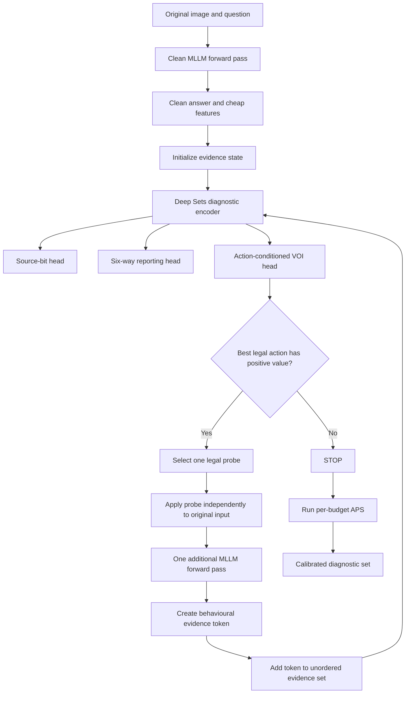
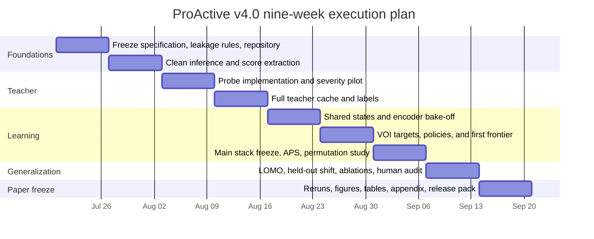

# ProActive v4.0 — Complete ICLR Implementation Plan

> **Purpose:** This is the single execution document for the ProActive project. It merges the complete engineering detail of the earlier plan with the professor’s methodological changes. It is written to be used directly by the project team and a coding agent.

> **Central design decision:** ProActive performs **active diagnostic measurement under a probe budget**. Probe observations are treated as an **unordered set of behavioural evidence**. **Deep Sets is the main encoder**, **masked-slot MLP is the invariant control**, **GRU is the order-sensitive baseline**, and **Set Transformer is a pilot-gated interaction-aware ablation**.

---

## 1. Executive summary

ProActive studies whether a multimodal large language model can be diagnosed reliably without running every possible diagnostic probe. The system begins with one clean model response, decides which additional probe is most useful, observes the probe result, updates its diagnostic state, and either acquires another probe or stops. The final output is not a single overconfident diagnosis. It is a **calibrated set of plausible behavioural failure states**.

The paper should be framed around four contributions:

1. **Active diagnostic measurement:** learn which behavioural probe to acquire next under a limited forward-pass budget.
2. **Unordered evidence modelling:** represent the acquired probe outcomes as a set rather than as an artificial sequence.
3. **Calibrated diagnostic sets:** return a set with target marginal coverage after the complete acquisition policy has been frozen.
4. **Robust evaluation:** compare cost–diagnostic frontiers, permutation stability, leave-one-model-out transfer, held-out dataset shift, and strong fixed or oracle baselines.

The implementation keeps the strongest parts of the earlier plan:

- full-probe teacher cache;
- atomic probes and a STOP action;
- offline counterfactual value-of-information learning;
- grouped train, validation, calibration, and test splits;
- per-budget APS calibration;
- HallusionBench, POPE or RePOPE, VizWiz-VQA, VSR, and a GQA relation slice;
- PRE-HAL and IllusionBench as held-out stress datasets;
- Qwen3-VL-8B-Instruct, Gemma-4-E4B-it, and InternVL3-9B;
- detailed repository, logging, testing, compute, and weekly execution structure.

The main methodological changes are:

- **Deep Sets replaces GRU as the main state encoder.**
- **GRU remains a mandatory baseline**, not the primary method.
- **Masked-slot MLP becomes the cheapest exact invariant control.**
- **Set Transformer is trained only if the pilot shows useful probe interactions.**
- **Three source bits are the main scientific learning target.**
- **The six-way state remains the human-readable reporting and APS calibration target.**
- **Permutation-drift evaluation becomes a main-paper experiment.**
- **Dataset ID and model ID are excluded from the main learner and used only in diagnostic controls.**
- **Calibration is performed only after the encoder and acquisition policy are frozen.**

The main paper succeeds only if ProActive achieves a better cost–diagnostic frontier than random and fixed acquisition, preserves coverage with smaller diagnostic sets, eliminates artificial order sensitivity relative to GRU, and retains useful performance under leave-one-model-out evaluation.

---

## 2. Paper framing

### 2.1 One-sentence problem statement

Given a clean multimodal model response and a limited budget, ProActive adaptively selects diagnostic probes and returns a calibrated set of plausible behavioural failure states while treating the accumulated probe evidence as unordered.

### 2.2 Research questions

- **RQ1 — Coverage:** Can active probing reduce diagnostic uncertainty while maintaining target coverage?
- **RQ2 — Budget:** Can a small number of probes recover most of the diagnostic quality of the full-probe teacher?
- **RQ3 — Adaptivity:** Can a learned acquisition policy outperform random and fixed probe schedules at matched cost?
- **RQ4 — Representation:** Does a permutation-invariant evidence encoder outperform or match an order-sensitive GRU while eliminating permutation drift?
- **RQ5 — Generalization:** Does the learned policy transfer to unseen MLLMs and held-out datasets?

### 2.3 Intended claims

The paper may claim the following only when supported by the corresponding experiments:

1. Active acquisition improves the cost–diagnostic frontier over clean-only, random, and fixed-order baselines.
2. Deep Sets provides a better inductive bias for independently acquired behavioural probes because the diagnosis is stable to evidence ordering.
3. The final stopped pipeline attains approximately nominal marginal coverage on the grouped in-distribution test split.
4. The policy shows empirical transfer to held-out models and stress datasets.
5. The full teacher remains a useful upper-bound reference but is not required at deployment time.

### 2.4 Claims the paper must not make

- Do not claim that the source bits are true causal failure sources.
- Do not claim universal coverage under model-family or dataset shift.
- Do not claim that Deep Sets is universally superior to every sequence model.
- Do not claim that the benchmark failure family is independent of dataset identity.
- Do not claim that probe order never matters when probes are applied sequentially to already modified inputs.
- Do not use dataset ID or model ID as an input to the main ProActive policy.
- Do not call the six-way labels clinical, causal, or ground-truth failure diagnoses. They are rule-backed behavioural states derived from probe outcomes.

### 2.5 Critical assumption behind permutation invariance

Permutation invariance is correct only because every probe is applied independently to the **same original image–question pair**. The blank-image, blur, crop, brightness, noise, grounding, and relation probes must not be chained on top of one another.

If a future variant applies the second transformation to the output of the first transformation, then order changes the actual observation and a set encoder would no longer represent the problem correctly.

---

## 3. Frozen scope, pilot-gated choices, and forbidden shortcuts

### 3.1 Frozen project decisions

| Item | Final decision |
|---|---|
| Project name | **ProActive** |
| Main framing | Active diagnostic measurement under cost |
| Main evidence representation | Unordered set of acquired probe observations |
| Main encoder | **Deep Sets** |
| Exact invariant control | **Masked-slot MLP** |
| Order-sensitive baseline | **GRU** |
| Interaction-aware model | **Set Transformer**, pilot-gated |
| Main scientific target | Three behavioural source bits |
| Reporting and calibration target | Six-way behavioural state |
| Continuous auxiliary target | Full-teacher signature |
| Teacher | Full cache of all legal probe outcomes |
| Acquisition learning | Offline supervised counterfactual VOI |
| Actions | blank, blur, crop, brightness, noise, grounding, relation, STOP |
| Primary cost | Additional MLLM forward passes |
| Secondary cost | Normalized GPU latency |
| Budgets | $B \in \{1,2,3,4,\text{full}\}$ |
| Calibration | Split conformal APS per budget at 90% and 95% |
| Split | Grouped 70/10/10/10 train, validation, calibration, test |
| Core datasets | HallusionBench, POPE or RePOPE, VizWiz-VQA, VSR, GQA relation slice |
| Held-out datasets | PRE-HAL, IllusionBench |
| Main models | Qwen3-VL-8B-Instruct, Gemma-4-E4B-it, InternVL3-9B |
| Main compute | 4 × A6000 GPUs |
| Final decision deadline | Main architecture and labels frozen by end of Week 3 |

### 3.2 Pilot-gated additions

| Addition | Gate |
|---|---|
| Set Transformer | Train only if Deep Sets loses on mixed or relation-heavy validation slices, or a measurable interaction signal appears |
| RAPS | Add only if APS sets are too large at nominal coverage |
| AMBER | Add only after the core evaluation is complete |
| Fourth held-out model family | Add only if teacher generation and adapters are on schedule by Week 7 |
| Leave-one-dataset-out | Run after leave-one-model-out if compute and time remain |
| HALP-style baseline | Restrict to one or two compatible models and move to appendix |
| BCEA-style comparator | Use only on a claim-compatible slice |
| Permutation-consistency regularization | Apply mainly to the GRU baseline as an order-sensitivity repair experiment |

### 3.3 Forbidden shortcuts

The following are not allowed:

- using test data to choose label thresholds;
- using calibration data to train the encoder or policy;
- using dataset ID or model ID as a main-model feature;
- exposing unacquired probe outcomes in a partial state;
- splitting different outputs from the same underlying image–question pair across train and test;
- selecting the best severity using final test performance;
- reporting only the best budget, seed, model, or dataset;
- silently removing failed examples;
- calibrating before the acquisition policy is frozen;
- treating benchmark family as a training label for the main model;
- running a large experiment before a small deterministic pilot passes.

---

## 4. End-to-end system overview

### 4.1 Method flowchart



### 4.2 Plain-language walkthrough

1. Run the MLLM once on the original image and question.
2. Extract cheap information such as answer probability, entropy, margin, answer length, and image-quality metadata.
3. Start with an empty set of acquired probe observations.
4. Encode the current evidence using Deep Sets.
5. Predict:
   - the three source-bit probabilities;
   - the six-way reporting probabilities;
   - the value of each legal next probe.
6. Run the highest-value probe when its predicted benefit is greater than its cost.
7. Add the new probe result to the evidence set.
8. Repeat until the policy selects STOP or the budget is exhausted.
9. Apply the APS threshold for that maximum budget to the final six-way probabilities.
10. Return the calibrated set and a trace of which probes were used.

### 4.3 Training flowchart

```mermaid
flowchart LR
    A[Core datasets and MLLMs] --> B[Clean inference cache]
    B --> C[Full independent probe cache]
    C --> D[Teacher source bits, six-way state, continuous signature]
    D --> E[Grouped partial-subset sampler]
    E --> F[Train clean MLP, GRU, masked MLP, Deep Sets]
    F --> G[Temporary validation APS]
    G --> H[Build realized counterfactual VOI targets]
    H --> I[Train acquisition policies]
    I --> J[Choose main stack on validation]
    J --> K[Freeze encoder and policy]
    K --> L[Final calibration-split APS]
    L --> M[Test frontier, permutation, transfer, shift, ablations]
```



---

## 5. Formal problem statement

### 5.1 Instance and clean response

For MLLM $M$, image $I$, question $q$, clean answer $\hat y$, and gold answer $y$, define

$$
x = (I,q,\hat y,y,M).
$$

The main learner may use $I$, $q$, $\hat y$, and features derived from the clean response. The model identity $M$ is retained in the record for grouping and analysis but is not provided as an input feature to the main policy.

### 5.2 Action space

Let the non-stop probe set be

$$
\mathcal{P}
=
\{
\text{blank},
\text{blur},
\text{crop},
\text{brightness},
\text{noise},
\text{grounding},
\text{relation}
\}.
$$

The complete action space is

$$
\mathcal{A} = \mathcal{P} \cup \{\text{STOP}\}.
$$

Every non-stop action is applied independently to the original instance and produces one new observation.

### 5.3 Clean features

The clean feature vector is

$$
g(x)
=
\left[
c,
\bar H,
\bar m,
\ell,
\operatorname{IQA},
\operatorname{qtype},
\operatorname{answerability},
\operatorname{relation\_available}
\right].
$$

Here:

- $c$ is normalized answer probability;
- $\bar H$ is mean token entropy;
- $\bar m$ is mean token margin;
- $\ell$ is answer length;
- $\operatorname{IQA}$ contains image-quality features;
- $\operatorname{qtype}$ is a coarse question-type feature derived from the text;
- $\operatorname{answerability}$ is a test-time-available image or question cue, not a gold label;
- $\operatorname{relation\_available}$ says whether relation swapping is legal.

Dataset ID, model ID, gold correctness, teacher bits, and unacquired probe results are excluded.

### 5.4 Probe observation

For action $a$, the cached probe observation is

$$
o_a(x)
=
\left(
\tilde y_a,
\operatorname{flip}_a,
\Delta c_a,
\Delta H_a,
\Delta m_a,
m_a^{\text{exact}},
m_a^{\text{sem}},
\operatorname{app}_a,
\tau_a
\right).
$$

The fields mean:

- $\tilde y_a$: normalized probe answer;
- $\operatorname{flip}_a$: whether the normalized answer changed from the clean answer;
- $\Delta c_a$: confidence change;
- $\Delta H_a$: entropy change;
- $\Delta m_a$: token-margin change;
- $m_a^{\text{exact}}$: exact normalized agreement;
- $m_a^{\text{sem}}$: semantic agreement;
- $\operatorname{app}_a$: whether the action is legal;
- $\tau_a$: probe metadata such as severity.

### 5.5 Evidence token

Each acquired probe becomes one fixed-format token:

$$
e_a
=
\operatorname{MLP}_{\text{probe}}
\left(
\left[
\operatorname{Emb}(a),
\mathbf{1}_{\text{acquired}},
\mathbf{1}_{\text{applicable}},
\mathbf{1}_{\text{flip}},
\Delta c_a,
\Delta H_a,
\Delta m_a,
m_a^{\text{exact}},
m_a^{\text{sem}},
c(a),
\operatorname{severity}(a)
\right]
\right).
$$

In simple terms, the token says what test was run, whether it was legal, whether the answer changed, how the model’s confidence changed, whether the new answer still matched, and how expensive the test was.

### 5.6 Evidence state

At step $t$, let

$$
S_t \subseteq \mathcal{P}
$$

be the set of acquired probes and let

$$
E_t = \{e_a : a \in S_t\}
$$

be the corresponding set of evidence tokens.

The remaining budget is

$$
B_t = B - \sum_{a \in S_t} c(a).
$$

The main state is a function of the clean features, the unordered evidence set, and the remaining budget:

$$
z_t = F_\theta\!\left(g(x),E_t,B_t\right).
$$

---

## 6. Diagnostic targets and teacher construction

### 6.1 Primary source-bit target

The main scientific target is

$$
b(x)
=
\left(
b_V,
b_L,
b_A
\right)
\in \{0,1\}^3.
$$

The bits describe behavioural evidence:

- $b_V$: visual fragility;
- $b_L$: language-prior persistence;
- $b_A$: alignment or relation instability.

They are not claimed to be independent causal sources.

### 6.2 Initial rule-backed bit definitions

The following thresholds are starting defaults. They must be frozen by the end of Week 3 using pilot sanity checks and human inspection, never final test performance.

Let $\mathcal{V}$ be the four canonical visual probe families: blur, crop, brightness, and noise.

$$
b_V
=
\mathbf{1}
\left[
\frac{1}{|\mathcal{V}|}
\sum_{a\in\mathcal{V}}
\operatorname{flip}_a
\ge 0.25
\;\lor\;
\frac{1}{|\mathcal{V}|}
\sum_{a\in\mathcal{V}}
|\Delta c_a|
\ge 0.15
\right].
$$

$$
b_L
=
\mathbf{1}
\left[
m_{\text{blank}}^{\text{sem}}=1
\;\land\;
\frac{c_{\text{blank}}}
{c_{\text{clean}}+\varepsilon}
\ge 0.8
\right].
$$

$$
b_A
=
\mathbf{1}
\left[
\operatorname{flip}_{\text{ground}}=1
\;\lor\;
|\Delta c_{\text{ground}}|\ge 0.15
\;\lor\;
\left(
\operatorname{relation\_available}=1
\land
\operatorname{swap\_invariance}=1
\right)
\right].
$$

For a relation-bearing true or false statement, `swap_invariance = 1` means that swapping the relation did not produce the logically expected answer change.

### 6.3 Six-way reporting target

Define

$$
\mathcal{F}
=
\{
\text{visual},
\text{language-prior},
\text{alignment},
\text{mixed},
\text{unclear},
\text{no-failure}
\}.
$$

The six-way reporting label $f(x)\in\mathcal{F}$ is assigned as follows:

- **no-failure:** clean answer is correct and $b_V+b_L+b_A=0$;
- **mixed:** at least two bits are active;
- **visual:** only $b_V=1$;
- **language-prior:** only $b_L=1$;
- **alignment:** only $b_A=1$;
- **unclear:** all remaining cases, including an incorrect clean answer with no sufficiently strong bit.

The six-way label is a compressed human-readable view of the richer bit target. It is the target used for APS because standard multiclass APS is straightforward, auditable, and feasible within the project timeline.

### 6.4 Continuous teacher signature

The full teacher also stores

$$
s_{\text{teacher}}(x)
=
\left(
V(x),
L(x),
A(x)
\right)
\in \mathbb{R}^3.
$$

This continuous signature is used only as auxiliary representation supervision and for analysis.

### 6.5 Benchmark failure family

The benchmark’s nominal failure family is retained as metadata for:

- stratified evaluation;
- dataset-identity controls;
- within-dataset reporting;
- error analysis.

It is not a training target for the main model because it can leak dataset identity.

---

## 7. Encoder family

### 7.1 Shared clean encoder

$$
e_{\text{clean}}
=
\operatorname{MLP}_{\text{clean}}(g(x))
\in \mathbb{R}^{64}.
$$

All encoder variants receive exactly the same clean features, evidence tokens, action masks, and budgets. This ensures that differences are attributable to the evidence encoder rather than different inputs.

### 7.2 Main encoder: Deep Sets

For each evidence token, compute

$$
u_a = \phi(e_a).
$$

Pool the acquired evidence with a symmetric sum:

$$
u_t
=
\sum_{a\in S_t}
\phi(e_a).
$$

The final state is

$$
z_t^{\text{DS}}
=
\rho
\left(
\left[
e_{\text{clean}},
u_t,
|S_t|,
\operatorname{Emb}(B_t)
\right]
\right).
$$

Recommended dimensions:

| Component | Size |
|---|---:|
| Probe token | 64 |
| $\phi$ hidden | 128 |
| $\phi$ output | 128 |
| Pooled vector | 128 |
| $\rho$ hidden | 128 |
| Final state | 128 |

The sum pooling is invariant to evidence order and also preserves information about how many tokens have been acquired. The explicit $|S_t|$ feature is retained for clarity and debugging.

### 7.3 Exact invariant control: masked-slot MLP

Create one canonical slot per probe identity. If probe $k$ has been acquired, place its token in slot $k$; otherwise place a zero vector.

$$
\tilde e_k
=
m_k e_k,
\qquad
m_k
=
\mathbf{1}[k\in S_t].
$$

Then compute

$$
z_t^{\text{slot}}
=
\rho_{\text{slot}}
\left(
\left[
e_{\text{clean}},
\tilde e_1,
\ldots,
\tilde e_K,
m_1,
\ldots,
m_K,
\operatorname{Emb}(B_t)
\right]
\right).
$$

This model is exactly invariant to acquisition order because the slot is determined by probe identity, not arrival time. It is the cheapest invariant baseline and a strong debugging control.

### 7.4 Order-sensitive baseline: GRU

For an acquisition order $\pi_t$, define

$$
z_t^{\text{GRU}}
=
\operatorname{GRU}
\left(
e_{\text{clean}},
e_{\pi_t(1)},
\ldots,
e_{\pi_t(|S_t|)}
\right).
$$

The GRU is mandatory because it tests whether the sequence assumption helps or introduces artificial order sensitivity.

Train and report at least two GRU conditions:

1. canonical or actual acquisition order;
2. random-permutation augmentation.

An optional third condition adds permutation-consistency regularization.

### 7.5 Optional interaction-aware encoder: Set Transformer

Let $X_t$ be the matrix of acquired probe tokens without positional encodings.

$$
H_t^{(1)}
=
\operatorname{SAB}_1(X_t),
$$

$$
H_t^{(2)}
=
\operatorname{SAB}_2(H_t^{(1)}),
$$

$$
u_t^{\text{ST}}
=
\operatorname{PMA}(H_t^{(2)}).
$$

The final state is

$$
z_t^{\text{ST}}
=
\rho_{\text{ST}}
\left(
\left[
e_{\text{clean}},
u_t^{\text{ST}},
|S_t|,
\operatorname{Emb}(B_t)
\right]
\right).
$$

Recommended minimal configuration:

| Component | Value |
|---|---:|
| Token dimension | 128 |
| Self-attention blocks | 2 |
| Attention heads | 4 |
| PMA seed vectors | 1 |
| Dropout | 0.1 |
| Positional encoding | None |

Set Transformer is not on the critical path. Train it only when one of the following is true:

- Deep Sets is at least 1.5 Macro-F1 points below GRU on mixed or relation-heavy validation slices;
- probe-pair interaction analysis shows stable non-additive gains;
- Deep Sets and masked-slot MLP are stable but clearly underfit the full-teacher signature.

### 7.6 Why Deep Sets is the default

A GRU assumes that the first, second, and third inputs have an order with meaning. In ProActive, the same subset of independently acquired probe outcomes should lead to the same diagnosis whether blur was observed before blank-image or after it. Deep Sets builds this assumption directly into the architecture.

The claim is not “Deep Sets is more powerful than a GRU.” The claim is “Deep Sets matches the structure of this evidence-acquisition problem and removes an unnecessary source of prediction drift.”

---

## 8. Diagnostic heads and training objective

### 8.1 Heads

The source-bit head predicts

$$
r_\theta(b\mid z_t)
=
\sigma
\left(
\operatorname{MLP}_{\text{bits}}(z_t)
\right)
\in [0,1]^3.
$$

The six-way reporting head predicts

$$
p_\theta(f\mid z_t)
=
\operatorname{softmax}
\left(
\operatorname{MLP}_{6}(z_t)
\right)
\in \Delta_6.
$$

Here

$$
\Delta_6
=
\left\{
p\in\mathbb{R}_{\ge 0}^{6}
:
\sum_{j=1}^{6}p_j=1
\right\}.
$$

The signature head predicts

$$
\hat s_\theta(z_t)
=
\operatorname{MLP}_{\text{sig}}(z_t)
\in \mathbb{R}^3.
$$

### 8.2 Diagnostic loss

The source bits are the main learning target:

$$
\mathcal{L}_{\text{diag}}
=
\mathcal{L}_{\text{bits}}
+
\beta_6\mathcal{L}_{6}
+
\beta_{\text{sig}}\mathcal{L}_{\text{sig}}.
$$

$$
\mathcal{L}_{\text{bits}}
=
\operatorname{BCE}_{\text{weighted}}
\left(
b,
r_\theta(b\mid z_t)
\right).
$$

$$
\mathcal{L}_{6}
=
\operatorname{CE}_{\text{weighted}}
\left(
f,
p_\theta(f\mid z_t)
\right).
$$

$$
\mathcal{L}_{\text{sig}}
=
\left\|
\hat s_\theta(z_t)
-
s_{\text{teacher}}(x)
\right\|_2^2.
$$

Starting weights:

$$
\beta_6 = 0.5,
\qquad
\beta_{\text{sig}} = 0.1.
$$

Class weights must be computed from the training split only.

### 8.3 Optional GRU permutation-consistency loss

For two permutations $\pi$ and $\pi'$ of the same acquired evidence set:

$$
\mathcal{L}_{\text{perm}}
=
\operatorname{JS}
\left(
p_\theta^{\pi}
\;\middle\|\;
p_\theta^{\pi'}
\right)
+
\gamma_b
\left\|
r_\theta^{\pi}
-
r_\theta^{\pi'}
\right\|_1.
$$

The augmented GRU objective is

$$
\mathcal{L}_{\text{GRU-aug}}
=
\mathcal{L}_{\text{diag}}
+
\gamma_{\text{perm}}
\mathcal{L}_{\text{perm}}.
$$

This is an ablation, not the main method.

---

## 9. Counterfactual value of information and policy learning

### 9.1 Realized counterfactual target

Because the full teacher cache contains every legal probe result, the project does not need online reinforcement learning. For a partial state $S_t$ and legal action $a\notin S_t$, construct the counterfactual next state

$$
S_t^a = S_t \cup \{a\}.
$$

Using the cached observation for $a$, define the realized VOI target:

$$
y_{\text{VOI}}(x,S_t,a)
=
\left(
\left|
\Gamma_{\alpha,B_t}^{\text{tmp}}(S_t)
\right|
-
\left|
\Gamma_{\alpha,B_t}^{\text{tmp}}(S_t^a)
\right|
\right)
+
\eta_{\text{loss}}
\left(
\mathcal{L}_{\text{diag}}(S_t)
-
\mathcal{L}_{\text{diag}}(S_t^a)
\right)
-
\lambda_{B_t}c(a).
$$

The temporary conformal set uses validation-derived thresholds only. The final calibration split is untouched until the policy is frozen.

Starting value:

$$
\eta_{\text{loss}} = 0.25.
$$

### 9.2 Plain-language explanation

The target asks three questions:

1. Does this probe make the diagnostic set smaller?
2. Does it improve the diagnostic prediction even when the set size does not change?
3. Is that improvement worth one more forward pass?

### 9.3 Action-conditioned VOI head

For each legal action:

$$
\hat y_{\text{VOI}}(z_t,a)
=
\operatorname{MLP}_{\text{VOI}}
\left(
\left[
z_t,
\operatorname{Emb}(a),
\operatorname{Emb}(B_t)
\right]
\right).
$$

The legal action set is

$$
\mathcal{A}_t
=
\left\{
a\in\mathcal{P}\setminus S_t:
\operatorname{app}_a=1,
\;
c(a)\le B_t
\right\}.
$$

### 9.4 Policy decision and STOP rule

$$
\hat a_t
=
\arg\max_{a\in\mathcal{A}_t}
\hat y_{\text{VOI}}(z_t,a).
$$

STOP is selected when

$$
\max_{a\in\mathcal{A}_t}
\hat y_{\text{VOI}}(z_t,a)
\le 0,
$$

or when no legal action remains.

### 9.5 Policy loss

Let

$$
a_t^\star
=
\arg\max_{a\in\mathcal{A}_t}
y_{\text{VOI}}(x,S_t,a).
$$

Use a combined ranking, regression, and action-classification objective:

$$
\mathcal{L}_{\text{policy}}
=
\mathcal{L}_{\text{rank}}
+
0.25\mathcal{L}_{\text{mse}}
+
0.5\mathcal{L}_{\text{act}}.
$$

$$
\mathcal{L}_{\text{mse}}
=
\frac{1}{|\mathcal{A}_t|}
\sum_{a\in\mathcal{A}_t}
\left(
\hat y_{\text{VOI}}(z_t,a)
-
y_{\text{VOI}}(x,S_t,a)
\right)^2.
$$

$$
\mathcal{L}_{\text{act}}
=
\operatorname{CE}
\left(
a_t^\star,
\left\{
\hat y_{\text{VOI}}(z_t,a)
\right\}_{a\in\mathcal{A}_t}
\right).
$$

For ordered action pairs where $y_a>y_b$:

$$
\mathcal{L}_{\text{rank}}
=
\sum_{(a,b):y_a>y_b}
\max
\left(
0,
m-
\left(
\hat y_a-\hat y_b
\right)
\right),
\qquad
m=0.05.
$$

Ranking is important because the policy mainly needs the correct action ordering, not perfectly calibrated numeric VOI values.

---

## 10. Conformal calibration

### 10.1 Freeze-before-calibrate rule

The encoder parameters $\theta$ and policy $\pi$ must be frozen before final calibration:

$$
(\hat\theta,\hat\pi)
\leftarrow
\text{freeze after validation selection}.
$$

The calibration score is computed on the final state produced by the frozen pipeline:

$$
z_i^{\text{final},B}
=
F_{\hat\theta}
\left(
x_i;
\hat\pi,
B
\right).
$$

### 10.2 APS calibration per budget

For budget $B$, sort the six-way probabilities:

$$
\pi_{(1)}(z)
\ge
\pi_{(2)}(z)
\ge
\cdots
\ge
\pi_{(6)}(z).
$$

If the true label rank for calibration example $i$ is $\rho_i$, define

$$
s_i^{(B)}
=
\sum_{j=1}^{\rho_i}
\pi_{(j)}
\left(
z_i^{\text{final},B}
\right).
$$

For $n_B$ calibration examples, compute

$$
\hat q_{\alpha,B}
=
\operatorname{Quantile}_{
\min
\left\{
1,
\frac{
\left\lceil
(n_B+1)(1-\alpha)
\right\rceil
}{
n_B
}
\right\}
}
\left(
s_1^{(B)},
\ldots,
s_{n_B}^{(B)}
\right).
$$

The test-time APS set is

$$
\Gamma_{\alpha,B}(z)
=
\left\{
f\in\mathcal{F}:
\sum_{j=1}^{\operatorname{rank}(f)}
\pi_{(j)}(z)
\le
\hat q_{\alpha,B}
\right\}.
$$

Compute separate thresholds for:

$$
B\in\{1,2,3,4,\text{full}\}
$$

and for

$$
1-\alpha\in\{0.90,0.95\}.
$$

### 10.3 Coverage language

For the grouped in-distribution test split, report nominal marginal coverage:

$$
\mathbb{P}
\left(
f(x)\in
\Gamma_{\alpha,B}
\left(
z^{\text{final},B}(x)
\right)
\right)
\ge
1-\alpha.
$$

For held-out models and held-out datasets, report empirical coverage only. Do not state a formal guarantee unless a target-like calibration pool is introduced.

### 10.4 APS versus RAPS gate

Keep APS in the main line. Add RAPS only when either condition holds on validation:

- average set size at 90% coverage exceeds 3.2;
- singleton rate is below 35% while coverage is near target.

RAPS is then an appendix efficiency ablation, not a post-hoc replacement chosen from test performance.

---

## 11. Modest theoretical claims

### 11.1 Deep Sets permutation invariance

For any permutation $\pi$ of the same evidence set:

$$
\sum_{a\in S_t}\phi(e_a)
=
\sum_{j=1}^{|S_t|}
\phi
\left(
e_{\pi(j)}
\right).
$$

Therefore

$$
z_t^{\text{DS}}(E_t)
=
z_t^{\text{DS}}
\left(
\pi(E_t)
\right).
$$

Plain meaning: rearranging the same evidence does not change the Deep Sets state.

### 11.2 One-step VOI regret

Assume the learned value estimate satisfies

$$
\left|
\hat V(z,a)-V(z,a)
\right|
\le
\varepsilon
$$

for every legal action. Let

$$
a^\star
=
\arg\max_a V(z,a),
\qquad
\hat a
=
\arg\max_a \hat V(z,a).
$$

Then

$$
V(z,a^\star)
-
V(z,\hat a)
\le
2\varepsilon.
$$

Plain meaning: when every action value is estimated within $\varepsilon$, choosing the action with the largest estimated value loses at most $2\varepsilon$ compared with the true best one-step action.

### 11.3 Post-acquisition conformal validity

When the acquisition policy and diagnostic model are frozen before calibration, the entire stopped pipeline is a fixed scoring function. Under exchangeability of calibration and test examples, split conformal calibration applies to the final stopped states.

The paper should present this as a standard conditional use of conformal prediction, not as a new theorem.

---

## 12. Data and model scope

### 12.1 Main model suite

| Role | Model |
|---|---|
| Main model 1 | Qwen3-VL-8B-Instruct |
| Main model 2 | Gemma-4-E4B-it |
| Main model 3 | InternVL3-9B |
| Optional held-out family | Molmo or LLaVA-OneVision, only after the core stack is frozen |
| Optional alternative anchor | Qwen2.5-VL, only when adapter replatforming is cheap |

The exact checkpoint revisions must be pinned in Week 1. The professor-preferred broader family set can be represented by Qwen2.5-VL, Molmo, InternVL, and LLaVA-OneVision, but the core three-model plan is retained to protect the schedule. Any additional family is a transfer experiment, not a replacement chosen after seeing test results.

### 12.2 Dataset suite and sample caps

| Role | Dataset | Per-model count | Purpose |
|---|---|---:|---|
| Core | HallusionBench | 951 | Mixed illusion and hallucination behaviour |
| Core | POPE or RePOPE | 3,000 | Object-presence failures across three splits |
| Core | VizWiz-VQA | 3,000 | Poor-image and answerability stress |
| Core | VSR | 340 | Explicit spatial relations |
| Core | GQA relation slice | 1,000 | Controlled relation diversity |
| Held-out | PRE-HAL | 600 | Perception–reasoning shift |
| Held-out | IllusionBench | 600 | Illusion-heavy shift |
| Optional | AMBER | Pilot-sized | Extra multidimensional validation |

Core total per model:

$$
951+3000+3000+340+1000=8291.
$$

Core total across three models:

$$
8291\times 3=24873.
$$

Including the two 600-example held-out sets:

$$
(8291+1200)\times 3=28473.
$$

### 12.3 Grouped split construction

Use a 70/10/10/10 split:

| Split | Use |
|---|---|
| Train | Diagnostic and policy training |
| Validation | Hyperparameter selection and temporary APS for VOI labels |
| Calibration | Final per-budget APS only |
| Test | Final locked evaluation |

Group by the underlying base instance:

$$
G
=
\operatorname{hash}
\left(
\text{dataset},
\text{image identity},
\text{question identity}
\right).
$$

All model outputs, prompt variants, severity variants, and probe outcomes for the same base instance must remain in the same split.

### 12.4 Leave-one-model-out split

For held-out model $M_k$:

1. train the diagnostic encoder and policy on the other models;
2. select hyperparameters using their validation groups;
3. calibrate using only their calibration groups;
4. evaluate on $M_k$ and report empirical coverage;
5. optionally run a separate small-target-calibration experiment, clearly labelled as recalibrated transfer.

---

## 13. Probe definitions

### 13.1 Primary action semantics

Each primary probe action costs exactly one additional MLLM forward pass. The main teacher cache therefore uses one pre-frozen canonical severity per visual family.

| Probe | Main implementation | Main cost |
|---|---|---:|
| blank | Replace image with a uniform blank canvas at the same resolution | 1 |
| blur | Gaussian blur at canonical $\sigma=15$ | 1 |
| crop | Center crop to canonical 50% width and height, resize back | 1 |
| brightness | Multiply brightness by canonical factor 0.3 | 1 |
| noise | Add Gaussian noise with canonical $\sigma=25$ | 1 |
| grounding | “Describe what you see, then answer the question.” | 1 |
| relation | Swap one vetted reversible relation and re-ask | 1 |
| STOP | End acquisition | 0 |

### 13.2 Severity sensitivity protocol

To avoid choosing one arbitrary perturbation strength, run a pilot sensitivity study:

| Probe | Pilot severities |
|---|---|
| blur | $\sigma\in\{8,15,22\}$ |
| crop | retained fraction $\in\{0.35,0.50,0.65\}$ |
| brightness | factor $\in\{0.15,0.30,0.50\}$ |
| noise | $\sigma\in\{10,25,50\}$ |

Important resolution:

- the three-level grid is used on the pilot and robustness slice;
- the middle severity is the pre-registered main-run action;
- all three severities are not treated as one cost-1 action;
- the final test set is never used to choose severity.

This keeps the main cost accounting consistent with 7 passes for non-relation examples and 8 passes for relation-bearing examples.

### 13.3 Relation applicability

The reversible lexicon is

$$
\{
\text{left}\leftrightarrow\text{right},
\text{above}\leftrightarrow\text{below},
\text{in front of}\leftrightarrow\text{behind},
\text{on top of}\leftrightarrow\text{under}
\}.
$$

Set `relation_applicable = 1` only when:

- exactly one reversible relation is detected;
- the statement has no ambiguous negation;
- the swap preserves grammar;
- the expected answer should logically reverse;
- round-trip swapping restores the original text.

Otherwise set `relation_applicable = 0`.

### 13.4 GQA relation slice

1. Read scene-graph triples $(s,r,o)$.
2. Keep relations in the reversible lexicon.
3. Produce a positive binary statement.
4. Produce its swapped negative counterpart.
5. Require

$$
\operatorname{swap}
\left(
\operatorname{swap}(q)
\right)
=
q.
$$

6. Manually inspect at least 100 generated pairs.
7. Sample 1,000 items approximately balanced across relation types.

---

## 14. Teacher cache and feature contracts

### 14.1 Teacher cache schema

```json
{
  "instance_id": "vsr_000123",
  "group_id": "sha256:...",
  "dataset": "VSR",
  "split": "core_train",
  "model_id": "Qwen/Qwen3-VL-8B-Instruct",
  "model_revision": "...",
  "image_path": "data/vsr/images/...",
  "prompt_text": "...",
  "gold_answer": "false",
  "relation_applicable": true,
  "clean": {
    "raw_answer": "True",
    "norm_answer": "true",
    "correct": 0,
    "answer_logprob": -0.417,
    "answer_prob": 0.659,
    "token_entropy_mean": 0.731,
    "token_margin_mean": 0.441,
    "answer_len_tokens": 1,
    "latency_ms": 3512
  },
  "probes": {
    "blank": {},
    "blur": {},
    "crop": {},
    "brightness": {},
    "noise": {},
    "grounding": {},
    "relation": {}
  },
  "teacher_signature": {
    "V": 0.42,
    "L": 0.78,
    "A": 0.67
  },
  "teacher_bits": {
    "visual": 0,
    "language": 1,
    "alignment": 1
  },
  "teacher_label6": "mixed",
  "benchmark_family": "spatial_relation_error"
}
```

Each probe payload must contain:

- `raw_answer`;
- `norm_answer`;
- `exact_match`;
- `semantic_match`;
- `flip`;
- `conf_shift`;
- `entropy_shift`;
- `margin_shift`;
- `applicable`;
- `latency_ms`;
- `severity`;
- `prompt_hash`;
- `image_transform_hash`;
- `generation_config_hash`.

### 14.2 Storage rule

Store aggregate response features and normalized answers by default. Do not store:

- full hidden states;
- full logits for every token;
- permanently materialized perturbed images.

Perturbed images must be reproducible from the original image and stored transformation specification.

### 14.3 Feature extraction

For every clean or probe response:

1. generate with deterministic decoding;
2. record the raw answer;
3. normalize the answer;
4. obtain token scores from generation when available;
5. otherwise run a teacher-forced scoring pass;
6. compute answer log-probability and probability;
7. compute mean token entropy;
8. compute mean top-1 versus top-2 margin;
9. record answer length and latency;
10. validate finite numeric values.

For generated answer tokens $y_1,\ldots,y_T$:

$$
\log p(\hat y\mid x)
=
\sum_{t=1}^{T}
\log p(y_t\mid y_{<t},x).
$$

Use length-normalized confidence:

$$
c
=
\exp
\left(
\frac{1}{T}
\sum_{t=1}^{T}
\log p(y_t\mid y_{<t},x)
\right).
$$

Mean token entropy is

$$
\bar H
=
\frac{1}{T}
\sum_{t=1}^{T}
\left(
-\sum_{v}
p_t(v)\log p_t(v)
\right).
$$

Mean token margin is

$$
\bar m
=
\frac{1}{T}
\sum_{t=1}^{T}
\left(
p_t^{(1)}
-
p_t^{(2)}
\right).
$$

### 14.4 Answer normalization

| Dataset | Authoritative normalization |
|---|---|
| POPE or RePOPE | Map to `yes` or `no` |
| HallusionBench | Map to `yes` or `no` |
| VSR | Map to `true` or `false` |
| GQA relation slice | Map to `true` or `false` |
| VizWiz-VQA | Lowercase, remove punctuation and articles, collapse whitespace, normalize unanswerable variants |

### 14.5 Semantic matching

For binary datasets, exact normalized equality is authoritative.

For short free-form answers:

$$
m^{\text{sem}}(a,b)
=
\mathbf{1}
\left[
\operatorname{norm}(a)
=
\operatorname{norm}(b)
\right]
\lor
\mathbf{1}
\left[
\cos
\left(
\varphi(a),
\varphi(b)
\right)
\ge
\tau_{\text{sem}}
\right].
$$

Starting threshold:

$$
\tau_{\text{sem}}=0.82.
$$

Freeze the threshold after Week 3 pilot inspection using only training and validation examples.

---

## 15. Human audit protocol

The human audit validates whether the rule-backed labels are understandable from observed behaviour. It is not a causal-source annotation task.

### 15.1 Sample

- 180 examples;
- approximately 30 targeted examples from each six-way category;
- cover all core datasets and all three models;
- oversample borderline and mixed cases for analysis, but preserve a separate naturally sampled subset.

### 15.2 Annotators

- three annotators;
- blind to dataset name;
- blind to model name;
- blind to teacher scores and teacher label;
- shown the image, question, gold answer, clean answer, and compact probe-result table.

### 15.3 Annotation questions

1. Is the clean answer correct?
2. Does the response appear visually fragile?
3. Does the answer persist without meaningful image evidence?
4. Does grounding or relation checking reveal instability?
5. Which six-way behavioural state is most appropriate?
6. Is the evidence insufficient or contradictory?

### 15.4 Acceptance thresholds

| Metric | Minimum target |
|---|---:|
| Fleiss’ $\kappa$ for six-way label | 0.20 |
| At least two of three annotators agree | 75% |
| Rule label matches adjudicated label | 55% overall |
| Rule label matches singleton-label cases | 65% |

If mixed and unclear dominate disagreements, keep them as ambiguity-preserving states and report the confusion structure. Do not force them into singleton classes.

---

## 16. Training pipeline

### 16.1 Stage order

1. Build grouped manifests.
2. Implement clean deterministic inference.
3. Implement independent probes.
4. Run severity and schema pilot.
5. Generate the full teacher cache.
6. Construct source bits, six-way states, and signatures.
7. Build partial evidence subsets.
8. Train clean-only MLP, GRU, masked-slot MLP, and Deep Sets.
9. Fit temporary validation APS.
10. Build realized VOI targets.
11. Train acquisition policies.
12. Select the main architecture on validation.
13. Optionally train Set Transformer.
14. Freeze the selected encoder and policy.
15. Fit final per-budget APS on the calibration split.
16. Run locked test, permutation, transfer, shift, and ablation evaluation.

### 16.2 Partial-state sampling

For each teacher record, create partial evidence subsets without exposing unacquired results.

Mandatory subsets:

- empty state;
- every legal singleton;
- every prefix produced by each fixed baseline;
- 16 random legal subsets with sizes sampled from $\{1,2,3,4\}$;
- 8 policy-rollout subsets after the first policy checkpoint;
- all subsets encountered by the oracle-next-action baseline.

For Deep Sets and masked-slot MLP, the subset is the state. For GRU, attach one or more orderings of the same subset.

Avoid exhaustive enumeration across all examples. With seven probes, all subsets are possible, but exhaustive expansion across roughly 25,000 core records creates unnecessary millions of states and repeated training examples.

### 16.3 State-sampling leakage test

For every sampled state:

$$
\operatorname{visible\_probes}
=
S_t.
$$

The serialized feature object must satisfy

$$
\operatorname{features}(a)
=
\texttt{MASKED}
\qquad
\forall a\notin S_t.
$$

A unit test must reconstruct the state and verify that no unacquired probe field is accessible.

---

## 17. Repository structure

```text
proactive/
  README.md
  PROJECT_STATUS.md
  DECISIONS.md
  RUN_REGISTRY.md
  FAILURE_LOG.md
  pyproject.toml
  requirements.txt

  configs/
    data/
      hallusionbench.yaml
      pope.yaml
      vizwiz.yaml
      vsr.yaml
      gqa_relation.yaml
      prehal.yaml
      illusionbench.yaml
      amber_optional.yaml
    models/
      qwen3_vl_8b.yaml
      gemma4_e4b.yaml
      internvl3_9b.yaml
    probes/
      main_probes.yaml
      severity_pilot.yaml
    experiments/
      teacher_pilot.yaml
      teacher_core.yaml
      diag_bakeoff.yaml
      policy_train.yaml
      calibrate_aps.yaml
      eval_frontier.yaml
      eval_permutation.yaml
      eval_transfer.yaml

  src/proactive/
    data/
      loaders.py
      gqa_relation_builder.py
      splits.py
      manifests.py

    prompts/
      templates.py

    probes/
      blank.py
      blur.py
      crop.py
      brightness.py
      noise.py
      grounding.py
      relation.py
      apply.py

    models/
      qwen_adapter.py
      gemma_adapter.py
      internvl_adapter.py
      score_extraction.py

    features/
      clean_features.py
      probe_tokens.py
      normalization.py
      semantic_match.py
      image_quality.py
      question_type.py
      evidence_state.py

    teacher/
      run_clean.py
      run_teacher.py
      build_labels.py
      sample_states.py

    networks/
      encoders/
        clean_mlp.py
        masked_slot_mlp.py
        deep_sets.py
        gru.py
        set_transformer.py
      heads/
        source_bits.py
        reporting_sixway.py
        signature_regression.py
        voi.py
      losses.py

    conformal/
      aps.py
      raps.py
      calibration.py

    train/
      train_diag.py
      build_voi_targets.py
      train_policy.py

    eval/
      baselines.py
      frontier.py
      permutation.py
      calibration_metrics.py
      transfer.py
      shift.py
      ablations.py
      latency.py
      statistics.py
      plots.py

    utils/
      io.py
      seed.py
      logging.py
      hashing.py
      manifest.py
      compute_estimator.py

  scripts/
    build_manifests.py
    run_clean.py
    run_teacher.py
    build_labels.py
    sample_states.py
    train_diag.py
    build_voi_targets.py
    train_policy.py
    calibrate_aps.py
    eval_frontier.py
    eval_permutation.py
    eval_transfer.py
    eval_shift.py
    run_human_audit_export.py
    measure_latency.py
    make_paper_assets.py

  tests/
    test_splits.py
    test_normalization.py
    test_relation_swap.py
    test_visual_probes.py
    test_teacher_schema.py
    test_evidence_masking.py
    test_masked_slot_invariance.py
    test_deep_sets_invariance.py
    test_set_transformer_invariance.py
    test_state_sampler.py
    test_aps.py
    test_policy_masks.py
    test_resume_integrity.py
```

---

## 18. Script contracts

| Script | Purpose | Main output |
|---|---|---|
| `build_manifests.py` | Build grouped split manifests | `manifests/*.jsonl` |
| `run_clean.py` | Deterministic clean inference | `clean_*.jsonl` |
| `run_teacher.py` | Generate all legal independent probes | `teacher_*.jsonl` |
| `build_labels.py` | Build bits, six-way state, signature | `labels_*.jsonl` |
| `sample_states.py` | Build partial evidence subsets | `states_*.jsonl` |
| `train_diag.py` | Train one encoder and diagnostic heads | checkpoint and metrics |
| `build_voi_targets.py` | Compute realized counterfactual values | `voi_*.jsonl` |
| `train_policy.py` | Train action-conditioned policy | policy checkpoint |
| `calibrate_aps.py` | Fit final per-budget thresholds | `aps_thresholds.json` |
| `eval_frontier.py` | Evaluate quality versus cost | CSV and plots |
| `eval_permutation.py` | Evaluate order sensitivity | permutation logs and plots |
| `eval_transfer.py` | Leave-one-model-out evaluation | transfer CSV |
| `eval_shift.py` | PRE-HAL and IllusionBench evaluation | shift CSV |
| `measure_latency.py` | Hardware-normalized cost | latency CSV |
| `make_paper_assets.py` | Rebuild final figures and tables | paper asset directory |

Every script must support:

- `--config`;
- `--seed`;
- `--resume`;
- `--limit`;
- `--device`;
- `--output_dir`;
- `--manifest_path`;
- `--dry_run`;
- `--overwrite false` by default.

Example:

```bash
python scripts/run_teacher.py \
  --config configs/experiments/teacher_core.yaml \
  --model qwen3_vl_8b \
  --dataset hallusionbench \
  --split train \
  --resume \
  --out outputs/teacher/qwen3_vl_8b/hallusionbench_train.jsonl
```

Checkpoint naming:

$$
\texttt{
\{stage\}\_\{encoder\}\_\{modelset\}\_\{datasetset\}\_\{seed\}\_\{date\}.ckpt
}.
$$

---

## 19. Evaluation protocol

### 19.1 Mandatory experiment matrix

| Condition | Encoder | Policy | Priority |
|---|---|---|---|
| Scalar confidence | None | No acquisition | Must |
| Clean-only learned | Clean MLP | No acquisition | Must |
| Clean-only conformal | Clean MLP | No acquisition plus APS | Must |
| Random acquisition | Shared diagnostic encoder | Random legal action | Must |
| Blank-first | Shared encoder | Fixed | Must |
| Visual-first | Shared encoder | Fixed | Must |
| Grounding-first | Shared encoder | Fixed | Must |
| Relation-first | Shared encoder | Fixed when legal | Must |
| Uncertainty-greedy | Shared encoder | Myopic uncertainty reduction | Must |
| Dataset-specific fixed schedule | Shared encoder | Uses dataset ID only as a control | Must |
| One-pass distilled | Clean MLP | Imitates full teacher | Must |
| GRU learned policy | GRU | Learned VOI | Must |
| Masked-slot learned policy | Masked-slot MLP | Learned VOI | Must |
| Deep Sets learned policy | Deep Sets | Learned VOI | Main |
| Full teacher | Full evidence | All legal probes | Must |
| Oracle next action | Any frozen diagnostic encoder | Realized best next action | Must |
| Oracle best subset | Any frozen diagnostic encoder | Best cached subset up to budget | Must where feasible |
| Dataset/model-ID control | Control classifier | No deployment claim | Must |
| Set Transformer | Set Transformer | Learned VOI | Pilot-gated |
| HALP-style one-pass baseline | Compatible white-box model | No acquisition | Optional |
| BCEA-style comparator | Verification-style | Acquire or abstain | Optional |

### 19.2 What each baseline answers

| Baseline | Reviewer concern |
|---|---|
| Scalar confidence | Standard uncertainty may already be enough |
| Clean-only learned | Probes may not add useful information |
| Clean-only conformal | Set prediction alone may explain gains |
| Random | Any extra probe may help without learning |
| Fixed schedules | A simple hand-designed order may be sufficient |
| Dataset-specific fixed | The policy may only learn dataset identity |
| One-pass distilled | Active acquisition may be unnecessary after distillation |
| GRU | Sequential modelling may be enough |
| Masked-slot MLP | A cheap invariant architecture may be enough |
| Full teacher | Upper-bound quality and maximum cost |
| Oracle next | Measures one-step policy headroom |
| Oracle best subset | Measures subset-selection ceiling |
| Dataset/model-ID control | Pooled performance may be shortcut-driven |

### 19.3 Dataset and model identity control

Train a control classifier with:

- dataset ID;
- model ID;
- scalar confidence;
- clean correctness-related features that are available at test time.

Then compare it with the same control plus learned probe evidence. Report:

- pooled results;
- within-dataset results;
- within-model results;
- leave-one-model-out results.

The main policy never receives dataset ID or model ID. The control exists only to measure shortcut pressure.

---

## 20. Permutation-invariance experiment

### 20.1 Exact protocol

For each encoder:

1. sample partial evidence sets of sizes 2, 3, and 4;
2. use at least 2,000 states across datasets and models;
3. generate

$$
P(S)
=
\min
\left(
10,
|S|!
\right)
$$

distinct permutations per state;
4. feed the same evidence values in different orders;
5. record the diagnostic outputs, APS set, next action, and hidden state.

For masked-slot MLP, Deep Sets, and Set Transformer without positional encodings, permutations should differ only by floating-point tolerance.

For GRU, report three conditions:

- canonical-order training;
- random-permutation augmentation;
- optional consistency regularization.

### 20.2 Probability drift

Let $p^{(r)}$ be the six-way probability vector under permutation $r$ and

$$
\bar p
=
\frac{1}{P}
\sum_{r=1}^{P}
p^{(r)}.
$$

Define mean Jensen–Shannon drift:

$$
D_{\text{JS}}(S)
=
\frac{1}{P}
\sum_{r=1}^{P}
\operatorname{JS}
\left(
p^{(r)}
\middle\|
\bar p
\right).
$$

### 20.3 Source-bit drift

$$
D_{\text{bit}}(S)
=
\frac{1}{P}
\sum_{r=1}^{P}
\left\|
r^{(r)}
-
\bar r
\right\|_1,
$$

where $\bar r$ is the mean source-bit probability vector.

### 20.4 Diagnostic-set disagreement

$$
D_{\text{set}}(S)
=
1
-
\frac{2}{P(P-1)}
\sum_{r<s}
\frac{
\left|
\Gamma^{(r)}
\cap
\Gamma^{(s)}
\right|
}{
\left|
\Gamma^{(r)}
\cup
\Gamma^{(s)}
\right|
}.
$$

Define the Jaccard ratio as 1 when both sets are empty.

### 20.5 Next-action agreement

Let $\hat a^{(r)}$ be the selected next action and let $\operatorname{mode}(\hat a)$ be the most frequent action:

$$
A_{\text{action}}(S)
=
\frac{1}{P}
\sum_{r=1}^{P}
\mathbf{1}
\left[
\hat a^{(r)}
=
\operatorname{mode}(\hat a)
\right].
$$

### 20.6 Hidden-state drift

$$
D_h(S)
=
\frac{1}{P}
\sum_{r=1}^{P}
\frac{
\left\|
h^{(r)}-\bar h
\right\|_2
}{
\left\|
\bar h
\right\|_2+\varepsilon
}.
$$

### 20.7 Calibration drift across permutations

For a fixed set of permutation seeds across the evaluation collection, compute the coverage range

$$
D_{\text{cov}}
=
\max_r
\operatorname{Coverage}^{(r)}
-
\min_r
\operatorname{Coverage}^{(r)}.
$$

Also compute the average-set-size range

$$
D_{\text{size}}
=
\max_r
\bar S^{(r)}
-
\min_r
\bar S^{(r)}.
$$

Invariant encoders should have effectively zero permutation-induced calibration drift.

### 20.8 Main expected result

The preferred result is:

- Deep Sets and masked-slot MLP have effectively zero order drift;
- Deep Sets matches or exceeds GRU on the cost–diagnostic frontier;
- GRU permutation augmentation reduces but does not eliminate drift;
- Set Transformer is useful only when interaction-heavy slices justify its extra complexity.

A valid paper does not require Deep Sets to beat GRU on every accuracy number. Matching frontier quality while removing order-induced instability is already a meaningful result.

---

## 21. Metrics

### 21.1 Diagnostic quality

Report:

- source-bit micro-F1;
- source-bit macro-F1;
- per-bit AUROC;
- Hamming loss;
- six-way Macro-F1;
- balanced accuracy;
- six-way confusion matrix.

### 21.2 Calibrated-set quality

Coverage:

$$
\operatorname{Coverage}_{\alpha,B}
=
\frac{1}{N}
\sum_{i=1}^{N}
\mathbf{1}
\left[
f_i
\in
\Gamma_{\alpha,B}
\left(
z_i^{\text{final}}
\right)
\right].
$$

Average set size:

$$
\bar S_{\alpha,B}
=
\frac{1}{N}
\sum_{i=1}^{N}
\left|
\Gamma_{\alpha,B}
\left(
z_i^{\text{final}}
\right)
\right|.
$$

Also report:

- singleton rate;
- empty-set rate;
- set-size distribution;
- coverage gap from target;
- class-conditional empirical coverage as a diagnostic, not a formal guarantee.

### 21.3 Cost

Average additional passes:

$$
\bar C
=
\frac{1}{N}
\sum_{i=1}^{N}
\sum_{a\in S_i}
c(a).
$$

Normalized latency:

$$
C_{\text{latency}}
=
\frac{
\text{total policy latency}
}{
\text{clean-pass latency}
}.
$$

Report probe-count histogram, STOP frequency, and action frequency.

### 21.4 Frontier metrics

Primary frontier:

- x-axis: average additional forward passes;
- y-axis: average set size at 90% empirical coverage.

Secondary frontier:

- x-axis: average additional passes;
- y-axis: source-bit Macro-F1 or six-way Macro-F1.

For method points sorted by cost $C_j$:

$$
\operatorname{AUC}_{\text{diag}}
=
\sum_j
\frac{
D_j+D_{j+1}
}{2}
\left(
C_{j+1}-C_j
\right),
$$

where $D_j$ is diagnostic quality.

Define set efficiency

$$
E_j
=
1-
\frac{
\bar S_{\alpha,j}
}{6}.
$$

Then

$$
\operatorname{AUC}_{\text{set}}
=
\sum_j
\frac{
E_j+E_{j+1}
}{2}
\left(
C_{j+1}-C_j
\right).
$$

### 21.5 Transfer

Report:

- leave-one-model-out diagnostic quality;
- empirical coverage and set size;
- PRE-HAL performance;
- IllusionBench performance;
- optional leave-one-dataset-out;
- optional target-recalibrated transfer as a separate setting.

### 21.6 Optional downstream correction utility

When a matched corrective intervention is available, report this only as a secondary or appendix result.

Accuracy:

$$
\operatorname{Accuracy}
=
rac{1}{N}
\sum_{i=1}^{N}
\mathbf{1}
\left[
\hat y_i^{	ext{post}}
=
y_i

ight].
$$

Fix rate among originally incorrect examples:

$$
\operatorname{FixRate}
=
rac{
\sum_i
\mathbf{1}
\left[
\hat y_i^{	ext{clean}}
eq y_i
\land
\hat y_i^{	ext{post}}=y_i

ight]
}{
\sum_i
\mathbf{1}
\left[
\hat y_i^{	ext{clean}}
eq y_i

ight]
}.
$$

Break rate among originally correct examples:

$$
\operatorname{BreakRate}
=
rac{
\sum_i
\mathbf{1}
\left[
\hat y_i^{	ext{clean}}=y_i
\land
\hat y_i^{	ext{post}}
eq y_i

ight]
}{
\sum_i
\mathbf{1}
\left[
\hat y_i^{	ext{clean}}=y_i

ight]
}.
$$

This experiment must not distract from the main active-diagnosis claim. It is included only when the correction pipeline already exists and can be evaluated without delaying the core results.

### 21.7 Statistical reporting

- Train the small diagnostic and policy networks with at least three seeds.
- Use paired bootstrap confidence intervals over grouped base instances.
- Use at least 1,000 bootstrap resamples.
- Report mean and 95% confidence interval.
- Use the same cached MLLM outputs for paired method comparisons.
- Apply Holm correction to the small set of declared primary comparisons.
- Declare the primary comparisons before locked test evaluation.

---

## 22. Ablations

### 22.1 Mandatory ablations

| Ablation | Question |
|---|---|
| Deep Sets versus GRU | Does order-invariant modelling help? |
| Deep Sets versus masked-slot MLP | Are learned set features better than fixed slots? |
| No budget embedding | Does budget conditioning matter? |
| No STOP action | Is adaptive stopping useful? |
| No VOI training | Is learned acquisition necessary? |
| Loss-only VOI | Does calibrated-set shrinkage add value? |
| No answer-flip feature | Is discrete instability useful? |
| No confidence-shift feature | Is soft confidence evidence useful? |
| No semantic match | Does free-form semantic matching help? |
| No relation probe | How much comes from relation-specific evidence? |
| No signature regression | Does continuous teacher supervision help? |
| Shared multi-task encoder versus independent heads | Does preserving entangled evidence help more than training isolated source predictors? |
| Global versus per-budget APS | Is budget-specific calibration needed? |
| Pass-count versus latency cost | Are results robust to cost definition? |
| Canonical order versus permutation augmentation for GRU | Can training repair order sensitivity? |

### 22.2 Optional ablations

| Ablation | Gate |
|---|---|
| Set Transformer | Interaction signal present |
| APS versus RAPS | APS sets too large |
| Atomic versus bundled visual probes | Enough compute remains |
| Leave-one-dataset-out | LOMO complete |
| HALP | Compatible white-box setup ready |
| BCEA-style comparator | Comparable task slice exists |
| Fourth model family | Core results frozen |

---

## 23. Main paper figures and tables

### 23.1 Main text

1. **Method overview:** clean pass, controller, independent probes, set encoder, calibrated output.
2. **Cost–diagnostic frontier:** clean-only, fixed, random, GRU, masked-slot MLP, Deep Sets, full teacher.
3. **Permutation-drift figure:** probability, action, and set disagreement by encoder.
4. **Leave-one-model-out table:** quality, empirical coverage, set size, cost.
5. **Calibration table:** 90% and 95% coverage, set size, singleton rate.
6. **Probe-use heatmap:** selected actions by dataset and predicted source bits.

### 23.2 Appendix

- per-dataset and per-model tables;
- all budgets;
- all seeds;
- severity sensitivity;
- Set Transformer details;
- GRU permutation augmentation;
- RAPS;
- latency;
- human audit;
- label thresholds;
- action traces;
- failure cases;
- optional HALP or BCEA comparison;
- target-recalibrated transfer;
- implementation and reproducibility details.

---

## 24. Compute and storage plan

### 24.1 Main teacher-pass count

Core relation-bearing examples per model:

$$
340+1000=1340.
$$

Core non-relation examples per model:

$$
8291-1340=6951.
$$

A non-relation example uses one clean pass plus six legal probes:

$$
1+6=7 \text{ passes}.
$$

A relation-bearing example uses one clean pass plus seven legal probes:

$$
1+7=8 \text{ passes}.
$$

Core passes per model:

$$
6951\times 7
+
1340\times 8
=
59377.
$$

Across three models:

$$
59377\times 3
=
178131.
$$

The held-out sets add approximately 27,000 passes across three models, depending on relation applicability. The complete main teacher workload is therefore approximately

$$
205000 \text{ MLLM forward passes}.
$$

### 24.2 GPU-hour estimate

At 4–8 seconds per pass:

| Mean pass time | Approximate GPU-hours |
|---:|---:|
| 4 seconds | 228 |
| 6 seconds | 342 |
| 8 seconds | 456 |

With 4 A6000 GPUs, ideal wall-clock time is approximately:

| Total GPU-hours | Ideal 4-GPU wall time |
|---:|---:|
| 228 | 57 hours |
| 342 | 86 hours |
| 456 | 114 hours |

Plan for 4–7 practical days because utilization, preprocessing, failures, and uneven shards reduce ideal scaling.

### 24.3 Additional overhead

- severity pilot: approximately 10–15% extra teacher passes;
- small diagnostic encoders: usually below 50 GPU-hours total;
- policy training: small relative to MLLM generation;
- permutation evaluation: mostly cached small-network inference;
- optional fourth model: roughly 33% additional teacher cost;
- Set Transformer: small compute but possible engineering and tuning cost.

### 24.4 Four-GPU allocation

| GPU | Default role |
|---|---|
| GPU 0 | Qwen teacher shards |
| GPU 1 | Gemma teacher shards |
| GPU 2 | InternVL teacher shards |
| GPU 3 | retries, pilot experiments, small-network training, evaluation |

When one model finishes early, reassign its GPU to the slowest remaining shard.

### 24.5 Storage

| Artifact | Estimate |
|---|---:|
| Clean and teacher JSONL | 3–8 GB |
| Partial-state corpus | 8–20 GB |
| VOI targets | 3–8 GB |
| Checkpoints | 3–8 GB |
| Permutation logs | 1–3 GB |
| Plots, tables, manifests, audit | 2–5 GB |
| Recommended free space | **35–60 GB** |

Do not store full logits or all transformed image files.

---

## 25. Nine-week execution plan

### 25.1 Gantt chart



### 25.2 Summary table

| Week | Prerequisite | Main objective | GPU-hours | Storage delta | Completion gate |
|---|---|---|---:|---:|---|
| 1 | None | Freeze specification, splits, interfaces, and leakage rules | 0–5 | Less than 1 GB | All configs instantiate and split audit passes |
| 2 | Week 1 | Clean inference harness for all three models | 15–30 | 2–4 GB | Deterministic clean outputs and valid scores |
| 3 | Week 2 | Probes, severity pilot, relation masks, schema | 25–45 | 2–5 GB | Nontrivial safe probe behaviour and frozen main severities |
| 4 | Week 3 | Full teacher cache, labels, state sampler, audit export | 80–140 | 8–15 GB | At least two full models cached and no leakage |
| 5 | Week 4 | Train clean MLP, GRU, masked MLP, Deep Sets | 30–55 | 4–8 GB | Deep Sets competitive and invariant tests pass |
| 6 | Week 5 | VOI targets, learned policies, strong baselines | 25–45 | 3–6 GB | Deep Sets policy beats random and one fixed schedule |
| 7 | Week 6 | Freeze main stack, final APS, full permutation study | 25–45 | 2–5 GB | Coverage near target and main method beats GRU or is much stabler |
| 8 | Week 7 | LOMO, shifts, ablations, latency, human audit | 45–90 | 3–6 GB | LOMO above clean-only and all core evidence ready |
| 9 | Week 8 | Seed reruns, figures, tables, appendix, release freeze | 10–25 | 1–2 GB | Reproducible paper-ready package |

---

### 25.3 Week 1 — Freeze the specification and build the skeleton

**Objective:** Remove ambiguity before expensive inference begins.

**Tasks:**

1. Freeze the target hierarchy:
   - source bits are the main scientific head;
   - six-way state is the reporting and APS head;
   - continuous signature is auxiliary;
   - benchmark family is analysis metadata only.
2. Freeze the main architecture hierarchy:
   - Deep Sets main;
   - masked-slot MLP control;
   - GRU baseline;
   - Set Transformer pilot-gated.
3. Define the `EvidenceState` dataclass.
4. Build grouped split manifests.
5. Pin exact model revisions and generation settings.
6. Create model adapters with a shared API.
7. Create the repository and configuration structure.
8. Add `PROJECT_STATUS.md`, `DECISIONS.md`, `RUN_REGISTRY.md`, and `FAILURE_LOG.md`.
9. Implement dry-run compute estimation.
10. Write leakage tests before training code.

**Deliverables:**

- `configs/`;
- grouped manifests;
- `EvidenceState`;
- adapter interface;
- repository skeleton;
- initial decision log;
- split checksum report;
- compute estimate.

**Tests:**

- no group overlap across splits;
- all configs parse;
- each model adapter initializes;
- no dataset ID or model ID in main feature schema;
- exact revision and generation hash stored.

**Completion gate:**

- one command can instantiate any mandatory encoder;
- grouped split overlap is zero;
- target and architecture choices are written in `DECISIONS.md`;
- no unresolved issue can change teacher-cache schema.

**Fallback:**

- defer GQA relation slice construction by one week;
- do not defer split or feature-schema freezing.

---

### 25.4 Week 2 — Clean inference and score extraction

**Objective:** Produce deterministic clean responses and trustworthy uncertainty features.

**Tasks:**

1. Implement clean generation for all three MLLMs.
2. Use deterministic decoding.
3. Implement answer normalization per dataset.
4. Extract token scores directly or by teacher-forced scoring.
5. Compute answer probability, entropy, margin, length, and latency.
6. Run 50-example smoke tests for every dataset–model pair.
7. Compare two repeated runs using output hashes.
8. Validate score ranges and missing-value rates.
9. Measure initial per-model throughput.
10. Update compute estimates from actual timings.

**Deliverables:**

- `run_clean.py`;
- `score_extraction.py`;
- `clean_smoke/*.jsonl`;
- latency and failure report;
- pinned generation config.

**Tests:**

- deterministic normalized answers;
- finite probabilities, entropy, and margins;
- missing score rate below 5%;
- no silent truncation;
- answer parser handles binary and free-form datasets.

**Completion gate:**

- at least two models pass every smoke test;
- the third has a documented fallback scoring path;
- actual runtime estimate is within a manageable range.

**Fallback:**

- use teacher-forced scoring when generation APIs do not expose token logits;
- keep a model for transfer-only evaluation if reliable scores remain impossible, but do not silently mix incompatible confidence definitions.

---

### 25.5 Week 3 — Probe implementation and pilot teacher cache

**Objective:** Validate every probe before large-scale generation.

**Tasks:**

1. Implement blank, blur, crop, brightness, noise, grounding, and relation probes.
2. Ensure every probe starts from the original input.
3. Implement the three-level visual severity pilot.
4. Implement relation applicability and round-trip tests.
5. Generate 100-example pilot caches per core dataset and model where feasible.
6. Plot answer-flip, confidence-shift, entropy-shift, and latency distributions.
7. Inspect at least 50 transformed images per visual probe.
8. Freeze canonical main severities.
9. Pilot source-bit thresholds.
10. Validate the teacher JSONL schema.
11. Freeze semantic-match threshold using training and validation pilot data.
12. Estimate final teacher generation wall time.

**Deliverables:**

- probe modules;
- `severity_pilot.jsonl`;
- relation lexicon and tests;
- pilot teacher cache;
- probe sanity plots;
- frozen main probe configuration.

**Tests:**

- transform determinism;
- relation round-trip equality;
- no invalid image tensors;
- nontrivial but noncatastrophic flip rates;
- no probe produces almost identical output on every example;
- no probe saturates confidence shifts across all data.

**Completion gate:**

- main severities and bit thresholds are frozen;
- all mandatory probes are stable;
- teacher schema passes validation;
- estimated full run fits the remaining schedule.

**Fallback:**

- repair or temporarily disable one unstable probe;
- retain the family in the sensitivity appendix only when it cannot be made reliable;
- move Set Transformer out of the critical path immediately when probe signal is too weak to justify interaction modelling.

---

### 25.6 Week 4 — Full teacher cache, labels, and partial states

**Objective:** Build the complete offline substrate for all later experiments.

**Tasks:**

1. Shard teacher generation across four A6000 GPUs.
2. Generate all legal canonical probe outcomes.
3. Resume failed shards without overwriting completed records.
4. Validate row counts and hashes daily.
5. Compute continuous teacher signatures.
6. Build source bits and six-way labels.
7. Inspect class and bit balance by dataset and model.
8. Build grouped partial-state subsets.
9. Export the 180-example human-audit packet.
10. Run the leakage audit.
11. Create teacher and state manifests with checksums.

**Deliverables:**

- `teacher_core/*.jsonl`;
- `labels_core/*.jsonl`;
- `states_v1/*.jsonl`;
- label distribution tables;
- audit packet;
- teacher manifest.

**Tests:**

- expected number of legal probe records;
- no duplicate instance–model–probe keys;
- no unacquired evidence in partial states;
- split group hashes preserved;
- label rules deterministic;
- per-class and per-bit counts usable.

**Completion gate:**

- at least Qwen and Gemma core caches complete;
- InternVL either complete or on a documented catch-up shard;
- no split leakage;
- no dominant label collapse that makes the task meaningless.

**Fallback:**

Reduce scope in this order:

1. optional held-out samples;
2. VizWiz cap;
3. optional GQA excess beyond the 1,000 target;
4. optional fourth model.

Do not reduce the number of core model families below two.

---

### 25.7 Week 5 — Shared-state encoder bake-off

**Objective:** Train all mandatory diagnostic encoders on identical evidence states.

**Tasks:**

1. Finalize shared tokenization and `EvidenceState`.
2. Train:
   - clean-only MLP;
   - GRU;
   - masked-slot MLP;
   - Deep Sets.
3. Use three seeds for the main diagnostic comparison.
4. Fit temporary APS using validation only.
5. Run source-bit and six-way metrics.
6. Run the first permutation pilot.
7. Run dataset/model-ID control classifiers.
8. Inspect within-dataset performance.
9. Decide whether Set Transformer has a valid pilot gate.
10. Freeze the diagnostic encoder candidate used to build first VOI targets.

**Deliverables:**

- encoder checkpoints;
- diagnostic metrics;
- temporary APS thresholds;
- permutation pilot;
- shortcut-control table;
- architecture decision memo.

**Tests:**

- Deep Sets output invariant within numerical tolerance;
- masked-slot output exactly stable;
- no positional encoding in Set Transformer code;
- GRU drift measurable or explicitly absent;
- same input schema for all encoders;
- validation metrics reproducible.

**Completion gate:**

One of the following must hold:

- Deep Sets equals or exceeds GRU on validation frontier quality; or
- Deep Sets is within 1 Macro-F1 point and has substantially lower permutation drift.

**Fallback:**

- simplify noisy features;
- remove answerability hints that behave like dataset shortcuts;
- retain only Deep Sets and GRU for the policy stage;
- keep Set Transformer out of scope unless a clear interaction need exists.

---

### 25.8 Week 6 — VOI targets, learned policies, and baseline frontier

**Objective:** Demonstrate that adaptive acquisition adds value.

**Tasks:**

1. Freeze the selected diagnostic checkpoints for VOI construction.
2. Build realized VOI targets from the full teacher cache.
3. Validate VOI sign and scale.
4. Train action-conditioned policies for:
   - Deep Sets;
   - GRU;
   - masked-slot MLP when time permits.
5. Implement scalar, clean-only, random, fixed, uncertainty-greedy, one-pass distilled, full-teacher, and oracle baselines.
6. Tune cost multipliers using validation only.
7. Plot the first cost–diagnostic frontier.
8. Inspect action frequencies and STOP behaviour.
9. Compare policy choices with oracle next actions.
10. Identify failure slices before final calibration.

**Deliverables:**

- `voi_targets/*.jsonl`;
- policy checkpoints;
- baseline results;
- frontier v0;
- action-selection diagnostics;
- oracle gap report.

**Tests:**

- legal action mask always respected;
- no repeated probe acquisition;
- STOP selected when all values are nonpositive;
- matched-budget comparisons use equal cost accounting;
- VOI targets use validation-temporary APS only.

**Completion gate:**

- Deep Sets policy beats random at one or more budgets;
- it beats at least one fixed schedule;
- full teacher remains stronger than clean-only;
- acquired sets shrink or diagnostic quality rises with budget.

**Fallback:**

- reduce budgets to $\{1,2,4\}$ for rapid iteration;
- tune the VOI loss weight;
- inspect label quality and semantic matching;
- use a supervised best-action classifier as a simpler policy baseline;
- do not proceed to broad transfer claims when adaptivity has not been demonstrated.

---

### 25.9 Week 7 — Main stack freeze, final APS, and full permutation study

**Objective:** Lock the method and produce the central paper evidence.

**Tasks:**

1. Select the main encoder and policy on validation only.
2. Decide Set Transformer using the predeclared pilot gate.
3. Freeze encoder, heads, and policy.
4. Run final policy trajectories on the calibration split.
5. Compute APS thresholds for every budget at 90% and 95%.
6. Run locked in-distribution test evaluation.
7. Run the full permutation protocol.
8. Compare GRU canonical, augmented, and optional consistency variants.
9. Produce the main frontier and permutation figure.
10. Freeze all main hyperparameters.

**Deliverables:**

- frozen main checkpoint;
- final policy checkpoint;
- `aps_thresholds.json`;
- main frontier CSV;
- permutation logs and figure;
- Week 7 go/no-go memo.

**Tests:**

- calibration split was never used for training;
- coverage near target;
- Deep Sets and masked-slot permutation drift near zero;
- every result reproducible from manifest;
- no post-test hyperparameter selection.

**Completion gate:**

- ProActive beats random;
- ProActive beats at least two fixed schedules on the aggregate frontier or has a clearly superior set-size frontier;
- Deep Sets beats GRU or matches it while removing meaningful drift;
- 90% and 95% coverage are acceptably close to target.

**Fallback:**

- use Deep Sets even when GRU is slightly more accurate if the frontier is statistically tied and GRU drift is substantial;
- move Set Transformer to appendix or cancel it;
- narrow the main claim to in-distribution active diagnosis when transfer readiness is weak.

---

### 25.10 Week 8 — Generalization, shift, ablations, latency, and audit

**Objective:** Test whether the result survives reviewer-facing stress.

**Tasks:**

1. Run leave-one-model-out for all feasible held-out models.
2. Run PRE-HAL and IllusionBench.
3. Run optional leave-one-dataset-out if schedule permits.
4. Execute mandatory ablations.
5. Measure latency on fixed hardware.
6. Complete the human audit.
7. Bootstrap confidence intervals.
8. Run within-dataset and within-model controls.
9. Collect positive and negative qualitative cases.
10. Finalize claim language for shift and calibration.

**Deliverables:**

- `lomo.csv`;
- `shift.csv`;
- `ablations.csv`;
- `latency.csv`;
- audit summary;
- confidence intervals;
- qualitative examples.

**Tests:**

- empirical coverage clearly labelled under shift;
- no target-domain calibration hidden in zero-shot transfer;
- identical cost accounting;
- all methods evaluated on the same cached examples;
- confidence intervals grouped by base instance.

**Completion gate:**

- LOMO remains above clean-only and scalar baselines;
- at least one meaningful held-out stress result exists;
- mandatory ablations support the method story;
- no fatal audit or leakage issue.

**Fallback:**

- make LOMO the main generalization result;
- present held-out datasets as stress tests or negative findings;
- remove universal transfer language;
- cut optional baselines before cutting core ablations.

---

### 25.11 Week 9 — Reproducibility, paper assets, and freeze

**Objective:** Produce a submission-ready and rerunnable result package.

**Tasks:**

1. Rerun all main small-network experiments with fixed seeds.
2. Regenerate every main table from raw result files.
3. Regenerate every main figure with one command.
4. Verify checkpoint and dataset checksums.
5. Complete the human-audit appendix.
6. Write the limitations and nonclaims.
7. Freeze the experiment manifest.
8. Archive logs and decisions.
9. Build the paper appendix skeleton.
10. Run an independent leakage and calibration review.

**Deliverables:**

- final figures;
- final tables;
- `repro_manifest.json`;
- frozen configs;
- final checkpoints;
- appendix materials;
- risk memo;
- release checklist.

**Tests:**

- all results reproduce within tolerance;
- no missing seed;
- no manual spreadsheet editing of final numbers;
- every table traces to a CSV;
- every figure traces to a script;
- no calibration or test contamination;
- no unresolved critical issue.

**Completion gate:**

A second person can follow the README and regenerate the primary results without asking for hidden settings.

**Fallback:**

No new scientific expansion in Week 9. Fix only:

- fatal bugs;
- leakage;
- incorrect cost accounting;
- broken calibration;
- unreproducible main results.

---

## 26. Per-week artifact matrix

| Week | Code | Data | Models | Main plots or reports |
|---|---|---|---|---|
| 1 | repository, adapters, splits, state schema | manifests | none | dataset and split report |
| 2 | clean harness, scoring | clean smoke caches | none | latency and score sanity |
| 3 | probes, relation logic | teacher pilot | none | probe and severity plots |
| 4 | label builder, state sampler | full teacher, labels, states | none | class and bit distributions |
| 5 | encoder modules, diagnostic trainer | final state corpus | four diagnostic encoders | architecture and permutation pilot |
| 6 | VOI builder, policy trainer, baselines | VOI corpus | policy checkpoints | frontier v0, action diagnostics |
| 7 | calibration and permutation evaluator | APS and permutation logs | frozen main stack | main frontier and drift figure |
| 8 | transfer, shift, ablation runners | transfer and audit outputs | ablation checkpoints | LOMO, shift, latency |
| 9 | asset and release scripts | final result pack | named frozen checkpoints | paper-ready figures and tables |

---

## 27. Coding-agent execution protocol

The coding agent must follow these rules throughout the project.

### 27.1 Required living documents

#### `PROJECT_STATUS.md`

Update after every meaningful run:

- completed work;
- current blockers;
- next three tasks;
- running jobs;
- expected completion;
- deviations from this plan.

#### `DECISIONS.md`

For every nontrivial decision record:

- question;
- available options;
- chosen option;
- reason;
- evidence;
- date;
- whether the decision is reversible.

#### `RUN_REGISTRY.md`

For every experiment record:

- run ID;
- git commit;
- config;
- model revision;
- dataset manifest hash;
- seed;
- GPU;
- expected GPU-hours;
- actual GPU-hours;
- status;
- output path.

#### `FAILURE_LOG.md`

Record:

- failed command;
- error;
- suspected cause;
- fix;
- whether outputs may be corrupted;
- rerun decision.

### 27.2 Approval thresholds

Before any run, the agent must print:

- number of examples;
- number of MLLM passes;
- expected seconds per pass;
- expected GPU-hours;
- expected wall time on available GPUs;
- expected storage.

The agent must stop and ask for approval when a run is expected to exceed:

- 24 GPU-hours;
- 24 wall-clock hours;
- 10 GB of new storage;
- 25% of the remaining project compute budget.

### 27.3 Pilot-first rule

Every new script or configuration must pass:

1. one-example test;
2. ten-example test;
3. 100-example pilot;
4. only then the full run.

### 27.4 No silent assumptions

When exact details are missing, the agent must:

1. state the missing decision;
2. list two or three reasonable options;
3. estimate the compute and scientific consequences;
4. recommend one option;
5. ask for approval when the choice affects claims, labels, splits, or more than 24 GPU-hours.

### 27.5 Reproducibility rules

- Never overwrite existing outputs by default.
- Every long job must support resume.
- Save a manifest before launching.
- Save partial progress atomically.
- Hash prompts, transformations, model revisions, and generation configs.
- Keep test metrics hidden until the relevant model is frozen.
- Do not modify label thresholds after locked test evaluation.
- Commit code before every large experiment.
- Tag the final experiment commit.

---

## 28. Risk register

| Risk | Detection | Concern threshold | Mitigation | Fallback claim | Fatal? |
|---|---|---:|---|---|---|
| Clean-only nearly matches full teacher | Set size and diagnostic gap | Less than 10% useful gap | Revisit probe semantics and label quality | One-pass distillation may be sufficient | Yes for active-acquisition claim |
| Fixed schedule matches ProActive | Frontier comparison | Learned policy wins fewer than two budgets | Improve VOI target and slice analysis | Source-conditioned schedules help | Borderline |
| Deep Sets loses clearly to GRU | Validation quality | More than 1.5 Macro-F1 points | Check interactions, train Set Transformer | Order may contain useful policy-history information | No |
| Deep Sets and GRU tie | Confidence intervals overlap | No meaningful quality gap | Use permutation stability as main architecture result | Invariance without quality loss | No |
| Permutation drift exists in Deep Sets | Unit and evaluation tests | Above floating tolerance | Fix token construction or hidden order leakage | None until fixed | Yes |
| Dataset identity dominates | ID control close to full model | Gap below 2 points | Remove shortcut features, report within-dataset | Narrow within-distribution claim | Yes |
| Unacquired evidence leakage | State audit | Any occurrence | Rebuild state corpus and rerun | None | Yes |
| APS sets too large | Mean size at 90% | Above 3.2 | Add RAPS validation ablation | Reliable but less informative sets | No |
| Undercoverage in-distribution | Test coverage | More than 3 points below target | Check freeze, split, score implementation | Recalibrate only after bug fix | Yes if unexplained |
| Undercoverage under shift | Empirical shift coverage | Below 80% at 90% target | Report stress result, no formal claim | Limited transfer | No |
| Relation probe sparse | Applicability | Below 15% in relation data | Expand vetted GQA relation slice | Emphasize grounding | No |
| Human agreement weak | Fleiss’ $\kappa$ | Below 0.15 | Analyze mixed and unclear, merge only before test freeze | Heuristic behavioural target | No |
| Teacher run overruns | Actual versus estimate | More than 25% | Reduce optional and VizWiz scale first | Smaller core evaluation | No |
| InternVL scoring unstable | Missing scores | Above 5% | Teacher-forced scoring or transfer-only role | Two-model main training | No |
| Set Transformer tuning expands | Engineering time | More than 3 days | Cancel or appendix only | Deep Sets main | No |
| Calibration contamination | Split audit | Any overlap | Rebuild split and rerun calibration/test | None | Yes |

---

## 29. Open decisions and their deadlines

| Decision | Default | Deadline |
|---|---|---|
| Exact model checkpoint revisions | Pin current chosen revisions | End of Week 1 |
| InternVL scoring path | Direct scores, otherwise teacher-forced | End of Week 2 |
| Semantic threshold | Start at 0.82 | End of Week 3 |
| Final source-bit thresholds | Use initial rules | End of Week 3 |
| Main visual severities | Middle values | End of Week 3 |
| Set Transformer | Off unless pilot gate fires | Middle of Week 5 |
| RAPS | Off unless APS gate fires | End of Week 5 |
| Budgets for final plots | All 1–4 plus full | End of Week 6 |
| Fourth model | Off unless schedule ahead | End of Week 7 |
| Leave-one-dataset-out | Optional after LOMO | Start of Week 8 |

After each deadline, the decision is frozen unless a reproducibility or correctness bug is discovered.

---

## 30. Experiment-freeze checklist

### 30.1 Data and teacher

- [ ] Grouped split checksum saved.
- [ ] No base-instance overlap across splits.
- [ ] All model revisions pinned.
- [ ] Prompt and generation hashes saved.
- [ ] Teacher cache manifest complete.
- [ ] Probe transformations reproducible.
- [ ] Main severities frozen.
- [ ] Source-bit thresholds frozen.
- [ ] Human-audit packet archived.

### 30.2 Models

- [ ] Clean-only MLP complete.
- [ ] GRU baseline complete.
- [ ] Masked-slot MLP complete.
- [ ] Deep Sets complete.
- [ ] Set Transformer decision documented.
- [ ] Main encoder selected on validation only.
- [ ] Policy selected on validation only.
- [ ] No test-driven hyperparameter changes.

### 30.3 Calibration

- [ ] Encoder and policy frozen first.
- [ ] Calibration split used only for APS.
- [ ] Separate thresholds computed for all budgets.
- [ ] 90% and 95% results regenerated.
- [ ] Empirical shift coverage clearly labelled.
- [ ] APS implementation unit-tested.

### 30.4 Evaluation

- [ ] Scalar, clean-only, random, fixed, uncertainty-greedy completed.
- [ ] Dataset-specific fixed control completed.
- [ ] One-pass distilled baseline completed.
- [ ] Full teacher completed.
- [ ] Oracle next and oracle subset completed where feasible.
- [ ] Dataset/model-ID controls completed.
- [ ] Permutation experiment completed.
- [ ] Leave-one-model-out completed.
- [ ] Held-out stress tests completed.
- [ ] Mandatory ablations completed.
- [ ] Latency measured on fixed hardware.
- [ ] Three small-network seeds reported.
- [ ] Bootstrap confidence intervals reported.

### 30.5 Reproducibility

- [ ] Every main table has a source CSV.
- [ ] Every main figure has a generation script.
- [ ] Run registry complete.
- [ ] Failure log reviewed.
- [ ] Git commit recorded for every final run.
- [ ] Frozen configs archived.
- [ ] No output file was manually edited.
- [ ] Independent leakage review passed.

---

## 31. Final go/no-go criteria

### 31.1 Method-level go criteria

The full ICLR-level ProActive story proceeds when:

1. learned acquisition beats random at matched cost;
2. it beats at least two fixed schedules on the aggregate frontier;
3. clean-only does not match the full teacher;
4. diagnostic sets shrink meaningfully with acquired evidence while coverage remains near target;
5. Deep Sets matches or exceeds GRU while showing substantially lower permutation drift;
6. leave-one-model-out remains above scalar and clean-only baselines;
7. dataset/model-ID controls do not explain the main result;
8. no leakage or calibration violation exists.

### 31.2 Architecture interpretation

- **Deep Sets better quality and lower drift:** strongest desired result.
- **Deep Sets tied quality and lower drift:** still a strong architecture result.
- **GRU better by a small amount but much less stable:** use a careful accuracy–stability trade-off claim.
- **GRU clearly better and stable:** investigate whether acquisition history contains legitimate sequential information; do not force the set claim.
- **Set Transformer improves mixed cases:** use it as an interaction-aware appendix or secondary model.
- **Set Transformer does not help:** omit from the critical path and report briefly.

### 31.3 No-go or pivot criteria

Pivot the paper when any of the following remains true after Week 7:

- learned acquisition does not beat random;
- fixed schedules match the learned policy everywhere;
- clean-only matches full probing;
- probe evidence does not reduce set size or diagnostic loss;
- the main result disappears within datasets;
- partial-state leakage is found;
- calibration is invalid.

Possible narrower pivots:

- invariant behavioural diagnosis without an adaptive-policy claim;
- source-conditioned fixed schedules rather than full adaptivity;
- one-pass teacher distillation when active acquisition adds no value;
- a negative result showing that apparent active gains are explained by dataset identity.

---

## 32. Final project narrative

The strongest version of the paper is not “we replaced a GRU with Deep Sets.” It is:

> Multimodal failure diagnosis is an active measurement problem. Each probe reveals one behavioural response from the same underlying image–question pair. Because the accumulated responses form an unordered evidence set, ProActive uses a permutation-invariant state encoder, learns which measurement to acquire next, and returns a calibrated diagnostic set under a forward-pass budget.

The paper should then support that narrative with four tightly connected results:

1. **Frontier:** adaptive acquisition recovers much of the full teacher at lower cost.
2. **Invariance:** Deep Sets removes order-induced diagnostic and policy drift.
3. **Calibration:** the frozen stopped pipeline maintains target in-distribution coverage with useful set sizes.
4. **Generalization:** the learned strategy remains useful on unseen models and informative under held-out dataset stress.

This document is the implementation source of truth. Any deviation that affects labels, splits, architecture, cost accounting, calibration, or the main claim must be recorded in `DECISIONS.md` before the corresponding experiment is run.
